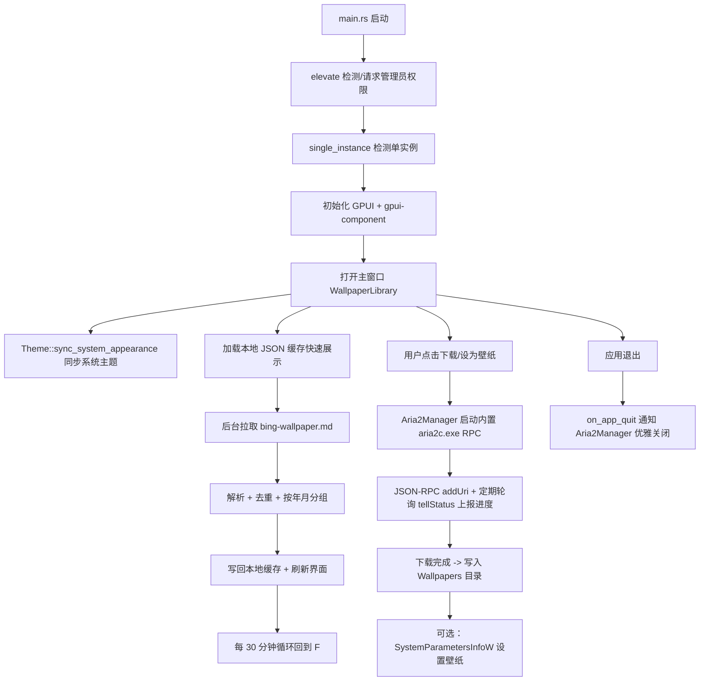

# AGENTS.md — 必应每日壁纸库

本文件面向后续维护本项目的开发者 / AI Agent，说明项目目标、架构设计、关键实现决策、构建与发布流程，以及已知的注意事项。

## 1. 项目简介

**必应每日壁纸库** 是一个 Windows 桌面应用，使用 Rust + [GPUI](https://gpui.rs)（Zed 编辑器同款 GPU 加速 UI 框架）+
[gpui-component](https://longbridge.github.io/gpui-component/zh-CN/) 组件库编写。

功能：

1. 自动获取开源项目 [niumoo/bing-wallpaper](https://github.com/niumoo/bing-wallpaper) 维护的**全部历史必应每日壁纸**（2021-02-01 至今），
   并按"年 / 月"在左侧导航栏中分类展示。
2. 每 30 分钟后台自动检查一次是否有新的一天的壁纸发布，一旦发布立即增量更新本地列表与缓存。
3. 支持将任意一天的壁纸**下载**到本地，或**一键设置为 Windows 桌面壁纸**，下载时有**实时进度条**。
4. 下载引擎基于 [aria2](https://github.com/aria2/aria2) 的 JSON-RPC 接口，并以最高速度（多连接分片）下载。
5. 最终发布物是**单个完全静态链接的 exe**，在全新安装的 Windows 系统上无需安装任何 Visual C++
   运行库、无需联网安装依赖即可直接运行；程序启动时会自动请求管理员权限，且**不会弹出黑色控制台窗口**。
6. 支持**白天 / 夜间（浅色 / 深色）主题**，默认跟随 Windows 系统浅色/深色模式，也可在左下角设置浮层中
   手动固定为白天或夜间模式。
7. **单实例**：重复启动时会自动把已运行的窗口带到前台，而不是打开第二个窗口/第二份 aria2c.exe 进程。
8. 应用图标使用内嵌的多分辨率 `ico/icon.ico`（16~256px），任务栏/标题栏/资源管理器中均显示清晰、无锯齿的
   自定义图标；exe 的"详细信息"属性页中包含版权署名 **© 2023-2026 小南瓜**，界面“关于”弹窗也展示同样的署名。

## 2. 数据源说明（重要）

- 权威数据源：[niumoo/bing-wallpaper](https://github.com/niumoo/bing-wallpaper) 仓库中的两份 Markdown：
  - `zh-cn/bing-wallpaper.md`：中文标题版本，自 v0.2.4 起作为主数据源。
  - `bing-wallpaper.md`：英文标题版本，自 v0.2.5 起作为补全集，用于补齐中文版缺失的历史日期。
- **多镜像回退策略（自 v0.2.1 起，见 `src/fetcher.rs::CHINESE_SOURCE_URLS` / `ENGLISH_SOURCE_URLS`）**：
  `raw.githubusercontent.com` 在中国大陆部分网络环境下经常无法直接访问（需要科学上网），因此中文、英文两组源
  都按顺序依次尝试 jsDelivr CDN 镜像、jsDelivr Fastly 节点、GitHub 官方原始地址。中文主源为：
  1. `https://cdn.jsdelivr.net/gh/niumoo/bing-wallpaper@main/zh-cn/bing-wallpaper.md`（jsDelivr CDN 镜像，优先）
  2. `https://fastly.jsdelivr.net/gh/niumoo/bing-wallpaper@main/zh-cn/bing-wallpaper.md`（jsDelivr 备用节点）
  3. `https://raw.githubusercontent.com/niumoo/bing-wallpaper/main/zh-cn/bing-wallpaper.md`（GitHub 官方原始地址，兜底）

  英文补全集使用同样顺序，但路径为仓库根目录下的 `bing-wallpaper.md`。每组源第一个请求成功的地址即被采用，
  任何一个失败都只记一条 `log::warn!` 并尝试下一个；若中文源成功但英文源失败，则只展示中文源已有范围，
  若中文源失败但英文源成功，则退回英文列表，只有两组源全部失败才对外报错。
  **已知权衡**：jsDelivr 对 GitHub 仓库内容存在数小时级（历史上最长约 12 小时）的 CDN 缓存延迟，但本项目
  本身只每 30 分钟检查一次是否有新的一天壁纸，这点延迟可以接受，换来的是国内绝大多数网络环境下无需 VPN
  即可直接使用。若以后 jsDelivr 出现长期不可用/正确性问题，可在两组 `*_SOURCE_URLS` 中调整顺序或替换镜像。
- 该文件是一份纯文本 Markdown，每天一行，格式形如：

  ```
  2026-07-02 | [埃斯纳神庙穹顶天花板, 埃及 (© Nick Brundle Photography/Getty Images)](https://cn.bing.com/th?id=OHR.TempleEsna_ZH-CN9834689523_UHD.jpg&rf=LaDigue_UHD.jpg&pid=hp&w=3840&h=2160&rs=1&c=4)
  ```

  与英文版相比有两处区别（均不影响现有解析器）：

  1. 图片 URL 中 OHR 文件名里的语言变体是 `_ZH-CN` 而不是 `_EN-US`，但 Bing CDN 实际返回的图片内容完全相同。
  2. 中文文件的**相邻两条记录之间多出一个空行**，英文版则不插空行。`parse_markdown` 本来就会过滤
     `line.is_empty()` 与不以数字开头的行，因此两种格式均能直接兼容。

- 两份文件都按日期**倒序**排列（最新一天在最前面）。`fetch_all` 会先对各自列表按日期去重，再合并：同一日期
  永远优先保留中文记录，只有中文版缺失的日期才追加英文记录，最后再统一按日期倒序排序。因此不会因为同时拉取
  中英文两份列表而让同一天/同一张图片重复出现在界面里。合并后的列表既可以用于首次全量拉取历史，也可以用于
  "取最上面一条日期，与本地缓存的最新日期比较"来判断是否有新的一天发布。
- **已知数据质量问题（解析时必须容错）：**
  - 个别日期存在**两条重复记录**（如 `2025-04-10`、`2025-01-17`、`2024-07-19`、`2024-04-24` 等），
    图片 URL 不同。当前策略是**保留同一天中第一条出现的记录**（`fetcher::dedup_by_date`）。
  - 2023-02-09 之前的记录，图片 URL **不带** `&rf=...&pid=hp&w=3840&h=2160&rs=1&c=4` 查询参数，只是一个裸的
    `.jpg` 链接；解析正则必须同时兼容这两种形式（见 `fetcher::line_regex`）。
  - 中文版文件中少量日期（如 `2025-05-15`）的标题里存在上游数据源留下的 UTF-8 替换字符 `�`
    （部分乱码），不尝试在解析层"修复"，直接展示即可。
- 解析实现：`src/fetcher.rs` 中的 `parse_markdown` / `dedup_by_date` / `merge_entries_prefer_primary` /
  `fetch_all`，并附带单元测试覆盖以上各类情况（现代格式、历史无查询参数格式、同日期去重、中文标题、带空行的
  中文多行样本、中文优先 + 英文补全集合并）。

## 3. 架构与模块划分

```
src/
├── main.rs             程序入口：管理员提权 → 单实例检测 → 初始化 GPUI → 主题同步 → 打开窗口 → 启动后台刷新循环
├── elevate.rs           UAC 管理员权限检测与运行时自我提权（见 §5）
├── single_instance.rs   基于命名互斥体的单实例检测，重复启动时把已运行窗口带到前台（见 §12）
├── paths.rs             应用数据目录、内置 aria2c.exe 的释放逻辑、默认/生效下载目录（见 §6、§12）
├── settings.rs          持久化应用设置（自定义下载路径），JSON 读写（见 §12）
├── model.rs             WallpaperEntry / MonthGroup 数据结构，按年月分组算法，缩略图 URL 转换
├── fetcher.rs           抓取 + 解析中英文 bing-wallpaper.md、中文优先合并、去重、本地 JSON 缓存、"是否有新一天"检测
├── downloader.rs        Aria2Manager：管理内置 aria2c.exe 子进程 + JSON-RPC 客户端（见 §7、§12）
├── wallpaper_setter.rs  调用 Windows IDesktopWallpaper / SystemParametersInfoW 设置桌面壁纸，支持多显示器
├── updater.rs           检查 GitHub Releases 最新版本，下载 + 自我替换重启（见 §14.3）
└── ui/
    └── mod.rs           主界面：左侧导航栏（主页 + 按年/月分组，支持折叠）+ 右侧内容区域
                         （首页网格视图 / 月份列表视图，预览大图弹窗、设置面板、关于弹窗、
                         新版本提醒弹窗、实时进度条）（见 §12、§14）

ico/
├── icon.ico             内嵌的多分辨率应用图标（16/24/32/48/64/72/96/128/256px）
└── icon.rc              Windows 资源脚本：图标（数字 ID `1`）+ VERSIONINFO 版本/版权信息（见 §10）

build.rs                构建脚本：在 Windows 目标上调用 embed-resource 编译 ico/icon.rc 并链接进最终 exe
```

数据流：



## 4. GPUI / gpui-component 依赖说明


<!-- Content truncated to meet Windsurf 6KB limit -->

---
> Source: [pandaligx/bing-wallpaper-lib](https://github.com/pandaligx/bing-wallpaper-lib) — distributed by [TomeVault](https://tomevault.io).
<!-- tomevault:4.0:windsurf_rules:2026-07-03 -->
