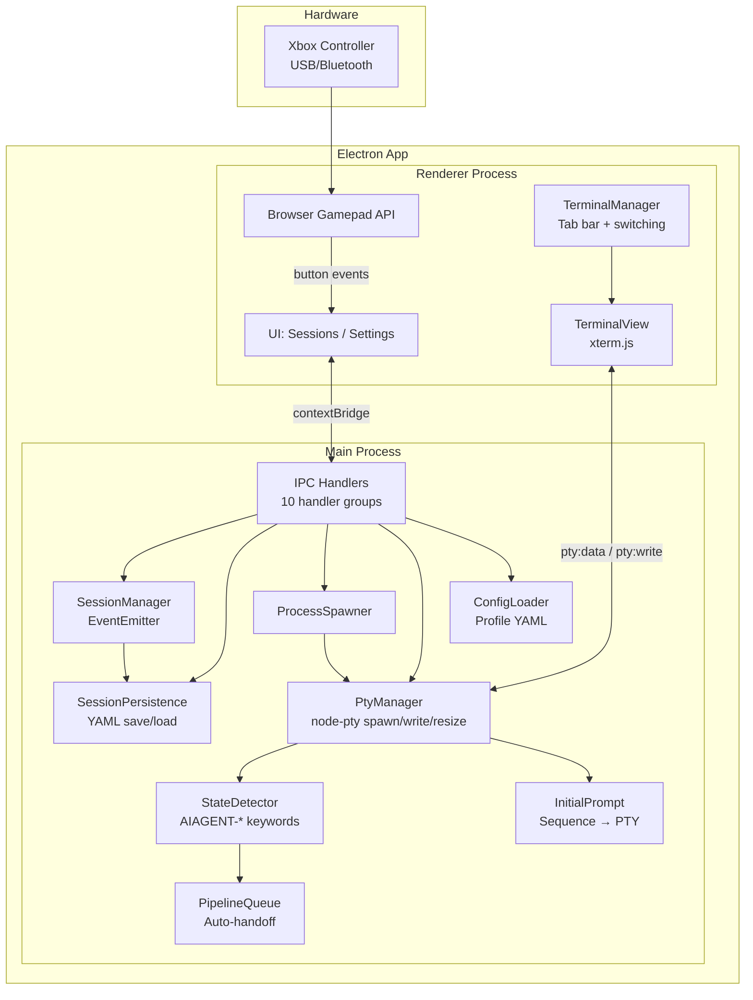
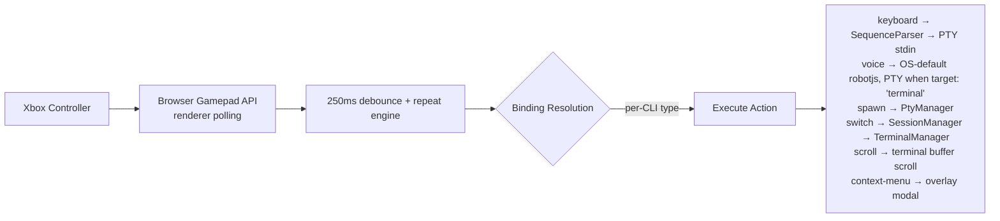

# gamepad-cli-hub — Copilot Instructions

## Project Purpose

DIY Xbox controller → CLI session manager. Control multiple AI coding CLIs (Claude Code, Copilot CLI, etc.) from a single game controller. Embedded terminals via node-pty + xterm.js — no external windows. Built as an Electron 41 desktop app on Windows.

---

## System Overview

### Data Flow Pipeline

**Detailed flow:**
1. Browser Gamepad API polls at 16ms in the renderer process
2. Button presses debounced at 250ms; D-pad and sticks auto-repeat when held (400ms initial delay, 120ms rate for D-pad; displacement-proportional for sticks)
3. Emits button events to subscribers; analog sticks emit virtual button events
4. Binding resolution: check CLI-specific bindings
5. Execute resolved action (keyboard sequence → PTY stdin, voice → OS-default robotjs or PTY when target: 'terminal', spawn → PTY, session-switch, scroll, etc.)
6. Voice bindings: default to OS (robotjs). If active terminal exists and `target === 'terminal'` → convert key to escape sequence via `keyToPtyEscape()` → `ptyWrite()`. Otherwise → robotjs. Hold mode sends escape sequence once (PTY has no key-up).
7. Analog sticks: explicit binding found → execute action; no binding → fall back to stick mode (left=cursor arrows via PTY, right=configurable per-CLI bindings, default: scroll)
8. D-pad / left stick navigates sessions and auto-selects the terminal
9. Keyboard input always routes to the active terminal (PTY stdin)
10. Ctrl+V paste: document-level interceptor reads clipboard text → writes to active PTY via `ptyWrite()` regardless of DOM focus

---

## Key Controls

| Input | Action |
|-------|--------|
| D-Pad Up/Down | Switch sessions (auto-selects terminal) |
| Left Stick | Same as D-pad |
| Right Stick | Scroll terminal buffer |
| A | Activate spawn action / configurable per-CLI binding |
| B | Back to sessions zone / configurable per-CLI binding |
| X | Close terminal |
| Y | Configurable per-CLI binding |
| Left Trigger | Spawn Claude Code |
| Right Bumper | Spawn Copilot CLI |
| Back/Start | Switch profile (previous/next) |
| Sandwich/Guide | Focus hub window + show sessions screen |
| Ctrl+Tab | Next terminal tab |
| Ctrl+Shift+Tab | Previous terminal tab |

---

## Module Reference

| Module | File | Responsibility |
|--------|------|---------------|
| **BrowserGamepad** | `renderer/gamepad.ts` | Browser Gamepad API polling (250ms debounce), button-press events via IPC, analog stick events. Sole gamepad input source — works with both USB and Bluetooth Xbox controllers. |
| **SequenceParser** | `src/input/sequence-parser.ts` | Parses sequence format strings (`{Enter}`, `{Ctrl+C}`, `{Wait 500}`, `{Mod Down/Up}`, `{{`/`}}` escapes, plain text) into typed SequenceAction arrays. Used by both button bindings and initial prompts. |
| **SessionManager** | `src/session/manager.ts` | EventEmitter tracking active/inactive sessions. Emits `session:added`, `session:removed`, `session:changed`. Supports `nextSession()`, `previousSession()`. Calls `persistSessions()` after every state change. |
| **SessionPersistence** | `src/session/persistence.ts` | `saveSessions()`, `loadSessions()`, `clearPersistedSessions()` to `config/sessions.yaml`. `restoreSessions()` on startup loads saved sessions, skips duplicates. `startHealthCheck()`/`stopHealthCheck()` methods exist but are dead code — not called in production; dead processes cleaned up via PTY exit events instead. |

<!-- Content truncated to meet Windsurf 6KB limit -->

---
> Source: [PetePeter/helm](https://github.com/PetePeter/helm) — distributed by [TomeVault](https://tomevault.io).
<!-- tomevault:4.0:windsurf_rules:2026-08-29 -->
