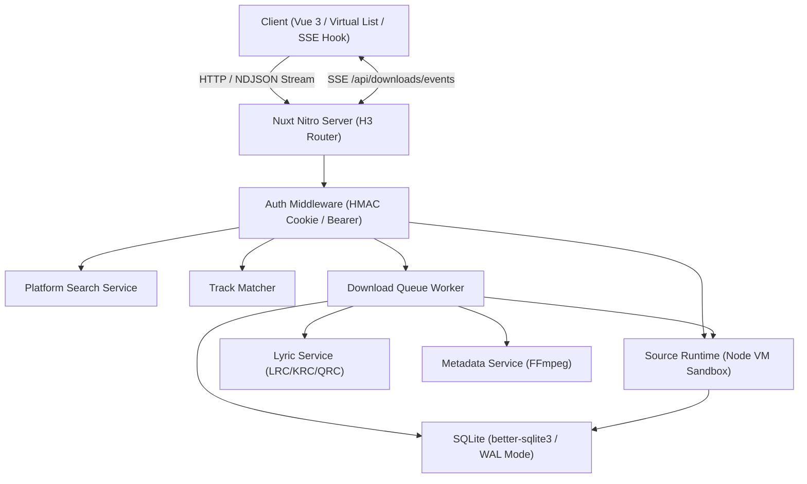

# Repository Guidelines

Miyin (觅音) is a full-stack music aggregation, resolution, and batch downloading service built with Nuxt 4 (Vue 3 + Nitro). It runs as a standalone Node.js service, multi-architecture Docker container, or native fnOS (TRIM OS) FPK package.

---

## Project Overview

- **Multi-Platform Search & Aggregation**: Aggregates music search and metadata across WangYi (`wy`), Kuwo (`kw`), Kugou (`kg`), Tencent/QQ Music (`tx`), and Migu (`mg`) via public endpoints and custom Lx-music-compatible JavaScript source scripts.
- **Sandboxed Custom Source Engine**: Evaluates untrusted user/community source scripts in isolated Node `vm.Script` execution environments with timer budgeting, network filtering, and module blacklisting.
- **Smart Track Matching & Downloader**: Fuzzy track metadata matching (Levenshtein distance, artist normalization, duration tolerance), multi-threaded download queue, binary audio header sniffing, preview clip detection heuristics, lyric decryption (LRC, KRC, QRC), and metadata/cover embedding via FFmpeg.
- **fnOS Native Integration**: Direct integration with fnOS shared storage permissions, wizard configuration, and reverse-proxy gateway routing over Unix domain sockets.

---

## Architecture & Data Flow



### Core Request & Task Flows

1. **Search Flow (`POST /api/search`)**: Dispatches concurrent upstream search requests via `platformSearch.ts` with loose JSON/JSONP parsers and artist sanitization.
2. **Audio URL Resolution (`musicUrlResolve.ts`)**: Queries active sources from `sourceRegistry.ts` $\to$ executes target provider in `sourceRuntime.ts` (`vm.Script`) $\to$ sniffs audio type and validates preview thresholds.
3. **Batch Playlist Matching (`POST /api/playlist/match`)**: Parses playlist links (NetEase/QQ) $\to$ matches track candidates across sources using `trackMatcher.ts` $\to$ enqueues tasks into SQLite.
4. **Download Lifecycle**: `downloadQueue.ts` worker loop polls `pending` tasks in SQLite $\to$ streams chunks to temporary files $\to$ checks audio magic bytes (`audioSniff.ts`) $\to$ verifies duration against preview cutoffs (`audioPreview.ts`) $\to$ decrypts lyrics (`lyricService.ts`) $\to$ embeds cover/ID3 tags with FFmpeg (`metadataService.ts`) $\to$ commits target file and broadcasts updates via SSE.

---

## Key Directories

```
miyin/
├── app/                  # Frontend: Vue 3 pages, components, composables, assets
│   ├── composables/      # useAuth, useDownloadEvents (SSE), usePlayer, useFnOsDirAuth
│   └── pages/            # index (search), playlist, queue, sources, settings, login
├── server/               # Backend: Nitro server engine
│   ├── api/              # API route handlers (/api/search, /api/downloads, /api/sources, etc.)
│   ├── middleware/       # Auth enforcement and request validation
│   ├── services/         # Core business logic (downloadQueue, sourceRuntime, lyricService, etc.)
│   └── utils/            # DB client, crypto, paths, audio sniffing, NDJSON stream helpers
├── shared/               # Shared isomorphic TypeScript types, platform IDs, and constants
├── packaging/fnos/       # fnOS FPK build scripts, lifecycle hooks, manifest, socket entry
├── scripts/              # Release automation, changelog generation, brand rendering
└── tests/                # Vitest unit and integration test suites
```

---

## Development Commands

### Daily Workflow

- **Start Dev Server**: `pnpm dev` (listens on `http://localhost:18980`)
- **Run Typecheck / Prepare**: `pnpm postinstall` or `npx nuxt prepare`
- **Run Tests**: `pnpm test` (executes `vitest run`)
- **Run Specific Test**: `pnpm vitest run tests/trackMatcher.test.ts`
- **Run Tests in Watch Mode**: `pnpm vitest`
- **Test Coverage**: `pnpm vitest run --coverage`

### Build & Release

- **Production Build**: `pnpm build` (outputs to `.output/`)
- **Preview Production Build**: `pnpm preview`
- **Build fnOS FPK Package**: `pnpm build:fpk` (runs `packaging/fnos/scripts/build-fpk.sh`)
- **Execute Release**: `pnpm release` (runs `scripts/release.sh` for semver bumps, changelog generation, and tagging)

---

## Code Conventions & Common Patterns


<!-- Content truncated to meet Windsurf 6KB limit -->

---
> Source: [qwex888/miyin](https://github.com/qwex888/miyin) — distributed by [TomeVault](https://tomevault.io).
<!-- tomevault:4.0:windsurf_rules:2026-10-01 -->
