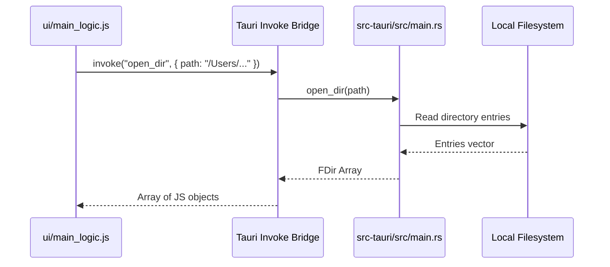

# AI Developer & Agent Onboarding Guide (AGENTS.md)

Welcome, agent! This document serves as your technical manual and architectural reference for developing, debugging, and extending **CoDriver**. Refer to this guide to align with existing design patterns, technology choices, and structural constraints.

For a comprehensive, deep-dive architectural reference covering module trees, Tauri IPC command descriptions, frontend global state variables, and end-to-end data flows (such as conflict resolution paste and AI integrations), please refer to [CONTEXT.md](file:///Users/rickyperlick/Coding/CoDriver/CONTEXT.md).

---

## 🚀 Repository Identity & Mission

**CoDriver** is a high-performance, cross-platform desktop file explorer built with **Tauri v2** and **Rust**.
- **No path caching**: Directory exploration is done in real-time, relying on the raw speed of Rust, concurrent disk access (`rayon` & `jwalk`), and CPU power.
- **Cross-platform**: Native feel on Windows, macOS, and Linux.
- **Rich features**: Includes dual-pane layout, miller columns, quick file preview (images, PDFs, video, code), drag-and-drop, multi-format archive compression/extraction, native FTP remote connection integration, and Gemini & OpenAI AI-powered superpowers (like image upscaling, creative enhancement, style editing, and semantic directory organizing).


---

## 📂 Directory Structure

Here is a map of the repository's major files and folders:

```
CoDriver/
├── .vscode/               # Workspace settings for VS Code
├── .zed/                  # Workspace settings for Zed
├── arch/                  # Architecture-specific scripts/files
├── docs/                  # Specifications, plans, release notes, and documentation
│   ├── design/            # UI/UX mockups and feature specs
│   └── superpowers/       # Active sprint specifications and plans
├── memories/              # AI-agent working state and project context
│   └── project_context.md # High-level summary of active sprints and tech stacks
├── snap/                  # Snap packaging configurations (Linux)
├── src-tauri/             # Rust backend code (Tauri Core)
│   ├── src/
│   │   ├── applications.rs # Desktop application integration helpers
│   │   ├── main.rs         # Entry point, state, and Tauri command declarations (heavy)
│   │   ├── utils.rs        # Heavy duty FS operations, watchers, compression
│   │   └── window_tauri_ext.rs # Platform window custom styling integrations
│   ├── Cargo.toml         # Rust crate dependency map
│   └── tauri.conf.json    # Tauri configuration (window sizes, allowlists, assets)
├── ui/                    # Frontend assets loaded by Tauri (Vanilla JS + jQuery)
│   ├── index.html         # Main app shell & modal containers
│   ├── main_logic.js      # Core UI state manager and operation orchestration (heavy)
│   ├── events.js          # Global listeners for Tauri-emitted backend events
│   ├── contextmenu.js     # Custom right-click menu management
│   ├── utils.js           # Shared DOM and IPC helpers
│   ├── models.js          # Core JS model definitions (e.g. ActiveAction, Popups)
│   └── style.css          # Premium glassmorphism design system & styles
├── CONTEXT.md             # Technical & architectural reference document (deep-dive)
└── README.md              # Public orientation document
```

---

## 💻 Tech Stack & Architecture

### 1. The Frontend (ui/)
- **Core UI Structure**: Single-page application built on pure HTML5 and vanilla CSS.
- **DOM Orchestration**: Uses **jQuery** (`$`) for event handling, animations, and DOM manipulation. Avoid introducing complex front-end frameworks (React, Vue, etc.) as the project structure relies on global namespace orchestration.
- **Visual Design**: Sleek glassmorphism theme defined in `ui/style.css` leveraging modern CSS variables (e.g., `--primaryColor`, `--textColor`, `--glass-blur`). Features responsive grid/list/miller layouts.
- **Third-Party Libraries**:
  - `DragSelect` (`ds.min.js`) for click-and-drag file selections.
  - `Font Awesome` (`font-awesome/`) for clean iconography.

### 2. The Backend (src-tauri/)
- **Core**: **Tauri v2** (Tauri v2 has been adopted for the codebase).
- **Disk Walking**: **jwalk** and **walkdir** for highly parallel directory traversals.
- **Concurrency**: **rayon** for multi-threaded operation mapping.
- **FS Watching**: **notify** crate registers platform-specific filesystem watchers to push live updates to the UI.
- **Archive Integrations**: `sevenz-rust`, `zip`, `tar`, `flate2`, `zstd`, `brotlic`, `density-rs`.

---

## 🔄 IPC & Tauri Command Integration

Communication between the frontend and the backend is done via Tauri's IPC bridge.




<!-- Content truncated to meet Windsurf 6KB limit -->

---
> Source: [RickyDane/CoDriver](https://github.com/RickyDane/CoDriver) — distributed by [TomeVault](https://tomevault.io).
<!-- tomevault:4.0:windsurf_rules:2026-07-22 -->
