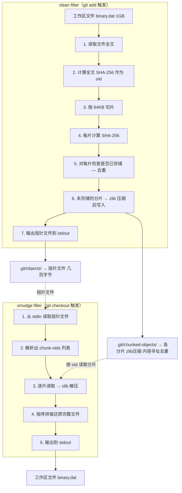

# Git Chunked Storage Backend — 规划文档

---

## 1. 项目概述

实现一个基于分片的 git 存储后端，替代 git-lfs 的整文件存储方式。核心思路是将二进制大文件按 64KB 分片，以内容寻址（SHA-256 + zlib 压缩）存储分片，实现增量存储和分片级去重。

## 2. 核心设计

### 2.1 工作原理



### 2.2 指针文件格式

```
version https://git-lfs-chunked/1
oid sha256:<全文SHA-256>
size <文件总字节数>
chunk-size 65536
chunks <分片总数>
chunk-oids sha256:<chunk1-hash> sha256:<chunk2-hash> ... sha256:<chunkN-hash>
```

- 小文件（< 64KB）时，只有一个分片，`chunks` 为 1
- 空文件时，`chunks` 为 0，`chunk-oids` 为空

### 2.3 分片存储格式

- 路径：`.git/chunked-objects/<sha256前2位>/<sha256剩余62位>`
- 内容：zlib 压缩后的原始分片数据
- 命名：分片的 **原始内容** SHA-256（压缩前计算，和 git objects 一致）

```
.git/chunked-objects/
├── a1/
│   └── b2c3d4e5f6...    ← zlib 压缩的分片数据
├── f6/
│   └── e7d8c9b0a1...    ← zlib 压缩的分片数据
└── ...
```

使用 2 位前缀做一级目录，避免单目录文件数过多，和 git objects 的 `xx/xxxx...` 结构一致。

### 2.4 去重机制

| 版本 | 操作 | chunked-objects 变化 |
|---|---|---|
| 首次 add 1GB 文件 | 存 16384 个分片 | +1GB（压缩后更小） |
| 修改头部后再次 add | 只新增 1 个分片 | +64KB（压缩后更小） |
| 总占用 | — | 所有出现过的不同分片的并集，每片仅存一份 |

### 2.5 zlib 压缩

- **写入时**：原始分片 → zlib 压缩 → 写入磁盘
- **读取时**：读取磁盘 → zlib 解压 → 得到原始分片
- **SHA-256**：始终基于**原始内容**计算，压缩是透明存储优化
- **性能开销**：1GB 文件约额外 1 秒，可忽略
- **存储收益**：压缩率取决于文件类型，文本类二进制（docx/xlsx）效果显著

## 3. 项目结构

```
interview-git-storage/
├── main.go                      # CLI 入口，注册子命令
├── cmd/
│   ├── clean.go                 # clean 子命令：stdin → 分片存储 + 指针文件 stdout
│   ├── smudge.go                # smudge 子命令：指针文件 stdin → 还原文件 stdout
│   └── setup.go                 # setup 子命令：配置 git filter 和 .gitattributes
├── internal/
│   ├── chunker/
│   │   └── chunker.go           # 分片逻辑：按 64KB 切片、SHA-256 计算
│   ├── store/
│   │   └── store.go             # 存储层：读写 .git/chunked-objects/、zlib 压缩/解压
│   └── pointer/
│       └── pointer.go           # 指针文件解析/序列化
├── go.mod
├── go.sum
└── .gitattributes               # filter=chunked 配置
```

## 4. 各模块详细设计

### 4.1 `cmd/clean.go` — Clean Filter

```go
func runClean(cmd *cobra.Command, args []string) {
    data := io.ReadAll(os.Stdin)
    fileSHA := sha256(data)
    fileSize := len(data)

    chunks := chunker.Split(data, 64*1024)

    chunkOids := []string{}
    for _, chunk := range chunks {
        oid := sha256(chunk)
        chunkOids = append(chunkOids, oid)
        store.Save(oid, chunk)
    }

    pointer := &Pointer{
        Oid:       fileSHA,
        Size:      fileSize,
        ChunkSize: 65536,
        Chunks:    len(chunkOids),
        ChunkOids: chunkOids,
    }
    fmt.Print(pointer.Serialize())
}
```

### 4.2 `cmd/smudge.go` — Smudge Filter

```go
func runSmudge(cmd *cobra.Command, args []string) {
    pointerData := io.ReadAll(os.Stdin)
    pointer := pointer.Parse(pointerData)

    var buf bytes.Buffer
    for _, oid := range pointer.ChunkOids {
        chunk := store.Load(oid)
        buf.Write(chunk)
    }
    os.Stdout.Write(buf.Bytes())
}
```

### 4.3 `internal/chunker/chunker.go` — 分片器

```go
func Split(data []byte, chunkSize int) [][]byte {
    var chunks [][]byte
    for offset := 0; offset < len(data); offset += chunkSize {
        end := min(offset+chunkSize, len(data))
        chunks = append(chunks, data[offset:end])
    }
    return chunks
}

func Hash(chunk []byte) string {
    h := sha256.Sum256(chunk)
    return hex.EncodeToString(h[:])
}
```

### 4.4 `internal/store/store.go` — 存储层

```go
type Store struct {
    basePath string  // .git/chunked-objects/
}

func (s *Store) Save(oid string, data []byte) error {
    path := s.oidToPath(oid)  // <basePath>/<前2位>/<剩余62位>
    if s.Exists(oid) {
        return nil  // 去重：已存在则跳过
    }
    os.MkdirAll(filepath.Dir(path), 0755)
    compressed := zlibCompress(data)
    return os.WriteFile(path, compressed, 0644)
}

func (s *Store) Load(oid string) ([]byte, error) {
    path := s.oidToPath(oid)
    compressed, _ := os.ReadFile(path)
    return zlibDecompress(compressed)
}

func (s *Store) Exists(oid string) bool {
    _, err := os.Stat(s.oidToPath(oid))
    return err == nil
}
```

### 4.5 `internal/pointer/pointer.go` — 指针文件

```go
type Pointer struct {
    Version   string   // "https://git-lfs-chunked/1"
    Oid       string   // 全文 SHA-256
    Size      int64    // 文件总大小
    ChunkSize int      // 65536
    Chunks    int      // 分片数量
    ChunkOids []string // 各分片 SHA-256
}

func (p *Pointer) Serialize() string {
    // 输出格式：
    // version https://git-lfs-chunked/1
    // oid sha256:<oid>
    // size <size>
    // chunk-size 65536
    // chunks <n>

<!-- Content truncated to meet Windsurf 6KB limit -->

---
> Source: [Rinki-S/git-chunked-store](https://github.com/Rinki-S/git-chunked-store) — distributed by [TomeVault](https://tomevault.io).
<!-- tomevault:4.0:windsurf_rules:2026-07-22 -->
