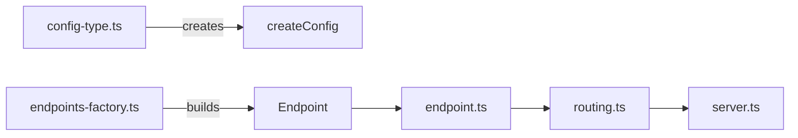

# Project Guide for AI Agents

This file provides essential context for working with the express-zod-api project.

## Project Overview

The **express-zod-api** is a TypeScript framework for building Express.js APIs with Zod schema validation. It provides
type-safe request/response handling, automatic OpenAPI documentation, and a clean API builder pattern.

- **Package manager**: pnpm
- **Current version** and **Node version**: See `express-zod-api/package.json`

## Project Structure

This is a pnpm monorepo. The directory name becomes the workspace name.

```
├── express-zod-api/   # Main package
│   ├── src/           # TypeScript source
│   └── tests/         # Unit tests (Vitest)
├── migration/         # Workspace: @express-zod-api/migration
├── example/           # Example API server
├── zod-plugin/        # Workspace: @express-zod-api/zod-plugin
├── cjs-test/          # CommonJS compatibility tests
├── esm-test/          # ESM compatibility tests
├── compat-test/       # Compatibility tests
└── issue952-test/     # Issue reproduction tests
```

### Workspaces

| Directory          | Package Name                  | Description                        |
| ------------------ | ----------------------------- | ---------------------------------- |
| `express-zod-api/` | `express-zod-api`             | Framework itself (main)            |
| `migration/`       | `@express-zod-api/migration`  | ESLint migration rules             |
| `zod-plugin/`      | `@express-zod-api/zod-plugin` | Zod plugin for schema enhancements |
| `example/`         | —                             | Usage example                      |

The rest are test workspaces.

## Architecture Overview

Quick reference on how the key modules connect:



See `src/index.ts` for the complete public API exports.

## Important Entry Points

- **`express-zod-api/src/index.ts`** — Public API exports
- **`express-zod-api/src/config-type.ts`** — Configuration types for `createConfig()`
- **`express-zod-api/src/routing.ts`** — Core routing logic
- **`express-zod-api/src/testing.ts`** — Test utilities: `testEndpoint` and `testMiddleware` are public, others internal
- **`express-zod-api/tests/express-mock.ts`** — Express mocking for tests
- **`express-zod-api/tests/peers-mock.ts`** — Mocks for compression, cookie-parser, express-fileupload, express-rate-limit
- **`migration/index.ts`** — Migration ESLint rules
- **`CHANGELOG.md`** — Version history and breaking changes

## Key Conventions

### 1. File Naming Conventions

- **Source files**: `src/*.ts`
- **Test files**: `tests/*.spec.ts` (Vitest)
- **Test organization**: In `express-zod-api` workspace, `tests/` mirrors `src/`.
  Each source file has a corresponding test file with the same name.

### 2. Public API Convention

Everything exported via `express-zod-api/src/index.ts` is part of the public API.

### 3. JSDoc Convention for Public Entities

All properties of publicly available entities (exposed via `index.ts`) must have JSDoc documentation using directives:

- **`@desc`**: Short description of what the property does, ends with a period
- **`@default`**: Default value (required for optional properties)
- **`@example`**: Example value (required for literal types, one per variant)

Each directive should aim to fit on one line:

```typescript
interface SampleInterface {
  /** @desc Enables certain feature. */
  sampleRequiredProperty: boolean | SampleOptions;
  /** @desc Controls another feature. */
  /** @default true */
  /** @example true — leads to one thing */
  /** @example false — leads to another thing */
  sampleOptionalProperty?: boolean;
}
```

### 4. Import Conventions

- **Zod**: Use named import `import { z } from "zod"`
- **Ramda**: Use namespace import `import * as R from "ramda"`
- **Node.js built-ins**: Use `node:` prefix
- **Type-only imports**: Use `import type` for types and interfaces (verbatimModuleSyntax)
- **Relative imports**: Use `.ts` extension when file is meant to be run by `node` (`example` and testing workspaces)
- Combine imports from the same module into a single statement

```typescript
import { z } from "zod";
import * as R from "ramda";
import { dirname } from "node:path";
import type { SomeType } from "./module-a"; // for compiled code
import { someValue } from "./module-b.ts"; // for node execution
```

### 5. Type Declaration Convention

Object-based types should be declared as interfaces, not types:

```typescript
// Good
interface User {
  name: string;
  age: number;
}

// Avoid
type User = { name: string; age: number };
```

### 6. Testing Convention

- **Use `test.each()`**: Always prefer parameterized tests to reduce repetition
- **Placeholders**: Use `%s` for the current value or `%#` for the index

```typescript
test.each([true, false, undefined])(
  "Should handle hintAllowedMethods=%s",
  (hintAllowedMethods) => {},
);
```

- **Mock patterns**: Use utilities from `src/testing.ts` (`testEndpoint`, `testMiddleware`, etc.)
  and Express mocks from `tests/express-mock.ts`:

```typescript

<!-- Content truncated to meet Windsurf 6KB limit -->

---
> Source: [RobinTail/express-zod-api](https://github.com/RobinTail/express-zod-api) — distributed by [TomeVault](https://tomevault.io).
<!-- tomevault:4.0:windsurf_rules:2026-06-29 -->
