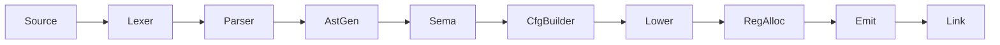

# CLAUDE.md

This file provides guidance to Claude Code (claude.ai/code) when working with code in this repository.

**Note**: This project uses [bd (beads)](https://github.com/steveyegge/beads) for issue tracking. Use `bd` commands instead of markdown TODOs. See the Issue Tracking section below for workflow details.

## Project Overview

Rue is a systems programming language aiming for memory safety without garbage collection, with higher-level ergonomics than Rust/Zig. Currently in early development with Rust-like syntax.

## Build System

This project uses Buck2 (via `./buck2` wrapper script), not Cargo.

### Common Commands

```bash
# Build the compiler
./buck2 build //crates/rue:rue

# Build everything
./buck2 build //...

# Run all tests (unit + spec)
./test.sh

# Run unit tests only
./buck2 test //...

# Run spec tests only
./buck2 run //crates/rue-spec:rue-spec

# Run a specific crate's tests
./buck2 test //crates/rue-lexer:rue-lexer-test

# Filter spec tests by pattern
./buck2 run //crates/rue-spec:rue-spec -- "1.1"  # Section 1.1
./buck2 run //crates/rue-spec:rue-spec -- "zero" # Tests matching "zero"

# Compile and run a program (single file)
./buck2 run //crates/rue:rue -- source.rue output
./output

# Compile multiple files into one program
./buck2 run //crates/rue:rue -- main.rue utils.rue math.rue -o program
./program

# With shell glob expansion
./buck2 run //crates/rue:rue -- src/*.rue -o program

# Note: -o is required when compiling multiple files
./buck2 run //crates/rue:rue -- a.rue b.rue          # Error!
./buck2 run //crates/rue:rue -- a.rue b.rue -o out   # OK

# Emit intermediate representations (can specify multiple stages)
./buck2 run //crates/rue:rue -- --emit tokens source.rue  # Lexer tokens
./buck2 run //crates/rue:rue -- --emit ast source.rue     # Abstract syntax tree
./buck2 run //crates/rue:rue -- --emit rir source.rue     # Untyped IR
./buck2 run //crates/rue:rue -- --emit air source.rue     # Typed IR
./buck2 run //crates/rue:rue -- --emit cfg source.rue     # Control flow graph
./buck2 run //crates/rue:rue -- --emit mir source.rue     # Machine IR (virtual registers)
./buck2 run //crates/rue:rue -- --emit asm source.rue     # Assembly (physical registers)

# Chain multiple stages to see the full pipeline
./buck2 run //crates/rue:rue -- --emit tokens --emit ast --emit rir source.rue
```

## Architecture

The compiler pipeline transforms source through successive IRs:



| Stage | Pass | IR Produced | `--emit` flag |
|-------|------|-------------|---------------|
| 1 | Lexer | tokens | `tokens` |
| 2 | Parser | AST | `ast` |
| 3 | AstGen | RIR (untyped) | `rir` |
| 4 | Sema | AIR (typed) | `air` |
| 5 | CfgBuilder | CFG | `cfg` |
| 6 | Lower | MIR (machine) | `mir` |
| 7 | RegAlloc | MIR (allocated) | `asm` |
| 8 | Emit | bytes | - |
| 9 | Link | ELF | - |

### Crate Responsibilities

| Crate | Purpose |
|-------|---------|
| `rue` | CLI binary |
| `rue-compiler` | Pipeline orchestration |
| `rue-lexer` | Tokenization |
| `rue-parser` | AST construction |
| `rue-rir` | Untyped IR (post-parse, pre-typing) |
| `rue-cfg` | Control flow graph construction and optimization |
| `rue-air` | Typed IR (after semantic analysis) |
| `rue-codegen` | x86-64 machine code generation |
| `rue-linker` | ELF object file creation and linking |
| `rue-error` | Error types and diagnostics |
| `rue-span` | Source location tracking |
| `rue-target` | Target platform configuration |
| `rue-spec` | Specification test runner |
| `rue-ui-tests` | UI/diagnostics tests (warnings, error messages) |
| `rue-fuzz` | Fuzz testing infrastructure |
| `rue-runtime` | Runtime support |
| `rue-builtins` | Built-in type definitions (String, future Vec, etc.) |

### Multi-File Compilation

Rue supports compiling multiple source files into a single executable:

```bash
# All files share a flat global namespace (no modules yet)
rue main.rue utils.rue lib.rue -o program
```

**Key semantics:**
- All functions, structs, and enums are globally visible across files
- Duplicate definitions (same name in multiple files) cause a compile error
- `main()` must exist in exactly one file
- Files are parsed in parallel, then merged for semantic analysis

**Current limitations (will be addressed by the module system):**
- No visibility control (`pub`/private)
- No namespacing - all symbols share global scope
- No `mod` or `use` syntax
- Must list all files explicitly on command line

### Key Design Decisions

- **Architecture-specific MIR**: Each target gets its own machine IR (currently X86Mir), following Zig's approach
- **Index-based references**: Instructions stored in vectors, referenced by u32 indices (cache-friendly, no lifetimes)
- **Direct code emission**: No LLVM dependency; machine code emitted directly
- **Minimal ELF**: Static executables with direct syscalls (Linux x86-64 only)
- **Built-in types as synthetic structs**: Types like `String` are defined in `rue-builtins` and injected as synthetic structs, not as hardcoded `Type` enum variants (see [ADR-0020](docs/designs/0020-builtin-types-as-structs.md))


<!-- Content truncated to meet Windsurf 6KB limit -->

---
> Source: [rue-language/rue](https://github.com/rue-language/rue) — distributed by [TomeVault](https://tomevault.io).
<!-- tomevault:4.0:windsurf_rules:2026-05-04 -->
