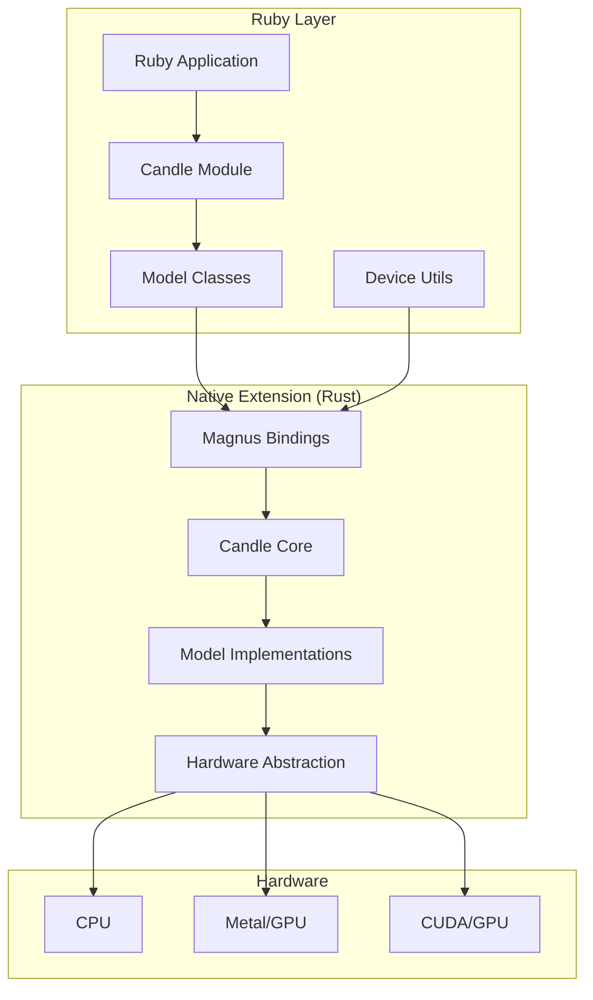
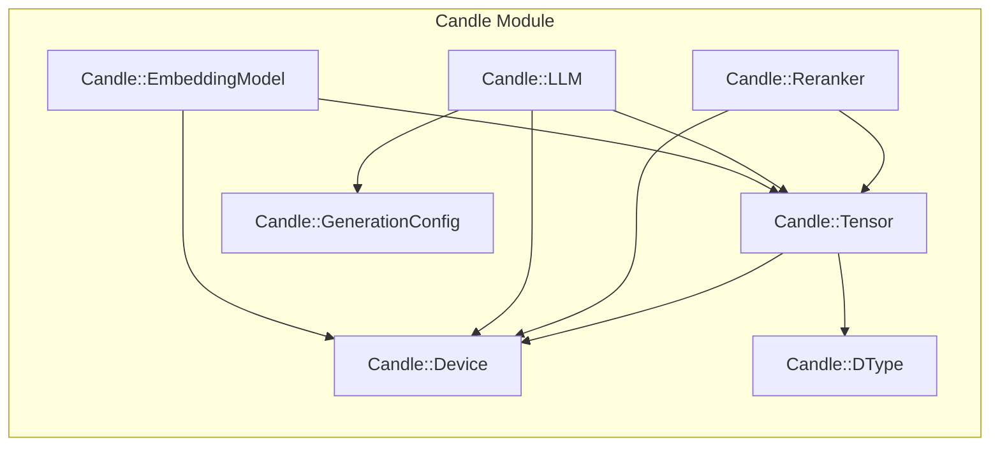

# Red Candle Development Guide

This guide captures the coding conventions and patterns used in the red-candle Ruby gem.

## Project Overview

Red Candle is a Ruby gem that uses the Magnus Rust crate to embed Rust code in Ruby, providing access to the Candle ML library from Hugging Face. It enables Ruby developers to use embedding models, rerankers, and LLMs including Llama, Mistral, Gemma, Qwen, and Phi models.

## Architecture Overview



## Module Structure

### Ruby Module Structure



### Rust Class Structure

```mermaid
graph TB
    subgraph "LLM Module"
        A[ModelType enum]
        B[Mistral]
        C[Llama]
        D[Gemma]
        E[Qwen]
        F[QuantizedGGUF]
        
        A --> B
        A --> C
        A --> D
        A --> E
        A --> F
    end
    
    subgraph "Embedding Module"
        EM[EmbeddingModel]
        EMI[EmbeddingModelInner]
        EMT[EmbeddingModelType]
        EMV[EmbeddingModelVariant]
        JB[JinaBert]
        SB[StandardBert]
        DB[DistilBert]
        ML[MiniLM]
        
        EM --> EMI
        EMI --> EMV
        EMT --> JB
        EMT --> SB
        EMT --> DB
        EMT --> ML
        EMV --> JB
        EMV --> SB
        EMV --> DB
        EMV --> ML
    end
    
    subgraph "Reranker Module"
        R[Reranker]
        RME[RerankerModel enum]
        RM[BertModel]
        RP[Pooler Linear]
        RC[Classifier Linear]
        RX[XLMRobertaForSequenceClassification]
        RD[DebertaV2Model + ContextPooler]
        RMB[ModernBert + Head]

        R --> RME
        RME --> RM
        RME --> RX
        RME --> RD
        RME --> RMB
        RQ[Qwen3 ModelForCausalLM]
        RME --> RQ
        RM --> RP
        RM --> RC
    end
    
    subgraph "Traits"
        F[TextGenerator]
        G[generate]
        H[generate_stream]
        I[clear_cache]
        
        F --> G
        F --> H
        F --> I
    end
    
    subgraph "GGUF Internals"
        J[QuantizedGGUF]
        K[ModelType::Llama]
        L[ModelType::Gemma]
        M[Architecture Detection]
        N[Tokenizer Download]
        
        J --> M
        J --> N
        J --> K
        J --> L
    end
    
    subgraph "Support Types"
        O[GenerationConfig]
        P[TokenizerWrapper]
        Q[TextGeneration]
        T[Tokenizer]
        DEV[Device]
        
        O --> Q
        P --> Q
    end
    
    B -.-> F
    C -.-> F
    D -.-> F
    E -.-> F
    
    EM -.-> T
    EM -.-> DEV
    R -.-> T
    R -.-> DEV
    A -.-> DEV
```



## Directory Structure

```
red-candle/
├── lib/              # Ruby source files
│   └── candle/       # Main module namespace
├── ext/              # Native extensions
│   └── candle/       # Rust extension
│       └── src/      # Rust source files
├── spec/             # RSpec test suite
├── examples/         # Usage examples
├── docs/             # Additional documentation
└── bin/              # Executables
```

## Ruby Conventions

### Module and Class Structure

- Single module namespace: `Candle`
- Clear class responsibilities:
  - `Tensor` - Core tensor operations
  - `LLM` - Language model functionality (Llama, Mistral, Gemma, Qwen, Phi)
  - `EmbeddingModel` - Text embeddings
  - `Reranker` - Document reranking
  - `Tokenizer` - Text tokenization
  - `NER` - Named Entity Recognition

### Ruby Style

```ruby
module Candle
  class ClassName
    # Constants first
    CONSTANT_NAME = value
    
    # Class methods
    class << self
      def class_method
      end
    end
    
    # Public instance methods
    def public_method
    end
    
    private
    
    def private_method
    end
  end
end
```

### Naming Conventions

- Classes: `PascalCase`
- Methods: `snake_case`
- Constants: `UPPER_SNAKE_CASE`
- Files: `snake_case.rb`
- Use modern hash syntax with symbols
- Use keyword arguments for optional parameters

## Rust Conventions

### Rust Configuration (rustfmt.toml)

- Indentation: 4 spaces
- Line width: 100 characters max
- Edition: Rust 2021

### Rust Patterns

```rust
#[magnus::wrap(class = "Candle::ClassName", free_immediately, size)]
pub struct ClassName(pub InternalType);

impl ClassName {
    pub fn new(params: Type) -> Result<Self> {
        // Implementation with proper error wrapping
    }
}
```

- Error handling: Uses `Result<T, magnus::Error>` type

<!-- Content truncated to meet Windsurf 6KB limit -->

---
> Source: [scientist-labs/red-candle](https://github.com/scientist-labs/red-candle) — distributed by [TomeVault](https://tomevault.io).
<!-- tomevault:4.0:windsurf_rules:2026-07-23 -->
