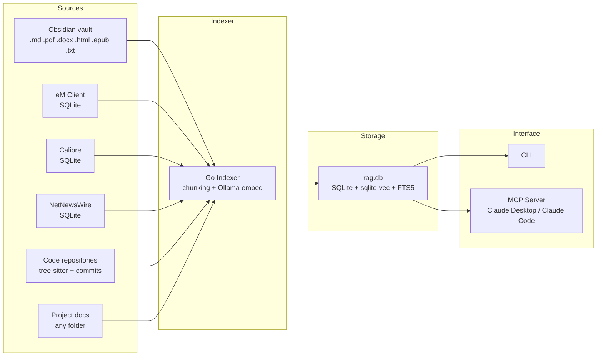

# CLAUDE.md

## Project: local-rag

A fully local, privacy-preserving RAG (Retrieval Augmented Generation) system for macOS. Indexes personal knowledge from multiple sources into a single SQLite database with vector + full-text hybrid search. Exposes search via CLI and an MCP server so Claude Desktop and Claude Code can query it directly.

---

## Quick Start

```bash
# Prerequisites
brew install ollama go
ollama pull bge-m3

# Optional: OCR support for scanned PDFs
brew install tesseract tesseract-lang

# Build
git clone https://github.com/sebastianhutter/local-rag.git
cd local-rag
make build            # binary at bin/local-rag

# Index sources
local-rag index obsidian
local-rag index email
local-rag index calibre
local-rag index rss
local-rag index code rustyquill
local-rag index code                    # all groups
local-rag index code rustyquill --history  # code + commit history
local-rag index project                  # all projects
local-rag index project "Project Alpha"  # specific project

# Search
local-rag search "kubernetes deployment strategy"
local-rag search "invoice from supplier" --collection email
local-rag search "API specification" --collection "Project Alpha"

# Remove entries whose originals are gone
local-rag prune                          # all collections
local-rag prune obsidian                 # one collection

# Run MCP server (for Claude Desktop / Claude Code integration)
local-rag serve
```

---

## Architecture



### Core Concepts

**Collections**: Every indexed source belongs to a collection. System collections ("obsidian", "email", "calibre", "rss") have dedicated parsers. Code repositories are collections of type "code" that contain one or more git repos grouped by org or topic. Project folders create project-type collections. Search can target a specific collection or search across all of them.

**Hybrid search**: Every query runs both vector similarity search (semantic) and FTS5 full-text search (keyword). Results are merged using Reciprocal Rank Fusion (RRF). This ensures that both "what does this mean" and "find the exact phrase" queries work well.

Vector search is two-stage for speed: a fast Hamming-distance KNN over binary-quantized vectors (`vec_documents_bin`) gathers a candidate pool, which is then reranked with the exact float vectors (`vec_documents`). This avoids a full-precision scan of every stored vector on each query. See `docs/hybrid-search-and-rrf.md`.

**Incremental indexing**: Track file hashes, modification times, and watermarks. Only re-embed changed or new content. Use `--force` to re-index everything.

**Pruning**: Indexing removes what indexing cannot see. Before indexing `obsidian`, `code`, `project` or `all`, a prune pass drops sources whose file no longer exists on disk, so deleted and moved files leave search results without a manual step; `--no-prune` skips it. The standalone `local-rag prune [COLLECTION]` covers every collection type — including email, calibre and rss, which are pruned against their source databases rather than the filesystem. `prune --vectors` is a separate repair path: it deletes embeddings in `vec_documents`/`vec_documents_bin` whose `document_id` no longer resolves, which CASCADE cannot do because the vec0 virtual tables have no foreign keys.

---

## Supported Sources

| Source | Collection | CLI Command | Data Source |
|--------|------------|-------------|-------------|
| **Obsidian** | `obsidian` | `index obsidian` | Vault directory — all file types (.md, .pdf, .docx, .html, .txt, .epub) |
| **eM Client** | `email` | `index email` | SQLite databases (read-only) — subject, body, sender, recipients, date, folder |
| **Calibre** | `calibre` | `index calibre` | SQLite metadata.db + book files (read-only) — EPUB/PDF content with author, tags, series metadata |
| **NetNewsWire** | `rss` | `index rss` | SQLite databases (read-only) — RSS article title, author, content, feed name |
| **Code Repositories** | repo name | `index code [NAME]` | Git repos grouped by org/topic — paths can be direct repos or parent directories (repos are discovered recursively). Tree-sitter structural parsing + commit history (messages and per-file diffs), respects .gitignore |

<!-- Content truncated to meet Windsurf 6KB limit -->

---
> Source: [sebastianhutter/local-rag](https://github.com/sebastianhutter/local-rag) — distributed by [TomeVault](https://tomevault.io).
<!-- tomevault:4.0:windsurf_rules:2026-08-21 -->
