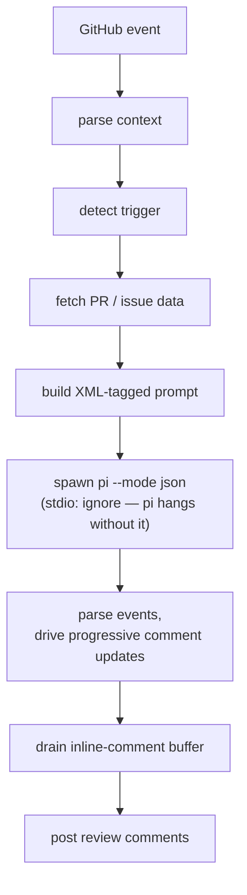

# AGENTS.md

Instructions for coding agents working in this repository. Read before editing.

## What this is

**elek** is a model-agnostic GitHub Action that runs AI code reviews on pull
requests and issues. It wraps [pi coding agent](https://github.com/earendil-works/pi)
and adds a tightly-scoped tool surface — the model can post inline review
comments and update its tracking comment, but **cannot** approve, merge, or
close a PR. That guarantee is structural: there is no plumbing to those
endpoints. Don't add it casually.

## How it runs

Composite GitHub Action. Single TypeScript orchestrator at
`src/entrypoints/run.ts` runs end-to-end:



Pi is run via the CLI (not the SDK) so we stay model-agnostic — any provider
pi supports, elek supports.

## File map

```
action.yml                            Composite GitHub Action declaration.
src/entrypoints/run.ts                Main orchestrator. Read this first.
src/entrypoints/post-buffered.ts      Drains MCP buffer; posts inline comments.
src/pi.ts                             pi CLI runner; parses --mode json events.
src/types.ts                          Shared types.
src/github/context.ts                 Parses the GitHub webhook payload.
src/github/trigger.ts                 @pi mention detection, actor filtering.
src/github/data.ts                    PR/issue data fetch + buildPrompt().
src/github/comments.ts                Tracking-comment lifecycle.
src/github/progress.ts                Live checklist body.
src/github/spinner.ts                 Animated elek SVG header.
src/github/mode.ts                    review / review+edit / agent presets.
src/github/git.ts                     git auth + branch ops.
src/mcp/handlers.ts                   Pure handler logic (testable, deps-injected).
src/mcp/github-review-server.ts       Thin McpServer shim around handlers.
test/*.test.ts                        Bun test, integration-style.
docs/ARCHITECTURE.md                  Deeper system overview.
```

## Conventions in this codebase

**Strict TypeScript** with `noImplicitAny`. The Octokit adapter types in
`comments.ts` and `post-buffered.ts` are deliberately loose (`any`-typed) —
Octokit's full generic types don't structurally fit a hand-rolled subset.
Don't try to tighten them; you'll fight tsc and lose.

**TDD when adding behavior.** Tests live in `test/`, exercised via `bun test
test/`. Pattern: pure functions take injected `Deps`, tests pass in spies.
See `test/mcp-handlers.test.ts` for the shape. Don't mock Octokit; pass an
object with the methods the code calls.

**Comments explain WHY, not WHAT.** Names already say what. Where you find
a non-obvious constraint (e.g., `stdio:["ignore",…]` in `pi.ts` — pi hangs
without it because it waits for stdin EOF), leave a comment. Don't write
prose narration.

**Professional branch and PR names.** Branches use product/work prefixes
such as `feature/`, `fix/`, `docs/`, `refactor/`, `test/`, `ci/`, `chore/`,
`security/`, or `release/`, followed by a lowercase kebab-case summary.
Do not use agent, tool, vendor, or person prefixes. PR titles use
Conventional Commit style, e.g. `feat(review): add cross-model validation`.

**Structural safety > runtime checks.** The MCP server exposes exactly two
tools: `create_inline_comment` and `update_tracking_comment`. There is no
code path to `pulls.createReview({event: "APPROVE"})`, `pulls.merge`, or
`issues.update({state: "closed"})`. **Do not add one.** If a feature
requires those, that's a change to the safety story — discuss in an issue
first.

## Things that bite

**`pi --mode json` hangs when stdin is open.** Spawn with
`stdio:["ignore","pipe","pipe"]`, never `["pipe","pipe","pipe"]`. Local repro
in `/tmp/mcp-debug/repro-mcp.mjs` (in dev history, not committed).

**`--tools <list>` filters the `mcp` proxy too.** When MCP is enabled, the
allowlist must include `mcp` — otherwise pi-mcp-adapter's tool is hidden
and the model literally cannot reach the MCP server. See
`src/github/mode.ts`.

**Tool names are server-prefixed.** pi-mcp-adapter exposes our
`update_tracking_comment` as `elek_review_update_tracking_comment`. The
prompt tells the model this; if you rename our server in `.mcp.json` (key
"elek-review"), update the prompt too.

**Race between progress update and final review post.** `pi.ts`'s `close`
handler `await`s `onProgress({type:"done"})` before resolving. Don't
fire-and-forget there — the final progress update will overwrite the
review body otherwise. (Bug from history; current code is correct.)

**`.mcp.json` carries `GITHUB_TOKEN`.** Written to
`$HOME/.config/mcp/mcp.json`, NOT the workspace, and `unlinkSync`'d in a
finally block after pi exits. Don't move it back to `process.cwd()`.

**`GITHUB_TOKEN` reviews don't satisfy required-approver counts** (GitHub
treats it as a bot). Even if the model called `createReview({event:"APPROVE"})`

<!-- Content truncated to meet Windsurf 6KB limit -->

---
> Source: [selimozten/elek](https://github.com/selimozten/elek) — distributed by [TomeVault](https://tomevault.io).
<!-- tomevault:4.0:windsurf_rules:2026-06-28 -->
