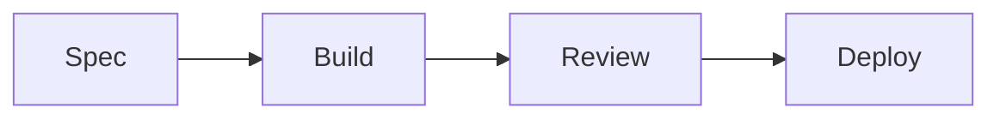

# Doc Style

## Three Rules

1. **Value only** - Include only information that helps someone
2. **Mermaid for diagrams** - Visual > text for complex flows
3. **Structure over prose** - Tables and bullets, not paragraphs

---

## Value Only

Ask: "Does this help someone do something?"

| Include | Skip |
|---------|------|
| How to do X | History of X |
| What to avoid | Obvious statements |
| Quick reference | Verbose explanations |

```markdown
# Good: Actionable
Run `npm install` then `npm run dev`

# Bad: No value added
This project uses npm for package management.
```

---

## Mermaid for Diagrams

Use mermaid for:
- Workflows and processes
- Architecture overviews
- Decision trees



Keep diagrams simple. If it needs explanation, simplify it.

---

## Structure Over Prose

| Instead of... | Use... |
|---------------|--------|
| Long paragraphs | Bullet points |
| Inline lists | Tables |
| Narrative | Headers + short sections |

```markdown
# Good: Scannable
| Command | Purpose |
|---------|---------|
| `dev` | Start server |
| `test` | Run tests |

# Bad: Wall of text
To start the development server you can run the dev command.
If you want to run tests instead, use the test command.
```

---
> Converted and distributed by [TomeVault](https://tomevault.io/claim/SergiuSavva) — claim your Tome and manage your conversions.
<!-- tomevault:4.0:windsurf_rules:2026-04-09 -->
