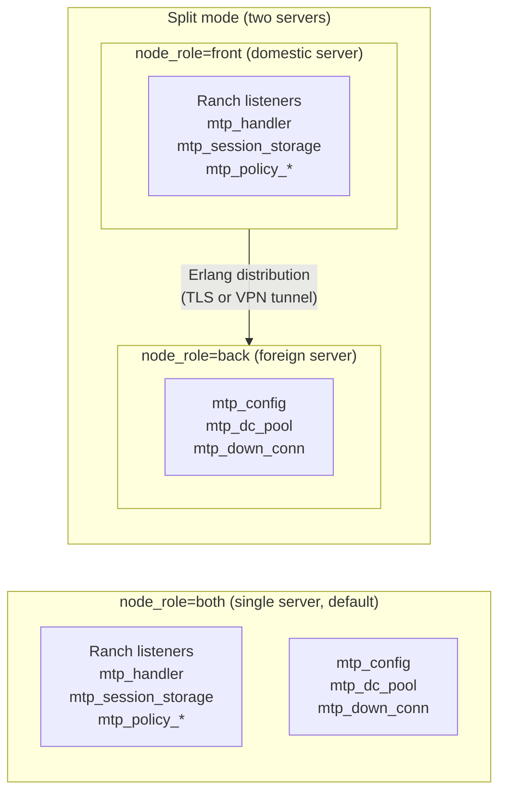

# AGENTS.md

## Project Overview

This is a high-performance **Telegram MTProto proxy** written in **Erlang/OTP**. It sits between Telegram
clients and Telegram servers, helping users bypass DPI-based censorship. It supports multiple anti-detection
protocols (fake-TLS, obfuscated/secure), connection multiplexing, replay attack protection, domain fronting,
and flexible connection policies.

## Repository Layout

```
src/              Erlang source files (OTP application)
test/             EUnit, Common Test, and PropEr test suites + benchmarks
config/           Example configs (sys.config.example, vm.args.example)
rebar.config      Build tool configuration and dependencies
Makefile          Build, test, install targets
start.sh          Foreground start script for development
Dockerfile        Docker image build
```

### Key source modules

| Module                                           | Role                                                  |
|--------------------------------------------------|-------------------------------------------------------|
| `mtp_handler`                                    | Accepts client TCP connections (Ranch listener)       |
| `mtp_obfuscated`                                 | Obfuscated MTProto protocol (client-side codec)       |
| `mtp_fake_tls`                                   | Fake-TLS protocol (mimics TLSv1.3 + HTTP/2)           |
| `mtp_secure`                                     | "Secure" randomized-packet-size protocol              |
| `mtp_dc_pool` / `mtp_down_conn`                  | Pooled/multiplexed connections to Telegram DCs        |
| `mtp_rpc`                                        | RPC framing protocol between proxy and Telegram       |
| `mtp_config`                                     | Periodically fetches Telegram DC configuration; in split mode exposes `backend_node/0` and remote-aware `get_downstream_pool/1` / `get_default_dc/0` |
| `mtp_policy` / `mtp_policy_table`                | Connection limit, blacklist, and whitelist rules      |
| `mtp_codec` / `mtp_aes_cbc`                      | Codec pipeline (MTProto framing + AES-CBC encryption) |
| `mtp_abridged` / `mtp_full` / `mtp_intermediate` | MTProto transport codec variants                      |
| `mtp_metric`                                     | Metrics/telemetry; `passive_metrics/0` is role-aware  |
| `mtp_session_storage`                            | Replay-attack protection (session deduplication)      |
| `mtproto_proxy_sup`                              | Root supervisor; calls `children(Role)` — children differ by `node_role` |
| `mtproto_proxy_app`                              | OTP application callback; `start/2` and `config_change/3` are role-gated |

### Process architecture

**Role overview** — what starts in each `node_role`:



```
OTP supervision tree
────────────────────────────────────────────────────────────────────
The supervisor is role-parameterised via the `node_role` config key
(`front | back | both`, default `both`).  Each role starts a different
subset of children:

  node_role=both  (default — single server)
  ├── mtp_config            (gen_server, singleton)
  ├── mtp_session_storage   (gen_server, singleton)
  ├── mtp_dc_pool_sup       (supervisor, simple_one_for_one)
  │    └── mtp_dc_pool      (gen_server, one per DC id, permanent)
  ├── mtp_down_conn_sup     (supervisor, simple_one_for_one)
  │    └── mtp_down_conn    (gen_server, one per Telegram TCP conn, temporary)
  └── Ranch listeners       (one per configured port: mtp_ipv4, mtp_ipv6, …)
       └── mtp_handler      (gen_server, one per client TCP conn, transient)

  node_role=front  (domestic server — accepts Telegram clients)
  ├── mtp_session_storage
  ├── mtp_policy_table
  ├── mtp_policy_counter
  └── Ranch listeners → mtp_handler

  node_role=back  (foreign server — connects to Telegram DCs)
  ├── mtp_config
  ├── mtp_dc_pool_sup → mtp_dc_pool
  └── mtp_down_conn_sup → mtp_down_conn

In split mode, the front node holds `back_node` in its config and
addresses back-node processes as `{RegisteredName, BackNode}`.
Multiple front nodes can share one back node.
```

**Data-plane message flow** — see [`doc/handler-downstream-flow.md`](doc/handler-downstream-flow.md)
for the full sequence diagram (pool lookup, steady-state data exchange, connection release) and
[`doc/migration-flow.md`](doc/migration-flow.md) for transparent DC connection rotation.
Both diagrams show the front/back node boundary. In `both` mode all processes share the same
node and there is no distribution overhead.


<!-- Content truncated to meet Windsurf 6KB limit -->

---
> Source: [seriyps/mtproto_proxy](https://github.com/seriyps/mtproto_proxy) — distributed by [TomeVault](https://tomevault.io).
<!-- tomevault:4.0:windsurf_rules:2026-07-20 -->
