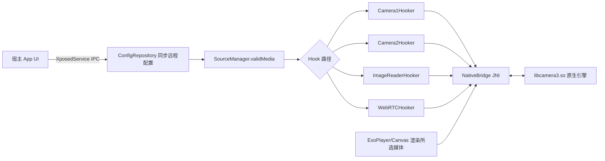

# Camera2 Magic - AI 项目指南

> 本文件用于帮助 AI（Codex 等）快速理解 `Camera2Magic` 项目，并在修改代码时遵守开发规范。
> 适用读者：任何需要在仓库内阅读、修改、构建代码的开发者或 AI 代理。

## 1. 项目是什么

**Camera2 Magic（包名 `com.nothing.camera2magic`，产物名 CAM2Magic）** 是一个基于
**LSPosed / libxposed（API 102）** 的 **Android 虚拟摄像头模块**：

- 用户在“作用域”页的每个应用配置（AppConfig）中按应用选择照片 / 视频作为“虚拟摄像头”内容；
- 当被 Hook 的应用调用
  Camera1 / Camera2 / ImageReader / WebRTC 等路径请求摄像头时，
  模块用所选媒体替换真实画面；
- 宿主 App 与 Hook 进程通过 `XposedService` IPC 共享配置和媒体文件。

架构上它是 **“Xposed Hook 引擎 + Compose 宿主 UI”一体化单模块工程**，且带有一个
**预编译的 C++ 原生库 `libcamera3.so`**（源码不在本仓库内）。

## 2. 技术栈与关键版本

| 项目 | 版本 / 值 |
| --- | --- |
| 构建系统 | Gradle 9.5.0（腾讯云镜像分发），AGP 9.3.0 |
| 原生依赖 | libjpeg-turbo 3.1.3（预编译 `.so` 静态链入，源码不入库） |
| Kotlin | 2.4.10（jvmTarget 11，官方代码风格） |
| SDK | compileSdk 37（release DSL），minSdk 33，targetSdk 36 |
| NDK | 29.0.14206865（仅本地原生构建需要；源码不入库，公开仓库不配置 CMake） |
| UI | Jetpack Compose + **Miuix 0.9.3**（HyperOS 风格组件库） |
| 导航 | androidx.navigation3 1.1.4（`Route` 为 @Serializable sealed 层级）+ `miuix-navigation3-ui`（随 Miuix 0.9.3） |
| 播放器 | media3-exoplayer 1.10.0（`ExoPlayer` + 自定义 `DataSource`） |
| Hook 框架 | libxposed：`compileOnly api:102.0.0` + `implementation service:102.0.0` |
| 序列化 | kotlinx.serialization-json 1.7.3（导航栈持久化） |
| 其他 | hiddenapibypass 6.1、accompanist-permissions、kotlinx-collections-immutable |

## 3. 目录结构

```text
Camera2Magic/
├── app/
│   ├── build.gradle                 # 版本、签名、ABI split、打包 jniLibs
│   ├── cam2magic.keystore*          # 本地 release 密钥（gitignored，不入库）
│   ├── keystore.properties*         # 本地 release 签名配置（gitignored，不入库）
│   ├── proguard-rules.pro           # keep native 方法与 com.nothing.camera2magic.**
│   └── src/main/
│       ├── AndroidManifest.xml      # 单 Activity，QUERY_ALL_PACKAGES + FileProvider
│       ├── java/com/nothing/camera2magic/
│       │   ├── MagicHook.kt         # Xposed 入口（java_init.list）
│       │   ├── GlobalState.kt       # 跨进程内存态（appContext/processName/activityCount）
│       │   ├── MainActivity.kt      # 宿主 UI 入口 + AppNavigation + 主题装载
│       │   ├── hook/                # ★ Hook 引擎（核心）
│       │   │   ├── Camera1Hooker.kt / Camera2Hooker.kt
│       │   │   ├── ImageReaderHooker.kt / WebRTCHooker.kt
│       │   │   ├── Camera3.kt / Camera3Extended.kt   # ExoPlayer 渲染端
│       │   │   ├── NativeBridge.kt  # JNI 桥（external fun 列表）
│       │   │   ├── BlackHole.kt / ShortId.kt         # 假 Surface 池 / 日志标识
│       │   │   ├── MagicDataSource.kt / MagicMedia.kt / SourceManager.kt
│       │   │   └── HookManager.kt  # safeHook 工具接口
│       │   ├── ui/                  # Compose UI（screen/component/navigation3/theme/util）
│       │   ├── utils/Dog.kt         # 日志单例（StateFlow + logcat 桥接监听）
│       │   ├── utils/MediaPathResolver.kt  # content:// 媒体解析为可展示路径
│       │   └── viewmodel/           # ConfigRepository + 3 个 ViewModel + Factory + CompositionLocals
│       ├── res/values{, -zh-rCN}/strings.xml  # 英文 + 中文文案
│       ├── res/xml/file_paths.xml   # FileProvider 导出路径
│       ├── jniLibs/{arm64-v8a}/libcamera3.so   # 预编译原生库（闭源，源码不入库）
│       └── resources/META-INF/xposed/  # module.prop / java_init.list / native_init.list / scope.list
├── app/src/test/                   # 单元测试（LogcatParserTest 等）
├── build.gradle / settings.gradle / gradle.properties / gradle/libs.versions.toml
└── local.properties                # 本机 SDK 路径，不入库
```

> 注意：公开仓库只含预编译 `.so`，原生源码仅在本地工作区维护（`app/src/main/cpp/`，
> 已加入 `.gitignore` 不入库）。常规构建直接使用 `jniLibs`。

## 4. 核心架构与数据流

### 4.1 总体流程



### 4.2 配置流（宿主 → Hook 进程）

1. 宿主 UI 通过 `ConfigRepository`（本地 `SharedPreferences("camera_magic_config")`）读写配置；
2. `XposedServiceHelper.registerListener` 绑定成功后 `syncAllToRemote()` 把本地全部键推到
   `service.getRemotePreferences("camera_magic_config")`；
3. 媒体文件通过 `openRemoteFile(fileName)` 写入 Hook 进程可读的文件描述符
   （`prepareRemoteMedia`），`MagicHook.openRemoteFile` 在 Hook 侧读取；
4. Hook 进程内 `SourceManager.refreshPrefs()` 按当前包（`GlobalState.processName`）读取
   **按应用配置**并计算 `validMedia`：`app_media_mode_<pkg>` 为 `photo`/`video` 时取
   `app_remote_photo/video_<pkg>` 远程文件；否则 `validMedia = null`（不替换）。
   全局媒体键已移除。

### 4.3 运行流（Hook 侧）

1. `MagicHook.onPackageReady`（仅 `isFirstPackage`）→ `SourceManager.init` →
   Hook `Application.onCreate` 取得 `appContext`，并注册前台 Activity 监听，
   首个 Activity 启动时 `refreshAndDispatch()`（重新解析媒体、可弹 Toast）；
2. `Camera1Hooker` / `Camera2Hooker`：把应用真实预览 Surface 换成 `BlackHole`
   假 Surface，原 Surface 通过 `NativeBridge.addRenderTarget` 交给原生引擎；
3. 同一时刻 `Camera3.start` 用 ExoPlayer 播放所选视频（或 Canvas 以 ~30fps
   绘制静态图）到 OES 纹理 → `SurfaceTexture` → 原生引擎注入到目标 Surface；
   `main_manually_rotate` 变化时通过改写 `updateCameraBaseData` 的
   sensorOri/displayOri 实时生效；
4. `ImageReaderHooker`：`format=256`(JPEG) 拍照时用所选图片按原始尺寸缩放替换
   （保留 EXIF，按字节数二分搜索压缩质量，JPEG 结果按媒体+开关缓存）；
   `format=35`(YUV) 走 `overwriteYuvBuffer` 原生覆盖；`main_fix_photo_rotation`
   开启时忽略相机 EXIF、按媒体自身方向烘焙旋转；Camera1 拍照路径同样支持
   （关闭时走原生 `overwriteJPEGBytes`）；

<!-- Content truncated to meet Windsurf 6KB limit -->

---
> Source: [servant1228/Camera2Magic](https://github.com/servant1228/Camera2Magic) — distributed by [TomeVault](https://tomevault.io).
<!-- tomevault:4.0:windsurf_rules:2026-08-13 -->
