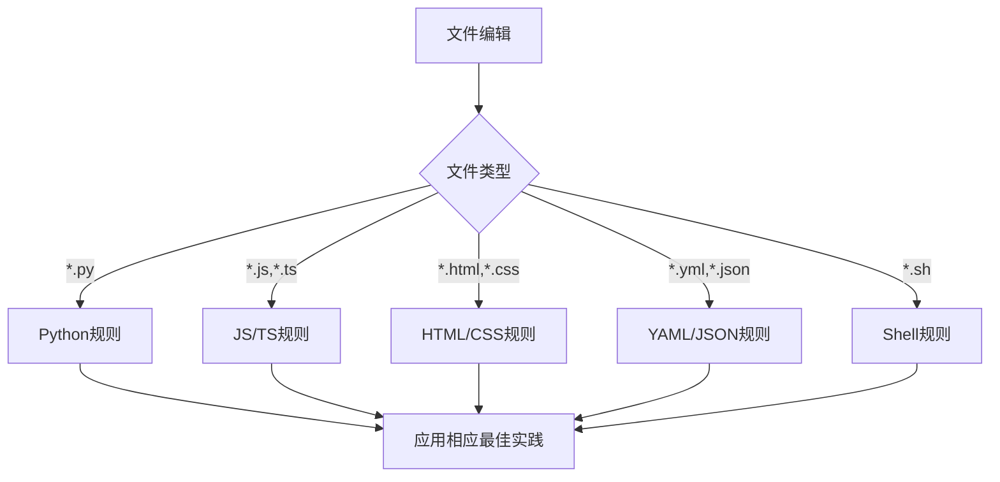

# 语言特定规则总览

基于awesome-cursorrules的语言特定规则，根据文件类型自动应用相应的编码规范。

## 规则映射

### Python文件 (*.py)
- **规则文件**: [python-specific.mdc](mdc:python-specific.mdc)
- **应用范围**: 所有Python文件
- **重点**: 类型注解、文档字符串、Django最佳实践

### JavaScript/TypeScript文件 (*.js, *.ts, *.jsx, *.tsx)
- **规则文件**: [javascript-typescript.mdc](mdc:javascript-typescript.mdc)
- **应用范围**: 前端JavaScript和TypeScript文件
- **重点**: 类型安全、React最佳实践、现代ES特性

### HTML/CSS文件 (*.html, *.css, *.scss, *.sass, *.less)
- **规则文件**: [html-css.mdc](mdc:html-css.mdc)
- **应用范围**: 前端模板和样式文件
- **重点**: 语义化HTML、现代CSS特性、响应式设计

### 配置文件 (*.yml, *.yaml, *.json)
- **规则文件**: [yaml-json.mdc](mdc:yaml-json.mdc)
- **应用范围**: 配置文件和数据文件
- **重点**: 格式规范、验证、环境配置

### Shell脚本 (*.sh, *.bash, *.zsh, *.fish)
- **规则文件**: [shell-scripts.mdc](mdc:shell-scripts.mdc)
- **应用范围**: 部署脚本和自动化脚本
- **重点**: 错误处理、安全性、可维护性

## 自动应用机制

Cursor会根据文件扩展名自动应用相应的规则：

## 规则优先级

1. **语言特定规则** - 最高优先级
2. **项目特定规则** - 中等优先级
3. **通用编程规则** - 基础优先级

## 使用指南

### 开发时
- 编辑Python文件时，自动应用Python最佳实践
- 编写前端代码时，自动应用JavaScript/TypeScript规范
- 修改配置文件时，自动应用YAML/JSON格式要求

### 代码审查时
- 检查是否遵循了相应语言的编码规范
- 验证类型注解和文档字符串的完整性
- 确保代码风格的一致性

### 部署时
- Shell脚本遵循安全性和错误处理规范
- 配置文件符合格式和验证要求
- 所有文件都符合项目整体标准

## 规则更新

当需要更新语言特定规则时：
1. 修改对应的 `.mdc` 文件
2. 确保规则与项目需求一致
3. 测试规则的有效性
4. 更新文档说明

## 自定义规则

如果需要为特定项目添加自定义规则：
1. 在对应的语言规则文件中添加
2. 使用 `globs` 字段指定应用范围
3. 确保与现有规则不冲突
4. 添加适当的文档说明

---
> Source: [shinytsing/modeshift_django](https://github.com/shinytsing/modeshift_django) — distributed by [TomeVault](https://tomevault.io).
<!-- tomevault:4.0:windsurf_rules:2026-05-22 -->
