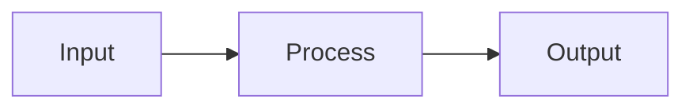

# CLAUDE.md — Claude Code Mastery Course

## PROJECT OVERVIEW

This is a comprehensive, professional-grade course teaching developers how to master Claude Code (Anthropic's CLI coding agent). The course targets senior developers and will be published as:

- **Digital course** (Markdown → Docusaurus/MkDocs website)
- **NotebookLM source** (upload .md directly)
- **Printed book** (Markdown → Pandoc → DOCX → InDesign/Canva → Print)
- **Workshop material** (DEMO + PRACTICE sections used as live exercises)

**Languages**: English (`/en/`) and Vietnamese (`/vi/`) — always maintain both in sync.

**Author**: Ethan Nguyen (Senior Android Engineer, 12+ Years, Vietnam-based, KMP/Android/Backend expert)

---

## COURSE STRUCTURE

- **16 Phases** → **55 Modules** → **~200+ Topics**
- Each phase is a directory: `phase-XX-name/`
- Each module is a file: `XX-module-name.md`
- Both languages follow identical structure and numbering

### Directory Layout

```
claude-code-mastery/
├── CLAUDE.md                     ← THIS FILE (project rules for Claude Code)
├── README.md                     ← Course overview (bilingual)
├── SUMMARY.md                    ← Full table of contents
│
├── en/                           ← English content
│   ├── phase-01-foundation/
│   │   ├── 01-installation.md
│   │   ├── 02-interfaces-modes.md
│   │   └── 03-context-basics.md
│   ├── phase-02-security/
│   │   └── ...
│   └── ...
│
├── vi/                           ← Vietnamese content
│   ├── phase-01-foundation/
│   │   ├── 01-installation.md
│   │   └── ...
│   └── ...
│
├── assets/
│   ├── diagrams/                 ← Mermaid source + exported PNG
│   └── screenshots/              ← Annotated screenshots
│
├── cheatsheets/
│   ├── en/
│   └── vi/
│
├── templates/                    ← CLAUDE.md templates, prompt recipes
│   ├── claude-md-kmp.md
│   ├── claude-md-backend.md
│   └── ...
│
└── scripts/
    ├── build-pdf.sh              ← Pandoc build pipeline
    ├── build-docx.sh
    └── build-site.sh
```

---

## TEACHING METHODOLOGY: Progressive Hands-on Hybrid

Every module MUST follow the **7-Block Structure** exactly. No exceptions. This ensures consistency across all 55 modules, both languages, and all output formats.

### The 7 Blocks (Mandatory)

| # | Block | Purpose | Target Length |
|---|-------|---------|--------------|
| 1 | **WHY** | Real pain point, motivation | 3-5 sentences |
| 2 | **CONCEPT** | Core mental model, theory | 1-2 paragraphs + diagram |
| 3 | **DEMO** | Step-by-step walkthrough | 5-15 steps, copy-paste ready |
| 4 | **PRACTICE** | Hands-on exercise | 1-3 exercises with expected output |
| 5 | **CHEAT SHEET** | Quick reference table | 1 page max, scannable |
| 6 | **PITFALLS** | Common mistakes | 3-7 items, ❌ Wrong → ✅ Right format |
| 7 | **REAL CASE** | Production scenario | 1 concrete story from real projects |

---

## MODULE TEMPLATE

Every module file MUST start with this exact structure:

```markdown
# Module X.Y: [Module Title]

> **Estimated time**: ~XX minutes
> **Prerequisite**: Module X.Z (or "None")
> **Outcome**: After this module, you will be able to [specific skill]

---

## 1. WHY — Why This Matters

[2-5 sentences describing a REAL pain point. Start with a scenario the reader
can relate to. Make them feel "yes, I need this." No fluff.]

---

## 2. CONCEPT — Core Ideas

[Explain the mental model. Use analogies. Include a diagram (Mermaid) if the
concept involves flow, architecture, or relationships.

If a diagram is needed, use this format:]



[Keep theory concise. This is NOT a textbook — just enough to understand
the WHY behind each command/feature.]

---

## 3. DEMO — Step by Step

[Numbered steps. Each step has:
1. What to do (command or action)
2. What you'll see (expected output)
3. Why it matters (1 sentence explanation)

ALL commands must be real, tested, copy-paste ready.
Use realistic project names and file structures.]

**Step 1: [Action]**
```bash
command here
```
Expected output:
```
output here
```

**Step 2: [Action]**
...

---

## 4. PRACTICE — Try It Yourself

### Exercise 1: [Title]
**Goal**: [What to accomplish]
**Instructions**:
1. ...
2. ...
3. ...

**Expected result**: [What success looks like]

<details>
<summary>💡 Hint</summary>
[Hint without giving full answer]
</details>

<details>
<summary>✅ Solution</summary>
[Full solution with explanation]
</details>

---

## 5. CHEAT SHEET

| Command / Feature | Description | Example |
|---|---|---|
| `command` | What it does | `usage example` |

---

## 6. PITFALLS — Common Mistakes

| ❌ Mistake | ✅ Correct Approach |
|---|---|
| Doing X without Y | Always do Y first because... |

---

## 7. REAL CASE — Production Story

**Scenario**: [Brief description of real situation]
**Problem**: [What went wrong or what was needed]
**Solution**: [How Claude Code was used to solve it]
**Result**: [Outcome with specific metrics if possible]

---

> **Next**: [Module X.Z: Title](link) →
```

---

## WRITING RULES

### Voice & Tone
- **Conversational but authoritative** — like a senior dev mentoring a colleague

<!-- Content truncated to meet Windsurf 6KB limit -->

---
> Source: [ShipWithAI/claude-code-mastery](https://github.com/ShipWithAI/claude-code-mastery) — distributed by [TomeVault](https://tomevault.io).
<!-- tomevault:4.0:windsurf_rules:2026-04-22 -->
