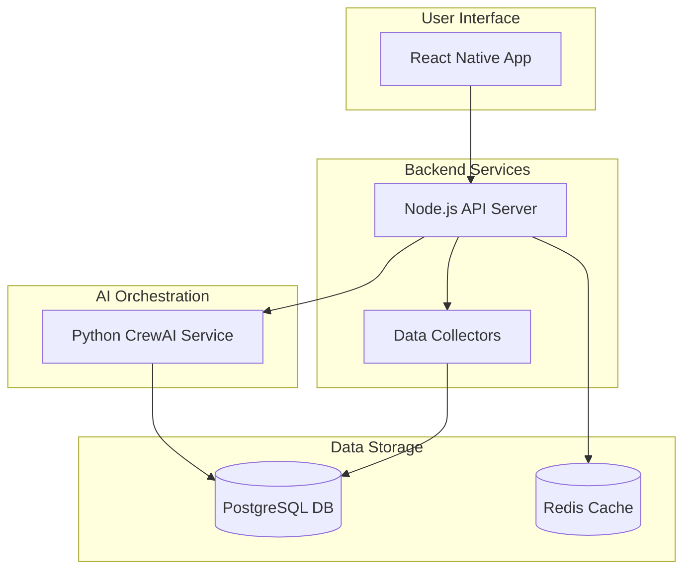

# Gemini Project Overview: Crypto Token Analyzer

This document provides a high-level overview of the Crypto Token Analyzer project, a sophisticated platform designed to provide comprehensive cryptocurrency analysis by orchestrating a suite of specialized AI agents.

## 1. Product Vision

The Crypto Token Analyzer is a local-first, mobile-first application that automates the collection, analysis, and scoring of cryptocurrency tokens. It leverages a multi-agent AI system to deliver intelligent investment recommendations, real-time market insights, and advanced portfolio management. The platform's unique value proposition lies in its integration of 13+ specialized AI agents, including industry-first capabilities for **MEV (Maximal Extractable Value) analysis, regulatory intelligence, cross-chain opportunity analysis, behavioral finance, and future-proof technology security**.

## 2. Core Architecture

The system is designed with a hybrid microservices architecture, separating concerns between a Node.js backend and a Python AI orchestration service.

-   **Frontend**: A React Native application provides a rich, mobile-first user experience.
-   **Backend (Node.js/Express.js)**: Acts as the API gateway, handling user requests, managing data collection, and coordinating with the Python AI service.
-   **AI Service (Python/FastAPI/CrewAI)**: The core of the platform, where a CrewAI-based multi-agent system performs detailed analysis. This service orchestrates 13+ specialized AI agents, each focused on a specific domain of analysis.
-   **Data Layer**: A PostgreSQL database serves as the central repository for all collected data, analysis results, and user information, with Redis used for caching to ensure high performance.
-   **Data Collectors**: A suite of services continuously gathers data from various sources, including RSS feeds, CoinGecko, social media platforms, and direct blockchain analysis.

## 3. Key Technical Components

-   **AI Agent Orchestration**: The system's intelligence is driven by the **CrewAI framework**, which manages a crew of specialized agents. Each agent is a Large Language Model (LLM) powered by **Google's Gemini 2.0 Flash**, fine-tuned for its specific role.
-   **Specialized AI Agents**: The crew includes agents for:
    -   Sentiment Analysis
    -   Fundamental Research
    -   Vision (for document/chart analysis)
    -   Technical Analysis
    -   Market Intelligence
    -   Portfolio Management
    -   DeFi Analysis
    -   **Regulatory Intelligence**
    -   **Cross-Chain Analysis**
    -   **MEV Analysis**
    -   **Behavioral Psychology**
    -   **Future-Tech Security**
    -   A **Master Agent** to synthesize all findings.
-   **Service Communication**: The Node.js and Python services communicate via a well-defined REST API, ensuring loose coupling and independent scalability.
-   **Local-First Data**: All data is stored locally, providing fast access, offline capabilities, and user privacy.

## 4. Project Structure

The project is organized as a monorepo to facilitate development and dependency management across the different services:

-   `/backend`: The Node.js API server.
-   `/ai-service`: The Python FastAPI and CrewAI service.
-   `/mobile`: The React Native application.
-   `/shared`: Shared TypeScript types and interfaces.

## 5. Getting Started

The development environment is managed with Docker Compose for the database and Redis instances. The backend and AI services can be run locally, providing a complete, self-contained development setup. See `tech.md` for detailed setup instructions and common commands.

This `gemini.md` file serves as a starting point for understanding the project. For more detailed information, please refer to the other documents in this repository, which cover the product, design, requirements, and technology stack in greater depth.

---
> Converted and distributed by [TomeVault](https://tomevault.io/claim/smarttoken101)
> This is a context snippet only. You'll also want the standalone SKILL.md file — [download at TomeVault](https://tomevault.io/claim/smarttoken101)
<!-- tomevault:4.0:windsurf_rules:2026-04-07 -->
