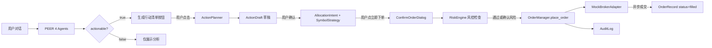

# AGENTS.md

> WealthPilot 项目级 AI Agent 协作说明
> 当前版本：v3.6.0 | 最后更新：2026-05-13

本文件遵循 [AGENTS.md 开放标准](https://agents.md/)，为 AI 编程助手（Claude Code / Cursor / Cline 等）提供项目上下文与协作约定。

## 项目概述

WealthPilot 是 AI 驱动的个人投资决策工作台。本地运行，数据私有，帮助个人投资者从"凭直觉"过渡到"系统化决策"。

核心能力覆盖 5 种意图：
- PositionDecision：单标决策（买入/持有/减仓/止损/止盈）
- PortfolioReview：组合健康度全面评估
- AssetAllocation：资产配置方案生成
- PerformanceAnalysis：收益表现归因分析
- Education：投资知识科普 / 通用对话

## 当前架构（v3.2）

WealthPilot v3.2 是 Multi-Agent + Skills 协议架构，参考蚂蚁 agentUniverse PEER 模式与 Anthropic Skills 开放标准。v3.2 新增投资行动模块，实现从"AI 分析建议"到"用户确认下单"的完整闭环。

### PEER 4 Agent

| Agent | 职责 | 关键代码 |
|-------|------|---------|
| PlanningAgent | 意图识别 + Skill 选择 + 路由（position_single / position_multi / portfolio / general） | `backend/agents/planning_agent.py` |
| ExecutingAgent | 数据加载（持仓/纪律/投研/市场行情）+ 信号生成 + 市场数据多源 fallback（Futu/AV/Tiger）+ 新建仓分支（v3.4 M8,target_position=None+买入意图） | `backend/agents/executing_agent.py` |
| ExpressingAgent | LLM 流式输出（唯一 AsyncGenerator）+ actionable 硬规则判断 + 新建仓 prompt 模板（v3.4 M8,_CHAT_FORMAT_NEW_ENTRY） | `backend/agents/expressing_agent.py` |
| ReviewingAgent | 硬校验（必填字段/格式）+ LLM 评分（0-1）+ retry/fallback 决策 | `backend/agents/reviewing_agent.py` |

数据契约：`backend/agents/contracts.py`（PlanningOutput / ExecutionOutput / ExpressionOutput / ReviewOutput）
类型适配：`backend/agents/adapters.py`（Tool Output → 业务对象转换）

#### Actionable 判断（ExpressingAgent）

ExpressingAgent 在流式输出完成后，基于 `structured_payload.decisionType` 判断是否可生成行动清单：
- `decisionType ∈ {buy_init, buy_more, trim, exit}` → `actionable=true`，前端显示"生成行动清单"按钮
- 其他 decisionType → `actionable=false`，按钮不出现

### 12 个原子能力 Skill

原子 Skill（10 个）：
- 数据获取：`wp-fetch-holdings` / `wp-fetch-research` / `wp-check-discipline`
- 知识检索：`wp-retrieve-principles`（v3.6 新增，检索投资纪律/风格/配置原则）
- 计算分析：`wp-calc-allocation-deviation` / `wp-generate-signals` / `wp-propose-allocation`
- LLM 推理：`wp-reasoning`（参数化 prompt 模板）
- 输出规范：`wp-citation-rules` / `wp-output-validator`

组合 Skill（1 个）：
- `wp-load-context`（封装 data_loader.load 装配逻辑，含 v3.6 RAG 第 7a/7b 步）

旁路 Skill（1 个）：
- `wp-action-planner`（不在 PEER 主链路上，由用户点击"生成行动清单"按钮触发）

#### 知识检索 Skill 语义二分法（v3.6）

| Skill | 语义边界 | 数据源 |
|-------|---------|--------|
| `wp-fetch-research` | 标的相关投研（"这个标的怎么样"） | 联网搜索 + 盈米 MCP + 本地投研卡 + 知识库 RAG |
| `wp-retrieve-principles` | 用户原则（"我的约束是什么"） | 知识库 RAG（纪律 + 风格 + 配置原则） |

代码位置：`skills/wp-*/SKILL.md`

#### wp-action-planner 详解

- **角色**：旁路调用，用户点击按钮 → 前端调 `/api/action/drafts/generate` → 后端调 ActionPlanner
- **输入**：对话上下文 + expressing_output（含 decisionType / recommendedAction / target_position / current_price / estimated_shares）
- **输出**：ActionListDraft（symbol_strategies[] / allocation_intents[] / risk_notes[] / missing_fields[]）
- **推算规则**（PRD v0.6 "积极推算"模式）：
  - quantity：从目标仓位% + estimated_shares 反算具体股数
  - limit_price：对话有明确限价用对话值；无明确限价用 current_price 兜底；current_price 未知才放 missing_fields
  - value_sources：每个推算字段标注依据
- **代码位置**：`backend/services/action/action_planner.py`

### 投资行动模块架构

三层状态机（从粗到细）：

```
AllocationIntent（组合级调整意图）
  ├── SymbolStrategy（单标的执行策略）1:N
  │     ├── OrderRecord（券商订单）1:N
  │     │     状态: created → submitted_to_broker → filled/rejected/cancelled
  │     │     MockBrokerAdapter 异步 5s 模拟成交
  │     └── cumulative_filled_quantity 自动回写
  └── status: active ↔ paused → completed | discarded
```

核心组件：

| 组件 | 职责 | 代码位置 |
|------|------|---------|
| OrderManager | 草稿 CRUD + 策略暂停/恢复/作废 + 订单创建/提交/状态同步 | `backend/services/action/order_manager.py` |
| RiskEngine | 下单前风控检查（3 条规则） | `backend/services/action/risk_engine.py` |
| BrokerAdapter | 券商抽象接口（place_order / get_order_status） | `backend/services/action/brokers/base.py` |
| TigerBrokerAdapter | Tiger 老虎证券（美股+港股 LIMIT 单,v3.4） | `backend/services/action/brokers/tiger.py` |
| MockBrokerAdapter | Mock 券商（异步 5s 成交，用于开发/演示） | `backend/services/action/brokers/mock.py` |
| CredentialProvider | 凭证管理抽象层（Keyring / InMemory,v3.4） | `backend/services/action/brokers/credentials.py` |
| OrderPoller | 订单状态后台轮询（3-5s 间隔,v3.4） | `backend/services/action/order_poller.py` |
| StateMachine | 状态流转校验（draft/strategy/order 三层独立） | `backend/services/action/state_machine.py` |
| AuditLog | 审计日志（append-only，含 ip_address / user_agent） | `backend/services/action/models.py` |

RiskEngine 三条规则：
1. 单笔金额占总资产 >5% → warning（需文字确认"我已知晓风险并坚持下单"）
2. 操作后单标的持仓占比 >40% → warning（卖出操作跳过此检查）
3. 纪律违反（复用 wp-check-discipline 简化版）→ warning

### 端到端数据流



## 技术栈

### 前端
- React 19 + Vite + TypeScript
- Tailwind CSS v4（`index.css` @theme 注册 Ocean 色系）
- Radix UI（Dialog）+ lucide-react 图标
- SSE 流式消费（fetch + ReadableStream）

### 后端
- FastAPI + SQLAlchemy + SQLite
- OpenAI SDK（GPT-4.1 主模型 + GPT-4.1-mini 评分/ActionPlanner 模型）
- Anthropic Skills 协议（12 个 SKILL.md）
- MCP 协议（盈米基金诊断 MCP 接入）
- 市场数据多源：Futu OpenD（optional）/ Alpha Vantage / Tiger OpenAPI

### 评测
- 18 个 yaml 用例（5 意图覆盖）
- L1（intent）/ L2（决策质量）/ L3（端到端）三层评测
- HTML 报告生成

## 目录结构（关键路径）

```
backend/

<!-- Content truncated to meet Windsurf 6KB limit -->

---
> Source: [song-buaa/WealthPilot](https://github.com/song-buaa/WealthPilot) — distributed by [TomeVault](https://tomevault.io).
<!-- tomevault:4.0:windsurf_rules:2026-06-25 -->
