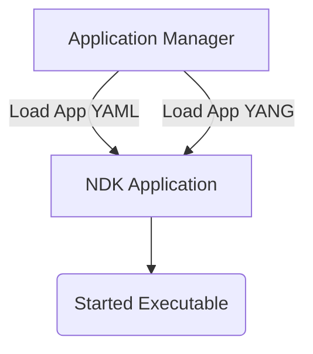

# Agent Structure

As was explained in the [NDK Architecture](architecture.md) section, an NDK agent[^10] is a custom software that can extend SR Linux capabilities by running alongside SR Linux's native applications and perform some user-defined work.

To deeply integrate with the rest of the SR Linux architecture, the agents have to be defined like an application that SR Linux's application manager can take control of. The structure of the agents is the main topic of this chapter.

<div class="grid" markdown>
<div markdown>
The main three components of an agent:

1. An executable file
2. A YANG module
3. Application configuration file

SR Linux application manager (which is like `systemd`) onboards the NDK application by reading its configuration file and YANG models and then starts the agent's executable file. We will cover the role of each of these components in the subsequent sections of this chapter.

</div>



</div>

## Application manager and Application configuration file

Recall the decoupled nature of SR Linux's architecture where each application is a separate process. Application manager is the service that is responsible for starting, stopping, and restarting applications, as well as for monitoring their health.

Both native SR Linux applications (AAA, LLDP, BGP, etc.) and NDK agents are managed by the application manager. Applications that are managed by the application manager should have a configuration file[^30] that describes the application and its lifecycle. For native SR Linux applications the app config files are located by the `/opt/srlinux/appmgr` path, and for NDK agents, the files are located by the `/etc/opt/srlinux/appmgr` path.

With an agent's config file, users define properties of an application, for example:

* application version
* location of the executable file
* YANG modules related to this app
* lifecycle management policy

NDK agents must have their config file present by the `/etc/opt/srlinux/appmgr` directory. It is a good idea to name the agent's config file after the agent's name; if we have the agent called `greeter`, then its config file can be named `greeter.yml` and stored by the `/etc/opt/srlinux/appmgr/greeter.yml` path.

Let's have a look at configuration file for a simple `greeter` NDK written in Go:

```yaml
greeter:
  path: /usr/local/bin #(1)!
  launch-command: greeter #(2)!
  version-command: greeter --version #(3)!
  failure-action: wait=10 #(4)!
  config-delivery-format: json #(5)!
  yang-modules:
    names:
      - "greeter" #(6)!
    source-directories:
      - "/opt/greeter/yang"   #(7)!
```

1. The path to use when searching for the executable file.
2. The binary app manager will launch. Relative to the `path`.
3. The command to run to get the version of the application. The version can be seen in the output of `show / system application <app name>`.
4. An action to carry out when the application fails (non zero exit code). The action can be one of the following:
    * `reboot` - reboot the system
    * `wait=<seconds>` - wait for `<seconds>` and then restart the application
5. The encoding format of the application's configuration when it is delivered to the application by the Notification Service.

    For NDK agents the recommended format is `json`.

6. The names of the YANG modules to load. This is usually the file-name without `.yang` extension.

    The YANG modules are searched for in the directories specified by the `source-directories` property.

7. The source directories where to search for the YANG modules. The `/opt/greeter/yang` directory should contain a YANG module with the `greeter` name.

    If your agent imports any existing SR Linux YANG modules, you should add the `/opt/srlinux/models/srl_nokia` directory to the list of source directories.

///details | Complete list of config files parameters

```yaml
# Example configuration file for the applications on sr_linux
# All valid options are shown and explained
# The name of the application.
# This must be unique.
application-name:
    # [Mandatory] The source path where the binary can be found
    path: /usr/local/bin
    # [Optional, default='./<application-name>'] The command to launch the application.
    # Note these replacement rules:
    #   {slot-num} will be replaced by the slot number the process is running on
    #   {0}, {1}, ... can be replaced by parameters provided in the launch request (launch-by-request: Yes)
    launch-command: "VALUE=2 ./binary_name --log-level debug"
    # [Optional, default='<launch-command>'] The command to search for when checking if the application is running.
    # This will be executed as a prefix search, so if the application was launched using './app-name -loglevel debug'
    # a search-command './app-name' would work.
    # Note: same replacement rules as launch-command
    search-command: "./binary_name"

<!-- Content truncated to meet Windsurf 6KB limit -->

---
> Source: [srl-labs/learn-srlinux](https://github.com/srl-labs/learn-srlinux) — distributed by [TomeVault](https://tomevault.io).
<!-- tomevault:4.0:windsurf_rules:2026-07-26 -->
