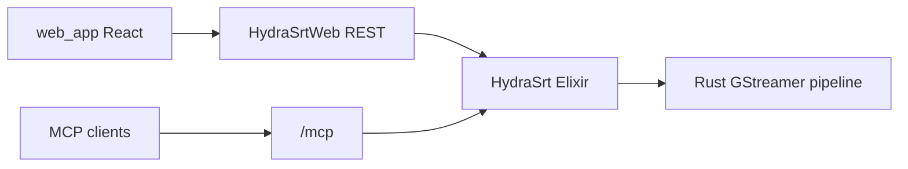

# AGENTS.md - HydraSRT Guide

## Intent

HydraSRT is an open-source SRT routing platform. The Elixir layer manages routes, configuration, and the REST/WebSocket API. The Rust/GStreamer pipeline runs as an isolated native process for media processing. The React UI (`web_app/`) talks to the backend over HTTP.

## Runtime Baseline

- Elixir `~> 1.18`
- OTP `27+` (CI baseline: Elixir 1.18.4, OTP 27.3 — see `.github/workflows/ci.yml`)
- Rust toolchain for `native/`

## Commands

| Task | Command |
|------|---------|
| First-time setup | `mix setup` |
| Local dev server | `make dev` (env vars: `docs/envs.md`) |
| Code quality gate | `mix q` or `mix quality` |
| Backend unit tests | `mix test` |
| Full test matrix | See `test/AGENTS.md` |
| CI-equivalent local run | `make test_ci_local` |
| Makefile targets | `make help` |

### Quality (`mix q`)

Runs, in order: format check, compile with warnings as errors, Credo, Sobelow, Dialyzer.

One-time Dialyzer setup (if PLT is missing):

```bash
mix dialyzer
```

## Architecture Snapshot

Three layers:

1. **Management & control (Elixir)** — `HydraSrt.Application`, `HydraSrt.RouteHandler`, `HydraSrt.RoutesSupervisor`, Ecto/SQLite for config state.
2. **Streaming (Rust + GStreamer)** — `native/` builds `priv/native/hydra_srt_pipeline`; isolated from the BEAM for stability.
3. **API & UI** — `HydraSrtWeb` (Phoenix), `web_app/` (Vite + React).
4. **MCP** — `HydraSrt.Mcp.Server` (Hermes) on `/mcp`; Human guide: [docs/mcp.md](docs/mcp.md).



## Standards

- **Language:** Write in **American English (en-US)** — documentation (`docs/`, `README.md`, `CONTRIBUTING.md`, agent/skills), code comments, commit messages, log messages meant for operators, UI copy, and developer-facing API text. Do not mix other languages in the repo unless a file is explicitly scoped to localization.
- Do not delete commented code.
- Do not use private functions (`defp`) in Elixir.
- In tests: use unique ports/IDs; avoid `Process.sleep/1` where a poll condition exists (see `test/AGENTS.md`).
- Keep human-facing docs separate from agent/machine docs:
  - Human docs: `README.md`, `CONTRIBUTING.md`, `docs/*.md`, `web_app/README.md`, `native/README.md`.
  - Agent/machine docs: `AGENTS.md`, `test/AGENTS.md`, `.agents/skills/*`.
  - Do not send human readers to `AGENTS.md` or `test/AGENTS.md`; put the needed commands or links to `docs/*.md` directly in human docs.
  - Keep agent behavior, test-matrix details, and command-routing notes in `AGENTS.md`, `test/AGENTS.md`, or skills.
- **Conventional Commits** for git messages: `type(scope): subject` in imperative mood, lowercase type.

  Common types: `feat`, `fix`, `docs`, `chore`, `test`, `refactor`, `perf`, `ci`.

  Examples:

  ```text
  feat: add route status history endpoint
  fix: make username and password configurable in development
  docs: add AGENTS.md for project guidelines
  chore: comment out npm watcher for dev
  ```

  Scope is optional (`feat(api): ...`). Keep the subject line concise; put detail in the body when needed.

## Testing

Unit tests run by default; E2E and native E2E are opt-in via tags and env vars. Full matrix, support modules, and debug flags: **`test/AGENTS.md`**.

## Agent skills

Workflow skills live under [`.agents/skills/`](.agents/skills/):

| Skill | Path |
|-------|------|
| `hydra-dev` | [`.agents/skills/hydra-dev/SKILL.md`](.agents/skills/hydra-dev/SKILL.md) |
| `frontend` | [`.agents/skills/frontend/SKILL.md`](.agents/skills/frontend/SKILL.md) |

`AGENTS.md` / `test/AGENTS.md` stay the canonical reference; skills add command routing and agent behaviour.

## Documentation

| Document | Purpose |
|----------|---------|
| [README.md](README.md) | Project overview and quick start |
| [docs/development.md](docs/development.md) | Setup, deployment, and Docker guide |
| [docs/architecture.md](docs/architecture.md) | System design and technical details |
| [CONTRIBUTING.md](CONTRIBUTING.md) | Contribution guidelines |
| [docs/api.md](docs/api.md) | REST API documentation |
| [docs/mcp.md](docs/mcp.md) | MCP server, tokens, client setup |
| [docs/envs.md](docs/envs.md) | Environment variables reference |
| [test/AGENTS.md](test/AGENTS.md) | Test suites and helpers |

## MCP (agent notes)

When changing MCP auth, tokens, or tools, read [docs/mcp.md](docs/mcp.md) for product behaviour; keep this section for code locations and tests.

## References

- [Makefile](Makefile) — dev and test targets
- [.github/workflows/ci.yml](.github/workflows/ci.yml) — CI jobs
- [test/AGENTS.md](test/AGENTS.md) — how to run all test layers

---
> Source: [streamband/hydra-srt](https://github.com/streamband/hydra-srt) — distributed by [TomeVault](https://tomevault.io).
<!-- tomevault:4.0:windsurf_rules:2026-06-06 -->
