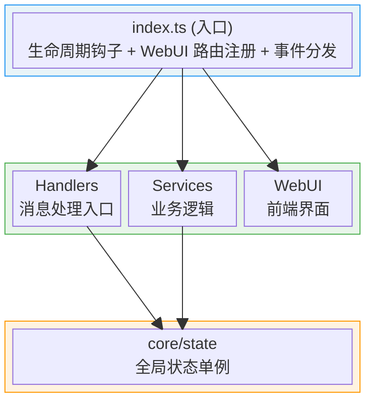
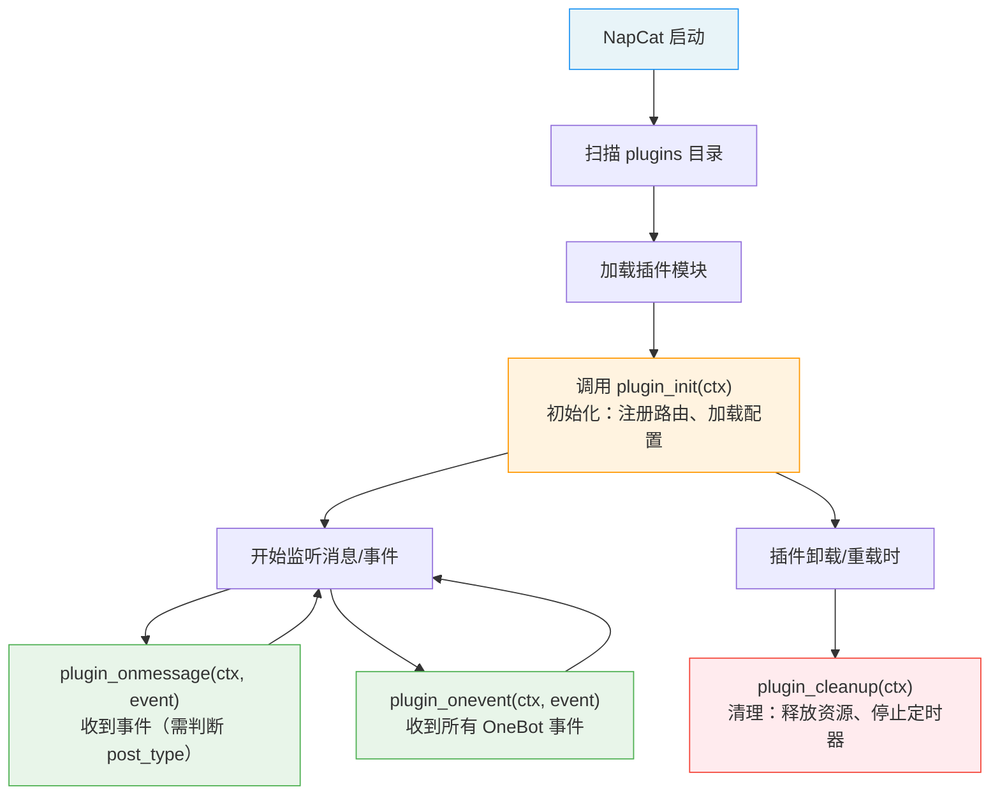

# Copilot Instructions for NapCat Plugin Template

## 目标

为 AI 编程代理提供立即可用的、与本仓库紧密相关的上下文：架构要点、开发/构建流程、约定与关键集成点，便于自动完成改进、修复与小功能。

---

## 一句话概览

这是一个面向 NapCat 的插件开发模板（TypeScript，ESM），使用 Vite 打包到 `dist/index.mjs` 作为插件入口；包含消息处理、配置管理和 WebUI 支持。

---

## 架构设计

### 分层架构



### 核心设计模式

| 模式 | 实现位置 | 说明 |
|------|----------|------|
| 单例状态 | `src/core/state.ts` | `pluginState` 全局单例，持有 ctx、config 引用 |
| 服务分层 | `src/services/*.ts` | 按职责拆分业务逻辑 |
| 配置校验 | `sanitizeConfig()` | 类型安全的运行时配置验证 |

---

## 关键文件与职责

### 入口与生命周期

| 文件 | 职责 |
|------|------|
| `src/index.ts` | 插件入口，导出生命周期钩子 (`plugin_init`, `plugin_onmessage`, `plugin_onevent`, `plugin_cleanup`) 和配置管理钩子 |
| `src/config.ts` | 默认配置 `DEFAULT_CONFIG` 和 WebUI 配置 Schema 构建 (`buildConfigSchema`) |

### 核心状态

| 文件 | 职责 |
|------|------|
| `src/core/state.ts` | 全局状态单例 `pluginState`，管理 ctx 引用、配置持久化、数据文件读写、selfId、定时器、统计信息 |
| `src/types.ts` | TypeScript 类型定义（`PluginConfig`, `GroupConfig`, `ApiResponse`） |

### 业务服务

| 文件 | 职责 |
|------|------|
| `src/services/api-service.ts` | WebUI API 路由注册（状态、配置、群管理接口） |

### 消息处理

| 文件 | 职责 |
|------|------|
| `src/handlers/message-handler.ts` | 消息事件入口，命令解析、CD 冷却、消息发送工具（含合并转发消息）、权限检查 |

### 前端 WebUI

| 文件 | 职责 |
|------|------|
| `src/webui/` | React + Vite 前端项目，管理界面用于配置和状态展示 |

---

## 插件生命周期



### 生命周期函数一览

| 函数名 | 是否必选 | 说明 |
|--------|---------|------|
| `plugin_init` | 必选 | 插件加载时调用，初始化资源、注册路由 |
| `plugin_onmessage` | 可选 | 收到事件时调用（需通过 `event.post_type` 判断事件类型） |
| `plugin_onevent` | 可选 | 收到所有 OneBot 事件时调用 |
| `plugin_cleanup` | 可选 | 插件卸载/重载时调用，必须清理资源 |
| `plugin_config_ui` | 可选 | 导出配置 Schema，用于 WebUI 生成配置面板 |
| `plugin_get_config` | 可选 | 自定义配置读取 |
| `plugin_set_config` | 可选 | 自定义配置保存 |
| `plugin_on_config_change` | 可选 | 配置变更回调（reactive 字段变化时触发） |
| `plugin_config_controller` | 可选 | 配置 UI 控制器，运行时动态控制配置界面 |

---

## NapCatPluginContext 核心属性

`ctx` 是插件与 NapCat 交互的核心桥梁：

| 属性 | 类型 | 说明 |
|------|------|------|
| `ctx.actions` | `ActionMap` | OneBot11 Action 调用器（最常用） |
| `ctx.logger` | `PluginLogger` | 日志记录器（自动带插件名前缀） |
| `ctx.router` | `PluginRouterRegistry` | 路由注册器（API、页面、静态文件） |
| `ctx.pluginName` | `string` | 当前插件名称 |
| `ctx.pluginPath` | `string` | 插件所在目录路径 |
| `ctx.configPath` | `string` | 插件配置文件路径 |
| `ctx.dataPath` | `string` | 插件数据存储目录路径 |
| `ctx.NapCatConfig` | `NapCatConfigClass` | 配置构建工具类 |
| `ctx.adapterName` | `string` | 适配器名称 |
| `ctx.pluginManager` | `IPluginManager` | 插件管理器 |
| `ctx.core` | `NapCatCore` | NapCat 底层核心实例（高级用法） |
| `ctx.oneBot` | `NapCatOneBot11Adapter` | OneBot11 适配器实例（高级用法） |
| `ctx.getPluginExports` | `<T>(id) => T` | 获取其他插件的导出对象 |

---

## 开发流程

### 环境准备

```bash
# 安装依赖
pnpm install

# 类型检查
pnpm run typecheck

# 完整构建（自动构建 WebUI 前端 + 后端 + 资源复制，一步完成）
pnpm run build
# 输出: dist/index.mjs + dist/package.json + dist/webui/

# WebUI 前端开发服务器（实时预览，推荐纯前端开发时使用）
pnpm run dev:webui
```

---

## 热重载开发说明

本模板已集成热重载开发能力，极大提升插件开发效率。依赖 Vite 插件 `napcatHmrPlugin`（已在 `vite.config.ts` 配置），需配合 NapCat 端安装并启用 `napcat-plugin-debug` 插件。

### 常用命令

```bash
# 一键部署：构建 → 自动复制到远程插件目录 → 自动重载
pnpm run push

# 开发模式：watch 构建 + 每次构建后自动部署 + 热重载（单进程）
pnpm run dev
```

> `push` = `vite build`（构建完成时 Vite 插件自动部署+重载）  
> `dev` = `vite build --watch`（每次重新构建后 Vite 插件自动部署+重载）

### 构建流程说明

每次执行 `pnpm run build`、`pnpm run deploy` 或 `pnpm run dev`（后端文件变化时），`vite.config.ts` 中的 `copyAssetsPlugin` 会在 `writeBundle` 阶段自动：

1. 构建 WebUI 前端（在 `src/webui` 目录执行 `pnpm run build`）
2. 复制 WebUI 构建产物到 `dist/webui/`
3. 生成精简的 `dist/package.json`
4. 复制 `templates/` 目录（如果存在）

然后 `napcatHmrPlugin` 会自动：
1. 连接调试服务（WebSocket）
2. 获取远程插件目录路径
3. 复制 `dist/` 到远程
4. 复制 WebUI 产物到远程插件目录的 `webui/` 子目录
5. 调用 `reloadPlugin` 热重载插件

> **注意**：`pnpm run dev` 仅监听插件后端（`src/` 下非 webui 的文件）的变化。修改 WebUI 前端代码后，随便改动一下后端文件即可触发重新构建（每次后端构建时会自动构建并部署 WebUI）。
>
> 如果只开发 WebUI 前端，推荐使用 `pnpm run dev:webui` 启动前端开发服务器，可实时预览。

如需自定义调试服务地址或 token：

```typescript
napcatHmrPlugin({
    wsUrl: 'ws://192.168.1.100:8998',
    token: 'mySecret',
    webui: {
        distDir: './src/webui/dist',
        targetDir: 'webui',
    },
})
```

### CLI 交互模式（可选）

```bash
# 独立运行 CLI，进入交互模式（REPL）
npx napcat-debug

# 常用参数
npx napcat-debug ws://host:port     # 指定调试服务地址
npx napcat-debug -t mySecret        # 带认证 token

<!-- Content truncated to meet Windsurf 6KB limit -->

---
> Source: [suoboge/qq-farm-query-plugin](https://github.com/suoboge/qq-farm-query-plugin) — distributed by [TomeVault](https://tomevault.io).
<!-- tomevault:4.0:windsurf_rules:2026-09-24 -->
