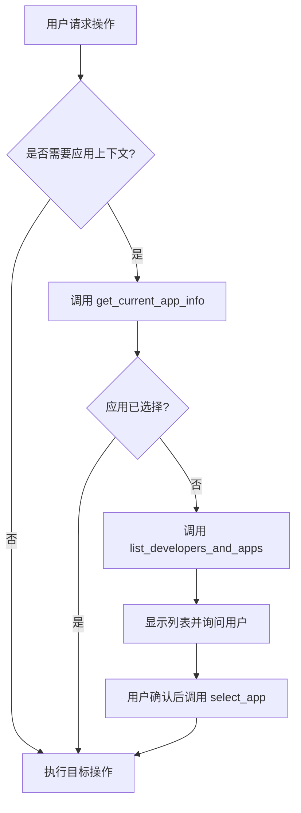

# AGENTS.md

This file provides guidance to Codex (Codex.ai/code) when working with code in this repository.

## 全局工作指引

**重要：Codex 在此项目中的工作规范**

### 文档更新规则

- **主动更新文档**：当有重要代码改动时（新特性、架构变更、API 修改），必须同时更新相关文档：
  - `AGENTS.md` - 开发指南和技术文档
  - `README.md` - 用户文档和使用说明
  - `docs/` - 相关技术文档
  - **不需要每次都问用户是否更新文档，主动更新即可**
  - **注意**：`CHANGELOG.md` 由 CI/CD 自动生成，无需手动维护

### Git 提交规范

> ⚠️ **重要：提交前必须确认 commit type！**
>
> 不同的 type 会触发不同的版本更新行为。提交前请先确认：
>
> - 本次改动是否需要触发版本更新？
> - 如果只是文档、调试、配置等改动，应使用 `chore:`、`docs:`、`ci:` 等不触发发布的 type
> - 如果是功能或修复，才使用 `feat:`、`fix:`、`refactor:` 等触发发布的 type

- **使用 Conventional Commits 规范**：项目已配置自动化 CI/CD，commit 消息格式至关重要

**触发版本更新的 type：**

- `feat:` - 新功能（触发 minor 版本升级）
- `fix:` - Bug 修复（触发 patch 版本升级）
- `feat!:` 或 `fix!:` - 破坏性变更（触发 major 版本升级）
- `refactor:` - 代码重构（触发 patch 版本升级）
- `perf:` - 性能优化（触发 patch 版本升级）

**不触发版本更新的 type：**

- `docs:` - 文档更新
- `chore:` - 构建/工具/配置/调试相关
- `test:` - 测试相关
- `ci:` - CI 配置更新
- `style:` - 代码格式
- `build:` - 构建系统变更

- **Commit Message 格式规范**（基于 `.commitlintrc.cjs`）：

  ```
  <type>(<scope>): <subject>

  <body>

  <footer>
  ```

  - **Header**（第一行，必填）：
    - 格式：`<type>(<scope>): <subject>`
    - 最大长度：100 字符
    - Type 必须小写
    - Scope 必须小写（可选）
    - Subject：最少 5 字符，最多 100 字符，不以句号结尾
  - **Body**（可选）：
    - 详细描述改动内容
    - 与 header 之间必须有空行
    - 每行不超过 100 字符（由 `body-max-line-length` 强制）
  - **Footer**（可选）：
    - 关联 issue 或注明破坏性变更
    - 与 body 之间必须有空行

- **完整示例**：

```
feat(leaderboard): add score submission API

- 新增 submitScores 工具
- 支持批量提交分数
- 添加输入验证

Closes #123
```

**注意事项**：

- ✅ Type 和 Scope 必须小写
- ✅ Subject 最少 5 字符，不以句号结尾
- ✅ Body 每行不超过 100 字符
- ✅ Body 和 Footer 前必须有空行
- ❌ 错误示例：`Feat(API): Added feature.`（Type 大写、Scope 大写、Subject 以句号结尾）

### Copilot/AI 提交规范

> 📄 详细规范请参考 `.github/copilot-instructions.md`

**Copilot 和其他 AI 工具必须遵循 Conventional Commits 规范。**

- ❌ **禁止的提交消息**：`Initial plan`、`WIP`、`temp`、`test` 等无类型前缀的消息
- ✅ **正确格式**：`feat(proxy): add new feature`、`chore(planning): initial investigation`
- ⚙️ **Commitlint 已配置忽略规则**：自动忽略 `Initial plan`、`WIP` 等模式的提交

### 分支工作流

- ❌ **不要直接 commit 到 main 分支**（已配置分支保护）
- ✅ **创建 feature/fix 分支** → 提交代码 → 创建 PR
- ✅ **PR 合并后自动触发发布**（由 semantic-release 处理）

**工作流程：**

```
feature 分支开发 → git commit (规范格式) → git push → 创建 PR
→ CI 检查 → Code Review → Merge PR → 自动发布 → 更新文档
```

### Git 工作区保护规则 ⚠️

**重要：所有 Git 操作必须保护工作区，防止代码丢失！**

- ✅ **切换分支前必须保存工作区**：

  ```bash
  # 方案 1：提交当前更改
  git add .
  git commit -m "wip: save current work"
  git checkout -b new-branch

  # 方案 2：暂存当前更改
  git stash push -m "description"
  git checkout -b new-branch
  git stash pop  # 恢复更改
  ```

- ❌ **永远不要在工作区有未保存更改时切换分支**
- ❌ **永远不要使用 `git checkout -- .` 或 `git reset --hard` 清理工作区**（会导致代码丢失）
- ✅ **如需清理工作区，先确认有 commit 或 stash 备份**

**详细流程参考：** [docs/CI_CD.md](docs/CI_CD.md)

## 项目概述

基于 Model Context Protocol (MCP) 的 TapTap Open API MCP 服务器，为 **TapTap Minigame 和 H5 游戏**提供排行榜、分享、多人联机、云存档，以及当前游戏 DC 数据查询、统计概览与评价操作能力。

**核心特性：**

- 🏆 排行榜系统 - 完整的 API 文档和服务端管理
- 🎮 H5 游戏管理 - 上传、发布、状态查询
- 🧭 当前游戏 DC 能力 - 商店/评价/社区统计概览、商店快照、论坛内容、评价列表、点赞、官方回复
- 🦞 OpenClaw Plugin 子包 - `packages/openclaw-dc-plugin`，面向 OpenClaw 暴露 raw JSON tools，并 bundled 运营简报 skill
- 🔐 OAuth 2.0 Device Code Flow - 零配置认证（扫码即用）
- 🎯 完整功能集 - 多类 Tools + Resources，覆盖文档查询与服务端动作
- 🚀 MCP 2025 标准 - Streamable HTTP + RFC 5424 Logging
- 📡 三种传输协议 - stdio（本地）+ SSE（远程/实时）+ HTTP JSON（兼容）
- 🔌 多客户端并发 - 独立会话管理，无限并发

**基本信息：**

- **NPM 包：** `@taptap/instant-games-open-mcp`
- **OpenClaw Plugin 子包：** `packages/openclaw-dc-plugin`（计划独立发布为 npm plugin）
- **官方 API 文档：** https://developer.taptap.cn/minigameapidoc/

## 架构概览

项目采用**三层模块化架构设计**：

```
功能模块层 (src/features/)
  ├── app/         - 应用管理模块（基础功能）
  ├── dcCurrentApp/ - 当前游戏 DC 能力模块
  ├── leaderboard/ - 排行榜模块
  ├── h5game/      - H5 游戏模块
  └── [未来]       - cloudSave/, share/ 等
       ↓ 依赖
核心共享层 (src/core/)
  ├── auth/        - OAuth 2.0 Device Code Flow
  ├── network/     - HTTP Client（MAC 认证 + 签名）
  ├── handlers/    - 通用处理器
  ├── utils/       - 工具函数
  └── types/       - 类型定义
       ↓ 依赖
服务器层
  ├── src/server.ts        - 主服务器（自动注册所有模块）
  └── bin/instant-games-open-mcp - NPM 可执行入口
```

**关键设计模式：**

1. **统一格式** - Tools 和 Resources 采用统一对象数组格式

```typescript
// Tools 统一格式
export const myTools: ToolRegistration[] = [
  {
    definition: { name: 'my_tool', ... },
    handler: async (args: { param: string }, context, extra) => { ... }
  }
];
```

2. **模块依赖规则**

- ✅ 业务模块可依赖 `core/` 和 `features/app/`
- ❌ 业务模块之间不能相互依赖
- ✅ app 模块只依赖 core，不依赖其他业务模块

3. **私有参数协议**（v1.3.0+）

- 支持 MCP Proxy 模式的多账号认证
- 对 AI Agent 和业务层完全透明
- 双模式注入：参数（`_mac_token`）或 Header（`X-TapTap-Mac-Token`）

**完整架构详见：** [docs/ARCHITECTURE.md](docs/ARCHITECTURE.md)

## AI Agent 工具使用指导

**设计原则：通过工具描述引导 AI Agent 行为**

### 核心设计理念

本项目通过精心设计的工具描述（Tool Description）来引导 AI Agent 的行为，确保：

1. **提前验证前置条件** - 避免因缺少必要信息而导致的操作失败
2. **优先询问用户选择** - 当有多个选项时，主动询问用户而不是自动决策
3. **提供清晰的错误指导** - 当操作失败时，明确告知下一步应该做什么

### 工具描述优化策略

#### 1. 前置条件检查

对于需要应用上下文的操作（如排行榜管理），工具描述中明确说明：

```
**PREREQUISITE: An app MUST be selected first.**
Before calling this tool, ALWAYS call get_current_app_info to verify
an app is selected. If not, guide user through:
1) Call list_developers_and_apps
2) Show list to user and ASK them to choose
3) Call select_app with user's choice
```

**受益工具：**

- `create_leaderboard` - 创建排行榜前必须选择应用
- `list_leaderboards` - 查询排行榜前必须选择应用
- `publish_leaderboard` - 发布排行榜前必须选择应用

#### 2. 强制用户确认

对于涉及选择的操作，工具描述中强调：

```
**CRITICAL: ALWAYS show the full list to the user and explicitly
ASK them to choose - DO NOT automatically select without user
confirmation, even if there is only one option.**
```

**受益工具：**

- `list_developers_and_apps` - 始终显示完整列表并询问用户选择
- `select_app` - 仅在用户明确确认后才调用
- `list_leaderboards` - 有多个排行榜时询问用户选择

#### 3. 渐进式引导流程

**标准工作流：**



### 实施要点

1. **工具描述是 AI 的行为准则**
   - 使用加粗的 `**PREREQUISITE:**` `**CRITICAL:**` `**IMPORTANT:**` 等关键词
   - 使用大写的 `MUST`、`ALWAYS`、`DO NOT` 来强调
   - 明确列出步骤 `1)`, `2)`, `3)`

2. **降低自动决策的优先级**
   - 明确说明"即使只有一个选项也要询问用户"
   - 强调"只有在用户明确确认后才调用"

3. **提供清晰的失败恢复路径**
   - 当前置条件不满足时，描述中提供完整的解决步骤
   - 使用"guide user through"语法提供流程指导

### 相关文件

- `src/features/app/tools.ts` - 应用管理工具定义
- `src/features/leaderboard/tools.ts` - 排行榜工具定义
- `src/features/h5Game/tools.ts` - H5 游戏工具定义

## 常用命令

### 开发环境设置

```bash
# 安装依赖（推荐，可复现安装）
npm ci

# 新增/更新依赖时使用
# npm install <package>

# 全局安装（可选）
npm install -g @taptap/instant-games-open-mcp
```

### 快速启动

```bash
# stdio 模式（默认，本地开发）
npm start                  # 或 npm run dev

# SSE 模式（远程部署，推荐用于 OpenHands）
npm run serve:sse          # 基础模式（端口 3000）
npm run serve:sse:dev      # 开发模式（详细日志）

# HTTP JSON 模式（兼容普通 HTTP 客户端）
npm run serve:http         # 端口 3000

# 自定义端口和环境
TAPTAP_MCP_PORT=8080 npm run serve:sse       # SSE 模式，端口 8080
TAPTAP_MCP_VERBOSE=true npm run serve:http   # HTTP 模式，启用日志
```

### 测试和验证

```bash
# 编译检查
npm run build

# 代码检查（ESLint）
npm run lint

# 代码检查并自动修复
npm run lint:fix

# 格式检查（Prettier）
npm run format:check

# 格式化代码
npm run format

# OpenClaw plugin 子包打包预检
npm run openclaw:pack
```

### 环境变量（常用）

| 变量名                               | 说明                               | 默认值                |
| ------------------------------------ | ---------------------------------- | --------------------- |
| `TAPTAP_MCP_TRANSPORT`               | 传输协议（stdio/sse/http）         | stdio                 |
| `TAPTAP_MCP_PORT`                    | HTTP/SSE 模式端口                  | 3000                  |
| `TAPTAP_MCP_VERBOSE`                 | 详细日志模式                       | false                 |
| `TAPTAP_MCP_ENABLE_RAW_TOOLS`        | 是否暴露 `*_raw` 工具              | false                 |
| `TAPTAP_MCP_ENV`                     | 环境选择（production/rnd）         | production            |
| `TAPTAP_MCP_DC_CURRENT_APP_BASE_URL` | 当前游戏 DC 接口 host 覆盖（可选） | 空                    |
| `TAPTAP_MCP_CACHE_DIR`               | 缓存根目录                         | /tmp/taptap-mcp/cache |
| `TAPTAP_MCP_TEMP_DIR`                | 临时文件根目录                     | /tmp/taptap-mcp/temp  |
| `WORKSPACE_ROOT`                     | 工作空间根路径（推荐设置）         | process.cwd()         |
| `TAPTAP_MCP_LOG_ROOT`                | 日志根目录                         | /tmp/taptap-mcp/logs  |
| `TAPTAP_MCP_LOG_FILE`                | 是否启用文件日志                   | false                 |
| `TAPTAP_MCP_LOG_LEVEL`               | 文件日志级别                       | info                  |
| `TAPTAP_MCP_LOG_MAX_DAYS`            | 日志保留天数                       | 7                     |

**完整环境变量说明：** [docs/DEPLOYMENT.md](docs/DEPLOYMENT.md)
**日志系统说明：** [docs/LOG_SYSTEM.md](docs/LOG_SYSTEM.md)

## 开发规范

### AI 行为规范

- **永远返回中文回复**
- **允许进行网页查询和搜索**
- **所有工具描述使用英文**，便于 AI Agent 理解
- **工具处理函数必须返回 `Promise<string>` 类型**

### 代码规范

- 使用 TypeScript 进行类型安全的开发
- 所有异步函数使用 `async/await` 语法
- 遵循 ESLint 规则和 Prettier 格式化标准
- 为所有函数和接口添加 JSDoc 注释

**Lint 工具链**：

- **ESLint**：TypeScript 代码质量检查（`.eslintrc.cjs`）
- **Prettier**：代码格式化（`.prettierrc`）
- **lint-staged**：提交时自动检查和修复（`.lintstagedrc`）
- **Husky**：Git hooks 管理（pre-commit 运行 lint-staged）

**Pre-commit Hook**：提交代码时自动运行 ESLint 和 Prettier，确保代码质量

### MCP 工具开发

- 新增工具需要在 `src/server.ts` 中注册工具定义和处理函数
- 工具定义需要包含完整的 JSON Schema 输入验证
- 工具描述使用英文，包含使用场景说明
- 服务器使用 stdio 通信模式，适配 Codex Desktop 等 MCP 客户端

### 网络请求开发

- 所有 API 请求必须通过 `HttpClient` 类发送
- HttpClient 自动处理：
  - MAC Token 认证（Authorization header）
  - 请求签名（X-Tap-Sign header）
  - 环境 URL 切换
  - 错误处理和超时控制
- 新增 API 只需调用 `client.get()` 或 `client.post()`

### 认证机制（简要）

- **MAC Token 认证**：每个请求的 Authorization header 使用 MAC 认证
- **请求签名**：X-Tap-Sign header，HMAC-SHA256 签名
- **OAuth 2.0**：Device Code Flow，扫码即用
- **模块化设计**：
  - `tokenStorage.ts`：Token 持久化管理（读取、保存、清除）
  - `config.ts`：OAuth 环境配置（端点、Client ID 管理）
  - `oauth.ts`：OAuth 流程实现（请求 device code、轮询 token）

**详细认证流程：** [docs/ARCHITECTURE.md#认证机制](docs/ARCHITECTURE.md)

### 原生签名模块（Native Signer）

为了保护 `CLIENT_SECRET` 不在 npm 源码中暴露，项目使用 Rust 编写的原生签名模块：

**安全模型：**

- `CLIENT_SECRET` 在 CI/CD 编译时 XOR 加密嵌入二进制
- 运行时在内存中解密，计算签名后返回结果
- SECRET 不暴露给 JS 层

**目录结构：**

```
native/
├── Cargo.toml          # Rust 项目配置
├── build.rs            # 编译时 SECRET 加密
├── src/lib.rs          # 签名实现
├── index.js            # JS 加载器
└── *.node              # 编译后的二进制
```

**开发模式：**

- 如果原生模块不可用，自动 fallback 到环境变量
- 设置 `TAPTAP_MCP_CLIENT_SECRET` 环境变量即可开发测试

**构建原生模块：**

```bash
cd native
export BUILD_CLIENT_ID="your_client_id"
export BUILD_CLIENT_SECRET="your_client_secret"
npm install && npm run build
```

**详细文档：** [native/README.md](native/README.md)

### 本地缓存（v1.4.1+）

**缓存目录结构：**

- 全局缓存：`/tmp/taptap-mcp/cache/global/app.json`
- 租户缓存：`/tmp/taptap-mcp/cache/{userId}/{projectId}/app.json`
- 临时文件：`/tmp/taptap-mcp/temp/{userId}/{projectId}/`

**特性：**

- ✅ 独立于 workspace，支持只读挂载
- ✅ 租户数据完全隔离
- ✅ 临时文件自动清理

### 路径处理最佳实践

1. **推荐使用绝对路径**（如 `/Users/username/project/dist`）
2. **相对路径注意事项**：stdio 模式下可能解析错误，推荐设置 `WORKSPACE_ROOT` 环境变量
3. **调试技巧**：启用 `TAPTAP_MCP_VERBOSE=true` 查看详细日志

**详细说明：** [docs/PATH_RESOLUTION.md](docs/PATH_RESOLUTION.md)

### 扩展新功能

使用脚手架快速创建新功能模块：

```bash
# 运行脚手架脚本
./scripts/create-feature.sh

# 按提示输入功能信息
# 自动生成模块结构：src/features/yourFeature/
# 包含：index.ts, tools.ts, handlers.ts, api.ts 等

# 在 src/server.ts 注册新模块
import { yourFeatureModule } from './features/yourFeature/index.js';
const allModules = [..., yourFeatureModule];
```

## 文档索引

### 用户文档

- **快速开始（零基础）**：[docs/QUICK_START.md](docs/QUICK_START.md) - 面向非技术用户的极简 Cursor 配置指南
- **AI 安装引导**：[docs/AI_SETUP_GUIDE.md](docs/AI_SETUP_GUIDE.md) - 面向 AI Agent 的可执行安装部署指南
- **详细配置指南**：[docs/USER_GUIDE.md](docs/USER_GUIDE.md) - 多种工具的完整配置方法
- **项目介绍**：[README.md](README.md) - 用户快速上手指南
- **贡献指南**：[CONTRIBUTING.md](CONTRIBUTING.md) - 开发者贡献流程

### 技术文档

- **完整架构**：[docs/ARCHITECTURE.md](docs/ARCHITECTURE.md) - 模块化架构、设计模式、认证机制
- **部署指南**：[docs/DEPLOYMENT.md](docs/DEPLOYMENT.md) - 三种传输协议、环境变量、MCP 集成配置
- **CI/CD 流程**：[docs/CI_CD.md](docs/CI_CD.md) - GitHub Flow、Semantic Release、自动发布
- **路径解析**：[docs/PATH_RESOLUTION.md](docs/PATH_RESOLUTION.md) - 路径处理问题、最佳实践

### Proxy 相关文档

- **Proxy 开发**：[docs/PROXY.md](docs/PROXY.md) - MCP Proxy 完整开发指引（整合了私有参数协议、客户端配置、独立打包、TapCode 集成示例）

### 原生签名模块

- **原生签名器**：[native/README.md](native/README.md) - Rust 原生签名模块开发和构建指南

### API 参考

- **TapTap Open API**：https://developer.taptap.cn/minigameapidoc/ - 官方 API 文档
- **MCP 规范**：https://spec.modelcontextprotocol.io/ - Model Context Protocol 规范

## 工具和资源概览

### 核心 MCP Tools

**流程指引（1个）**

- `get_leaderboard_integration_guide` - 排行榜完整接入工作流指引

**信息查询（2个）**

- `get_current_app_info` - 获取当前选择的应用信息
- `check_environment` - 检查环境配置和认证状态

**认证（3个）**

- `start_oauth_authorization` - 开始 OAuth 授权（获取二维码）
- `complete_oauth_authorization` - 完成 OAuth 授权
- `clear_auth_data` - 清除认证数据和缓存

**应用管理（3个）**

- `list_developers_and_apps` - 列出所有开发者和应用（含关卡与非关卡）
- `select_app` - 选择要使用的应用（支持关卡与非关卡）
- `create_developer` - 创建新开发者

**当前游戏 DC 能力（8个）**

- `get_current_app_store_overview` - 获取当前游戏商店统计概览
- `get_current_app_review_overview` - 获取当前游戏评价统计概览
- `get_current_app_community_overview` - 获取当前游戏社区统计概览
- `get_current_app_store_snapshot` - 获取当前游戏商店结果型快照
- `get_current_app_forum_contents` - 获取当前游戏论坛内容
- `get_current_app_reviews` - 获取当前游戏评价列表
- `like_current_app_review` - 给当前游戏指定评价点赞
- `reply_current_app_review` - 以官方身份回复当前游戏评价

**排行榜管理（5个）**

- `create_leaderboard` - 创建新排行榜
- `list_leaderboards` - 列出所有排行榜
- `publish_leaderboard` - 发布排行榜
- `get_user_leaderboard_scores` - 获取用户分数数据
- `get_app_status` - 获取应用审核状态

**H5 游戏管理（3个）**

- `prepare_h5_upload` - 收集 H5 游戏信息（上传前）
- `upload_h5_game` - 上传 H5 游戏包
- `get_debug_feedbacks` - 拉取用户调试反馈并下载附件到本地

> 注：创建/编辑应用请使用 `create_app` 和 `update_app_info` 工具（在应用管理分类中）

**振动 API 文档（1个）**

- `get_vibrate_integration_guide` - 振动 API 完整文档和接入指引

### MCP Resources（示例）

**API 详细文档（6个）**

- `docs://leaderboard/api/get-manager` - tap.getLeaderboardManager()
- `docs://leaderboard/api/open` - openLeaderboard()
- `docs://leaderboard/api/submit-scores` - submitScores()
- `docs://leaderboard/api/load-scores` - loadLeaderboardScores()
- `docs://leaderboard/api/load-player-score` - loadCurrentPlayerLeaderboardScore()
- `docs://leaderboard/api/load-centered-scores` - loadPlayerCenteredScores()

**概览文档（1个）**

- `docs://leaderboard/overview` - 所有 API 的完整概览

## 注意事项

- 所有工具描述使用英文，便于 AI Agent 理解
- 环境变量名称使用 TAPTAP*MCP* 前缀
- MAC Token 必须是 JSON 字符串格式
- 请求签名使用两层机制（MAC + X-Tap-Sign）
- 默认环境为 production，可通过 TAPTAP_MCP_ENV 切换

---
> Converted and distributed by [TomeVault](https://tomevault.io/claim/taptap)
> This is a context snippet only. You'll also want the standalone SKILL.md file — [download at TomeVault](https://tomevault.io/claim/taptap)
<!-- tomevault:4.0:windsurf_rules:2026-04-08 -->
