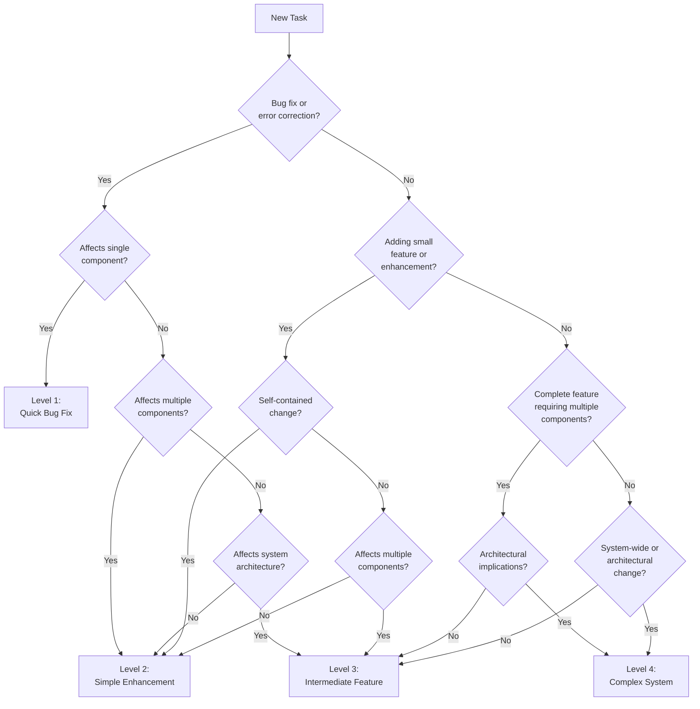

# Task Complexity Determination

Determine the appropriate complexity level (1-4) for a task, then write the determination to the memory bank and load the corresponding workflow.

## Decision Tree



## Complexity Indicators

### Level 1: Quick Bug Fix
- **Signals**: "fix", "broken", "not working", "bug", "error", "crash"
- **Scope**: Single component or UI element
- **Risk**: Low, isolated changes
- **Examples**: broken button, styling glitch, validation error, typo, broken link

### Level 2: Simple Enhancement
- **Signals**: "add", "improve", "update", "change", "enhance", "modify"
- **Scope**: Single component or subsystem
- **Risk**: Moderate, contained to specific area
- **Examples**: add form field, improve validation, update styling, enhance existing component

### Level 3: Intermediate Feature
- **Signals**: "implement", "create", "develop", "build", "feature"
- **Scope**: Multiple components, complete feature
- **Risk**: Significant, affects multiple areas
- **Examples**: user authentication flow, dashboard, search functionality, complex form system

### Level 4: Complex System
- **Signals**: "system", "architecture", "redesign", "integration", "framework"
- **Scope**: Multiple subsystems or entire application
- **Risk**: High, architectural implications
- **Examples**: payment processing framework, microservice architecture, database migration system, real-time communication system

## Assessment Questions

When the decision tree doesn't give a clear answer, consider:

1. **Scope** — Single component, multiple components, or system-wide?
2. **Design decisions** — Can you start coding immediately, or do you need to explore and choose between approaches first?
3. **Risk** — What breaks if this goes wrong? Is it isolated or cascading?
4. **Effort** — Hours, days, or weeks?

## Write Determination to Memory Bank

Before writing, check whether the ephemeral files already exist:

- If **all four** ephemeral files exist (`projectbrief.md`, `activeContext.md`, `tasks.md`, `progress.md`), work is already in-progress. **Warn the user** — the previous task should be archived first, or explicitly abandoned before proceeding.
- If the ephemeral files are absent and only the persistent files exist, the memory bank is ready for new work. Create or overwrite the ephemeral files as described below.

---

**`memory-bank/projectbrief.md`** — Capture the user story and requirements: Populate it from the user's input, prompting for clarification if the requirements are incomplete or ambiguous.

**`memory-bank/activeContext.md`** — Record the current session state:

- **Current Task** — task name derived from the user's request
- **Phase** — `COMPLEXITY-ANALYSIS - COMPLETE`
- **What Was Done** — complexity level determined (Level N) and rationale
- **Next Step** — load the Level N workflow

**`memory-bank/tasks.md`** — Stub the task list:

Create a stub file with the task name. Do **not** populate checklists yet — the level-specific planning rules prescribe the exact format and content.

**`memory-bank/progress.md`** — Initialize if absent:

Include a brief summary of the work to be done as described in the project brief - you've just *completed* complexity analysis!

## Next Steps

After writing the determination, inform the user:

```markdown
✅ **Complexity Analysis Complete** - Level N determined.
Loading Level N workflow...
```

Then, load the level-specific workflow and proceed to the next phase as specified by that document.

- Level 1: `.cursor/rules/shared/niko/level1/level1-workflow.mdc`
- Level 2: `.cursor/rules/shared/niko/level2/level2-workflow.mdc`
- Level 3: `.cursor/rules/shared/niko/level3/level3-workflow.mdc`
- Level 4: `.cursor/rules/shared/niko/level4/level4-workflow.mdc`

---
> Converted and distributed by [TomeVault](https://tomevault.io/claim/Texarkanine)
> This is a context snippet only. You'll also want the standalone SKILL.md file — [download at TomeVault](https://tomevault.io/claim/Texarkanine)
<!-- tomevault:4.0:windsurf_rules:2026-04-08 -->
