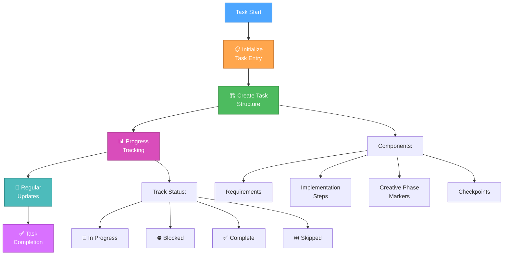
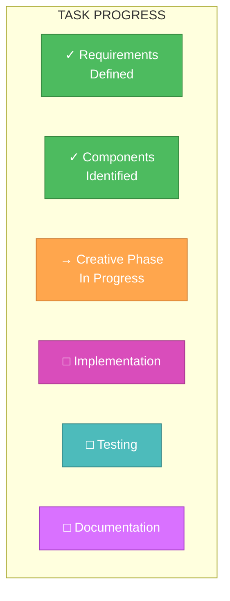
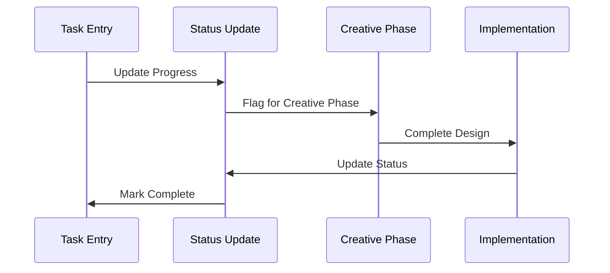
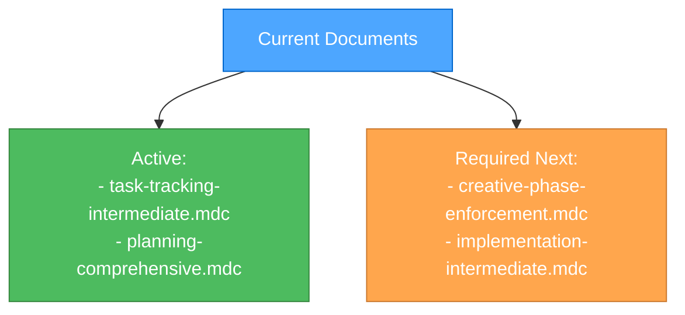

# LEVEL 3 INTERMEDIATE TASK TRACKING

> **TL;DR:** This document provides structured task tracking guidelines for Level 3 (Intermediate Feature) tasks, using visual tracking elements and clear checkpoints.

## 🔍 TASK TRACKING WORKFLOW



## 📋 TASK ENTRY TEMPLATE

```markdown
# [Task Title]

## Requirements
- [ ] Requirement 1
- [ ] Requirement 2
- [ ] Requirement 3

## Components Affected
- Component 1
- Component 2
- Component 3

## Implementation Steps
1. [ ] Step 1
2. [ ] Step 2
3. [ ] Step 3

## Creative Phases Required
- [ ] 🎨 UI/UX Design
- [ ] 🏗️ Architecture Design
- [ ] ⚙️ Algorithm Design

## Checkpoints
- [ ] Requirements verified
- [ ] Creative phases completed
- [ ] Implementation tested
- [ ] Documentation updated

## Current Status
- Phase: [Current Phase]
- Status: [In Progress/Blocked/Complete]
- Blockers: [If any]
```

## 🔄 PROGRESS TRACKING VISUALIZATION



## ✅ UPDATE PROTOCOL



## 🎯 CHECKPOINT VERIFICATION

| Phase | Verification Items | Status |
|-------|-------------------|--------|
| Requirements | All requirements documented | [ ] |
| Components | Affected components listed | [ ] |
| Creative | Design decisions documented | [ ] |
| Implementation | Code changes tracked | [ ] |
| Testing | Test results recorded | [ ] |
| Documentation | Updates completed | [ ] |

## 🔄 DOCUMENT MANAGEMENT



---
> Converted and distributed by [TomeVault](https://tomevault.io/claim/Texarkanine) — claim your Tome and manage your conversions.
<!-- tomevault:4.0:windsurf_rules:2026-04-09 -->
