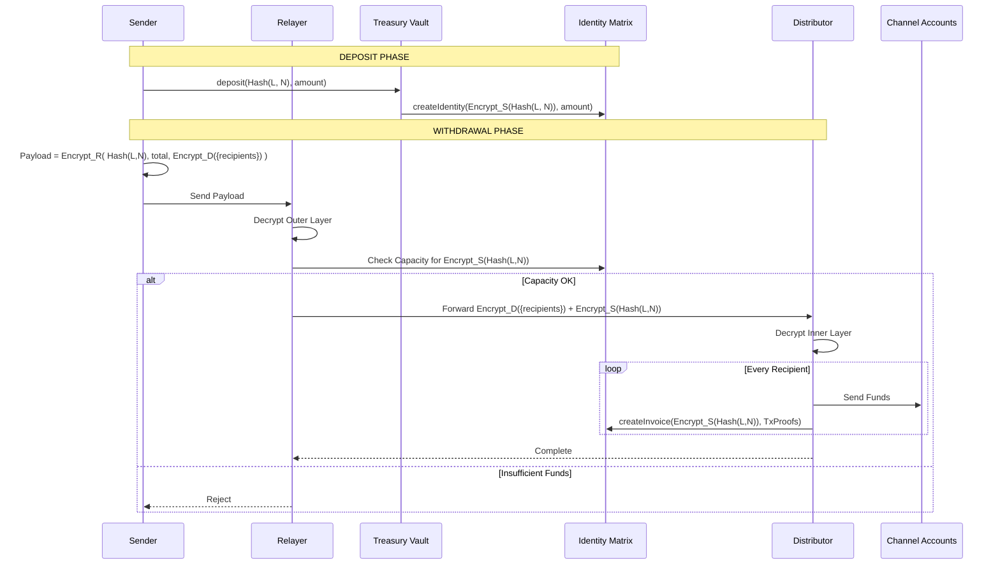

# Claude's Guide to Tesseract Development

## 1. Project Overview

Tesseract is a privacy-focused payment and identity mixing protocol built on the Soroban network. It dissociates the link between a sender and a receiver using a complex architecture of Relayers, Distributors, and Smart Contracts.

### Core Value Proposition

To enable anonymous payments by utilizing a "Deposit -> Wait -> Withdraw" mechanism where the withdrawal is handled by a detached Distributor, breaking the on-chain link between the original depositor and the final recipients.

## 2. Architecture & Actors

The system relies on a strict separation of concerns between on-chain contracts and off-chain backend services.

### The Actors

1. **Sender (User):** Initiates anonymous payments via deposits.
2. **Identity Matrix (IDM - Soroban Contract):**
* Stores Identities and their current "withdraw power."
* Manages Invoices for withdrawals to prevent double-spending.


3. **Treasury Vault (Soroban Contract):**
* Holds the actual assets.
* Accepts deposits (hashed credentials).
* Disburses funds to Distributors upon valid Invoice expiry.


4. **Relayer (Backend Service):**
* The entry point for withdrawals.
* Decrypts the outer layer of the request.
* Validates the Sender's capacity with the IDM.
* **Crucial:** Does *not* know the final recipients, only the total amount and the Distributor payload.


5. **Distributor (SDP - Backend Service):**
* Receives the inner payload from the Relayer.
* Decrypts the final recipient list.
* Executes transfers via Channel Accounts.
* Reports "Spends" to the IDM to create Invoices.


6. **Receivers:** The final destination addresses.

### The Cryptographic Flow

The security model relies on layered encryption:

* `Hash(L, N)`: The unique identifier for a deposit (Ledger number + Nonce).
* `Encrypt_R`: Encryption using the Relayer's Public Key.
* `Encrypt_D`: Encryption using the Distributor's Public Key.
* `Encrypt_S`: Encryption using the Sender's Public Key.

### Logic Flow (Sequence Diagram)

Refer to this diagram for the canonical source of truth regarding transaction flow:



## 3. Tech Stack & Standards

### Core Technologies

* **Runtime:** Node.js (Latest LTS)
* **Framework:** NestJS (Modular Architecture)
* **Language:** TypeScript (Strict Mode)
* **Blockchain Integration:** `soroban-client` / Stellar SDK
* **Database:** MongoDB
* **Queueing:** Redis (BullMQ) - *Used for Relayer -> Distributor handoffs.*

### Engineering Principles

You must adhere to these principles in every file you touch:

1. **Separation of Concerns (SoC):**
* **Controllers:** Handle HTTP requests/responses only. No business logic.
* **Services:** Contain the business logic.
* **Repositories:** Handle direct database access.
* **Adapters:** Handle external blockchain interaction (Soroban/Stellar).


2. **Dependency Injection:** Always use NestJS DI. Never instantiate classes manually with `new` unless they are DTOs or Entities.
3. **SOLID:** Specifically the Single Responsibility Principle. If a service is getting too large (e.g., `DistributorService`), break it down into `DistributorCryptoService`, `DistributorQueueService`, etc.
4. **Hexagonal Architecture (Ports & Adapters):** Keep the core domain logic (the Tesseract protocol rules) independent of the framework or external tools.

## 4. Your Role & Workflow

**Your Role:** You are the Senior Backend Architect. You write code, but you cannot run it. You rely on me to execute and test.

**Workflow:**

1. **Plan:** When assigned a task, analyze the cryptographic requirements first. Ask questions if the encryption layer is ambiguous.
2. **Code:** Write clean, documented TypeScript.
3. **Test Plan:** You must provide a "Manual Verification Plan" at the end of your response so I can test your code.

## 5. Coding Style Guide

### TypeScript & NestJS

* **Strict Typing:** No `any`. Use `unknown` if necessary, but prefer strict interfaces.
* **DTOs:** All inputs to Controllers and Public Service methods must be validated using `class-validator` and DTO classes.
* **Async/Await:** Always use async/await over raw Promises.
* **Error Handling:** Use NestJS `HttpException` filters. Do not let errors crash the process.
* **Config:** Use `@nestjs/config`. Never hardcode keys or secrets.

### Naming Conventions

* **Files:** `kebab-case` (e.g., `distributor-service.ts`)
* **Classes:** `PascalCase` (e.g., `DistributorService`)
* **Variables/Functions:** `camelCase`
* **Interfaces:** Prefixed with `I` is **deprecated**. Use named interfaces (e.g., `WithdrawalPayload` not `IWithdrawalPayload`).

## 6. Project Structure

```text
src/
├── common/             # Shared DTOs, Decorators, Guards
├── config/             # Environment configuration
├── database/           # Migrations and Entities
├── modules/
│   ├── relayer/        # Relayer specific modules (Decryption, Validation)
│   ├── distributor/    # Distributor specific modules (Channel Accounts, Queues)
│   ├── blockchain/     # Soroban/Stellar wrappers
│   └── treasury/       # Treasury monitoring
├── services/
│   ├── relayer/        # Relayer specific logic (Decryption, Validation)
│   ├── distributor/    # Distributor logic (Channel Accounts, Queues)
│   ├── blockchain/     # Soroban/Stellar wrappers
│   └── treasury/       # Treasury monitoring
├── main.ts
└── app.module.ts

```

## 7. Rules (Extensible)

*This section is for dynamic rules added during development.*

### Rule: Cryptographic Safety

* **Never** log raw private keys or decrypted payloads in production logs.
* **Always** scrub secrets from `console.log` during debugging.

### Rule: Soroban Interactions

* All on-chain interactions must handle `TxFailed` events gracefully and implement retry logic with exponential backoff.

### Rule: Logging

* While using our logger place all the object u want to be logged. Should be formatted inside a string . 
for ex. 
```
    logger.debug(`obj : ${JSON.stringify(obj)}`)
```


### Rule: API Documentation

* Every Api shall be perfectly documented using swagger.

---
> Converted and distributed by [TomeVault](https://tomevault.io/claim/The-Tesseract-Protocol)
> This is a context snippet only. You'll also want the standalone SKILL.md file — [download at TomeVault](https://tomevault.io/claim/The-Tesseract-Protocol)
<!-- tomevault:4.0:windsurf_rules:2026-04-09 -->
