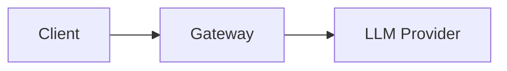

# Agent Router Documentation Site

This file provides guidelines for AI coding assistants working on the documentation site.

## Tech Stack

- **Framework**: Docusaurus 3.9.x with TypeScript
- **UI**: React 19
- **Diagrams**: Mermaid (enabled via `@docusaurus/theme-mermaid`)
- **Node.js**: 22.0+ required
- **Package Manager**: npm 10.9.0

## Brand System (Agent Router)

The visual identity is vendored from
[theagentrouter/brand-assets](https://github.com/theagentrouter/brand-assets)
into `src/css/brand/` (tokens + A-pattern), `static/fonts/`, and
`static/img/brand/` — **never edit vendored files here**; change them upstream
and re-sync (see `src/css/brand/README.md`). Site chrome maps brand tokens onto
Infima variables in `src/css/custom.css`.

Rules that must not regress:

- **Ink or white on orange, by ramp step**: `#FF5500` (Marquee 500) is a
  mark/display colour and never a fill behind text. Interactive orange steps
  down the ramp — buttons are Marquee 600 `#E04400` with white text, hover
  700 `#B83700`; orange text on light grounds is Marquee 700.
- **Envoy magenta `#AC6199` is transition-only** (the rebrand announcement
  bar and "formerly" badges) — never in UI, marks, or new content.
- **Pattern discipline**: one texture per screen, clipped to whole sections,
  faded under text; opacity ceilings 0.06 light / 0.10 dark.
- **Dark mode is real**: every new component needs `[data-theme='dark']`
  coverage (semantic `--ar-*` tokens give most of it for free).

## Renaming Rules (formerly Envoy AI Gateway)

The product name is renamed **in prose only**. Frozen identifiers that must
never be renamed: the `aigateway.envoyproxy.io` API group and annotations,
all CRD kinds (`AIGatewayRoute`, `AIServiceBackend`, …), the `aigw` CLI (and
its literal `--help` output quoted in docs), `envoyproxy/ai-gateway`
repo/image/chart paths, and the `envoy-ai-gateway-system` namespace.
Blog history, talks data, and release-notes series titles keep the old name.
Run `npm run check:brand` after any docs-wide edit — CI-grade assertions
guard all of the above.

## Homepage Content

All homepage copy lives in `src/data/home/` (`index.ts`, `providers.ts`);
section components live in `src/components/home/`. To change homepage text,
edit the data modules — do not hardcode copy in components.

## Project Structure

```
site/
├── docs/                    # Current/latest documentation
├── blog/                    # Blog posts organized by year
├── src/
│   ├── components/          # Custom React components
│   ├── css/                 # Custom styles
│   ├── data/                # JSON data files (releases, adopters, solutions, talks)
│   ├── pages/               # Custom pages (homepage, release notes)
│   └── theme/               # Theme customizations
├── static/                  # Static assets (images, favicons)
├── versioned_docs/          # Snapshots of docs for previous versions
├── versioned_sidebars/      # Sidebar configs for previous versions
├── docusaurus.config.ts     # Main Docusaurus configuration
└── sidebars.ts              # Sidebar configuration (auto-generated)
```

## Documentation Conventions

### Frontmatter

All documentation files require frontmatter:

```yaml
---
id: unique-page-id
title: Page Title
sidebar_position: 1
---
```

- `id`: Unique identifier for the page (used in URLs and links)
- `title`: Display title in sidebar and page header
- `sidebar_position`: Controls ordering in the auto-generated sidebar (lower numbers appear first)

### Admonitions

Use Docusaurus admonition syntax for callouts:

```md
:::tip
Helpful tips for users
:::

:::info
Additional information
:::

:::warning
Important warnings
:::

:::danger
Critical warnings about destructive actions
:::
```

### Internal Links

Use relative paths for internal links:

```md
[Prerequisites](./prerequisites.md)
[Getting Started](/docs/getting-started)
```

### Mermaid Diagrams

Mermaid is enabled. Use fenced code blocks:

````md

````

## Documentation Verification

When generating or updating documentation, **always verify accuracy** against the source code and API specifications in the repository:

### Code Verification

- Cross-reference documented features with the actual implementation in `/internal/` and `/api/`
- Verify configuration options, field names, and default values match the Go struct definitions
- Check that documented behaviors align with the code logic

### API Spec Verification

- Ensure documented API fields match the CRD definitions in `/api/`
- Verify types, required fields, and enum values against the Go types
- Check for any newly added or deprecated fields that may need documentation updates

### Best Practices

- Read relevant source files before writing documentation about a feature
- When documenting configuration options, locate the corresponding Go structs to confirm field names and types
- If documentation conflicts with code, the code is the source of truth—update the documentation accordingly
- Run `npm run build` to catch broken links and ensure all references are valid

## Blog Post Conventions

### File Location

Place blog posts in `blog/YYYY/` with the naming format:

```

<!-- Content truncated to meet Windsurf 6KB limit -->

---
> Source: [theagentrouter/agent-router](https://github.com/theagentrouter/agent-router) — distributed by [TomeVault](https://tomevault.io).
<!-- tomevault:4.0:windsurf_rules:2026-09-23 -->
