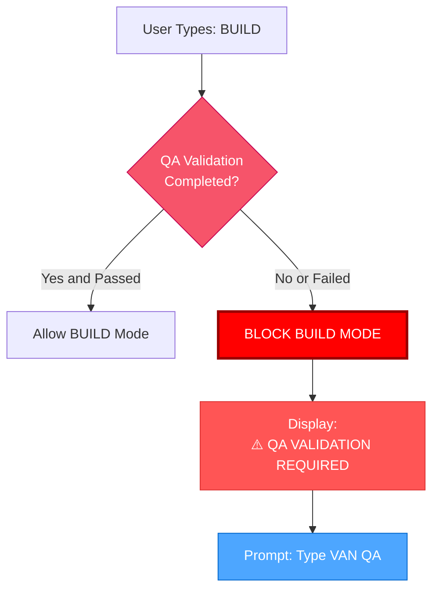

# VAN QA: MODE TRANSITIONS

> **TL;DR:** This component handles transitions between modes, particularly the QA validation to BUILD mode transition, and prevents BUILD mode access without successful QA validation.

## 🔒 BUILD MODE PREVENTION MECHANISM

The system prevents moving to BUILD mode without passing QA validation:



### Implementation Example (PowerShell):
```powershell
# Check QA status before allowing BUILD mode
function Check-QAValidationStatus {
    $qaStatusFile = "memory-bank\.qa_validation_status" # Assumes status is written by reports.mdc
    
    if (Test-Path $qaStatusFile) {
        $status = Get-Content $qaStatusFile -Raw
        if ($status -match "PASS") {
            return $true
        }
    }
    
    # Display block message
    Write-Output "`n`n"
    Write-Output "🚫🚫🚫🚫🚫🚫🚫🚫🚫🚫🚫🚫🚫🚫🚫🚫🚫🚫🚫🚫🚫🚫🚫🚫🚫🚫🚫🚫🚫"
    Write-Output "⛔️ BUILD MODE BLOCKED: QA VALIDATION REQUIRED"
    Write-Output "⛔️ You must complete QA validation before proceeding to BUILD mode"
    Write-Output "`n"
    Write-Output "Type 'VAN QA' to perform technical validation"
    Write-Output "`n"
    Write-Output "🚫 NO IMPLEMENTATION CAN PROCEED WITHOUT VALIDATION 🚫"
    Write-Output "🚫🚫🚫🚫🚫🚫🚫🚫🚫🚫🚫🚫🚫🚫🚫🚫🚫🚫🚫🚫🚫🚫🚫🚫🚫🚫🚫🚫🚫"
    
    return $false
}
```

## 🚨 MODE TRANSITION TRIGGERS

### CREATIVE to VAN QA Transition:
After completing the CREATIVE phase, trigger this message to prompt QA validation:

```
⏭️ NEXT MODE: VAN QA
To validate technical requirements before implementation, please type 'VAN QA'
```

### VAN QA to BUILD Transition (On Success):
After successful QA validation, trigger this message to allow BUILD mode:

```
✅ TECHNICAL VALIDATION COMPLETE
All prerequisites verified successfully
You may now proceed to BUILD mode
Type 'BUILD' to begin implementation
```

### Manual BUILD Mode Access (When QA Already Passed):
When the user manually types 'BUILD', check the QA status before allowing access:

```powershell
# Handle BUILD mode request
function Handle-BuildModeRequest {
    if (Check-QAValidationStatus) {
        # Allow transition to BUILD mode
        Write-Output "`n"
        Write-Output "✅ QA VALIDATION CHECK: PASSED"
        Write-Output "Loading BUILD mode..."
        Write-Output "`n"
        
        # Here you would load the BUILD mode map
        # [Code to load BUILD mode map]
        
        return $true
    }
    
    # QA validation failed or not completed, BUILD mode blocked
    return $false
}
```

**Next Step (on QA SUCCESS):** Continue to BUILD mode.
**Next Step (on QA FAILURE):** Return to QA validation process. 

---
> Converted and distributed by [TomeVault](https://tomevault.io/claim/TheCowboyAI) — claim your Tome and manage your conversions.
<!-- tomevault:4.0:windsurf_rules:2026-04-11 -->
