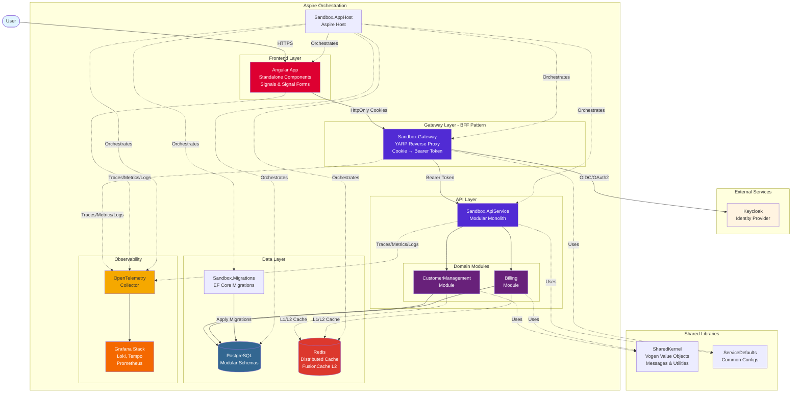

# Critical System Understanding: Sandbox Application

The Sandbox Application is a monorepo containing an a .NET backend and a Angular frontend. It has a comprehensive testing strategy including unit, integration, architecture, and end-to-end tests.

## Architecture Foundation

**Monorepo**: All backend and frontend code lives in a single repository, enabling easier cross-team collaboration, consistent tooling, and simplified dependency management.

**Modular Monolith** + DDD: Clear bounded contexts. Each module implements IModule with separate schemas, DbContexts, and caching strategies. Always use TUnit for testing.

**BFF Pattern**: Gateway uses YARP to proxy requests, managing authentication server-side. Frontend never touches tokens—only HttpOnly cookies. The gateway automatically transforms cookies to Bearer tokens for API calls.

**Angular Frontend**: Modern Angular 21 app using standalone components, signals, and signal forms. Always Vitest for testing.

**Aspire Orchestration**: Aspire hosts the modular monolith, managing service lifecycles, configurations, and dependencies.

**Observability**: OpenTelemetry collector for metrics, traces, and logs across backend and frontend. Grafana (with loki, tempo, blackbox, prometheus) dashboards for visualization.

### System Architecture

The application follows a modular monolith architecture hosted by .NET Aspire with a BFF (Backend for Frontend) pattern for secure authentication:



**Key Architectural Decisions:**

- **Aspire Orchestration**: Single command (`dotnet run --project ./Sandbox.AppHost`) starts entire stack
- **BFF Pattern**: Gateway handles authentication, transforms cookies to Bearer tokens
- **Modular Monolith**: Each module has its own DbContext, schema, and bounded context
- **Security-First**: Tokens never exposed to frontend, only secure HttpOnly cookies
- **Observability-Ready**: OpenTelemetry integrated at all layers

### Request Flow

The following diagram illustrates how a typical authenticated API request flows through the system using the BFF pattern:

```mermaid
sequenceDiagram
    actor User
    participant Browser as Angular App<br/>(Browser)
    participant Gateway as Sandbox.Gateway<br/>(YARP BFF)
    participant Keycloak as Keycloak<br/>(Identity Provider)
    participant API as Sandbox.ApiService<br/>(Modular Monolith)
    participant Module as Domain Module<br/>(e.g., CustomerManagement)

<!-- Content truncated to meet Windsurf 6KB limit -->

---
> Source: [timdeschryver/Sandbox](https://github.com/timdeschryver/Sandbox) — distributed by [TomeVault](https://tomevault.io).
<!-- tomevault:4.0:windsurf_rules:2026-05-20 -->
