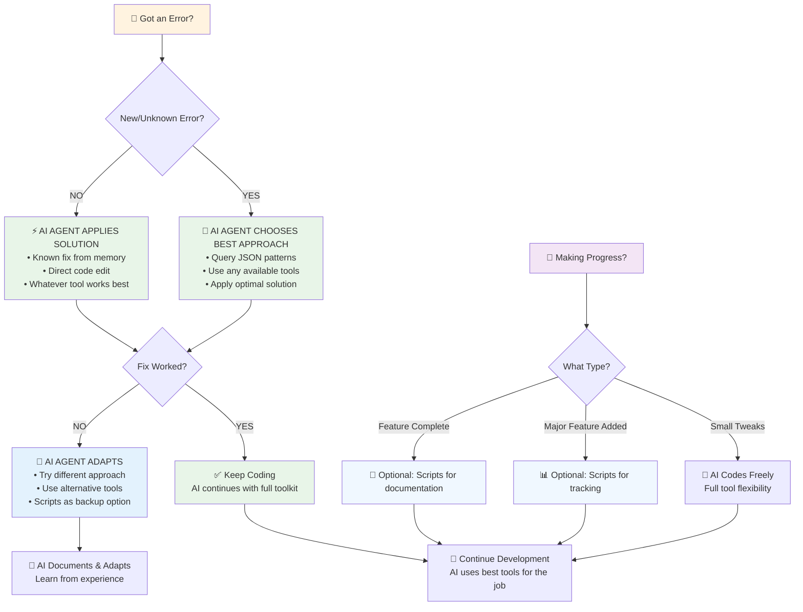

# Pine Script Error Prevention Automation Rules

## Core Automation Workflow with Intelligent Script Usage

### 🎯 Primary Scripts (Only Two Needed)
1. **`pine_master.sh`** - Development, versioning, error detection, solutions
2. **`pine_tracker.sh`** - Feature tracking, failure logging, rollback documentation

### 📋 When to Use Scripts (Not Every Time!)

#### Use `pine_master.sh develop` ONLY when:
- Starting a NEW feature/modification
- After SIGNIFICANT changes (not every edit)
- Before taking a break/ending session
- When you explicitly ask for versioning

#### Use `pine_master.sh fix` ONLY when:
- Actual compilation error occurs
- You report a specific problem
- After multiple failed attempts

#### Use `pine_tracker.sh` ONLY when:
- You explicitly mention a new feature to add
- A feature attempt fails completely
- Rolling back to previous version
- Marking feature as complete

### 🚫 DON'T Run Scripts When:
- Making minor edits or tweaks
- In the middle of active coding flow
- Just fixed a simple typo
- You haven't asked for any tracking

### 💡 Intelligent Workflow Pattern

```mermaid
flowchart TD
    A[🎯 1. FEATURE REQUEST<br/>"Add weekly filter to FVG"] --> B[🧠 AI CHOOSES APPROACH<br/>• Track if helpful<br/>• Version if needed<br/>• Start coding]
    B --> C[🔨 2. ACTIVE DEVELOPMENT<br/>AI uses full toolkit<br/>• edit_file, search_replace<br/>• codebase_search, grep_search<br/>• run_terminal_cmd if needed<br/>• Any available tool]
    
    C --> D{3. ERROR OCCURS?}
    D -->|YES| E[🧠 AI SELECTS BEST SOLUTION<br/>• Pattern recognition<br/>• Tool combinations<br/>• Creative problem solving]
    D -->|NO| F{4. MAJOR MILESTONE?}
    
    E --> G{Fixed?}
    G -->|YES| C
    G -->|NO| H[🔄 AI ADAPTS STRATEGY<br/>• Try different tools<br/>• Use scripts if helpful<br/>• Document learning]
    
    F -->|SUCCESS| I[🎯 AI CHOOSES COMPLETION<br/>• Track success if valuable<br/>• Document patterns<br/>• Version if appropriate]
    F -->|FAILURE| H
    F -->|CONTINUE| C
    
    I --> J[📦 SESSION END<br/>AI decides best wrap-up<br/>• Scripts if helpful<br/>• Direct action if better]
    H --> J
    
    style A fill:#e3f2fd
    style B fill:#e8f5e8
    style C fill:#fff3e0
    style E fill:#e8f5e8
    style I fill:#e8f5e8
    style J fill:#e8f5e8
    style H fill:#e3f2fd
```

**Key Phases:**
1. 🎯 **Start**: Version + track ONCE at beginning
2. 🔨 **Code**: Active development with NO script interruptions  
3. 🔧 **Error**: Use scripts only when needed
4. 🎯 **Milestone**: Track significant progress
5. 📦 **End**: Final version at session end

### 🎯 Smart Decision Tree



**🧠 AI Agent Flexibility Guidelines:**
- 🛠️ **Tool Freedom** → Use any tool that solves the problem best
- 🎯 **Intelligent Selection** → Choose optimal approach for each situation  
- 📊 **Scripts as Enhancement** → Use when helpful, not mandatory
- 🔄 **Adaptive Response** → Switch strategies as needed
- 💡 **Creative Solutions** → Not limited to predefined workflows

### 📊 Script Usage Guidelines

#### High-Value Script Usage:
- **Beginning**: Version once, track feature
- **Errors**: Search solutions, apply fixes
- **Completion**: Document success/failure
- **End**: Final version with summary

#### Avoid Script Overuse:
- NOT after every code change
- NOT for minor syntax fixes
- NOT during rapid iterations
- NOT when in coding flow

### 🔄 Error Handling Priority

1. **First Time Error**: 
   - Run `pine_master.sh fix`
   - Log to solutions if fixed
   
2. **Repeat Error**:
   - Check local memory first
   - Apply known solution
   - No script needed

3. **Persistent Error**:
   - Run `pine_tracker.sh fail`
   - Consider rollback
   - Document approach

### 💾 Database Update Strategy

#### Update Immediately:
- New error type discovered
- Successful fix for complex issue
- Feature completion/failure

#### DON'T Update:
- Every minor edit
- Known issues already in DB
- Simple typo fixes
- Routine code changes

### 🎮 Practical Example Flow

```bash
# You: "Add weekly timeframe filter to FVG"

# 1. START (Scripts needed)

<!-- Content truncated to meet Windsurf 6KB limit -->

---
> Source: [tradesdontlie/pinescript-development-workspace](https://github.com/tradesdontlie/pinescript-development-workspace) — distributed by [TomeVault](https://tomevault.io).
<!-- tomevault:4.0:windsurf_rules:2026-07-01 -->
