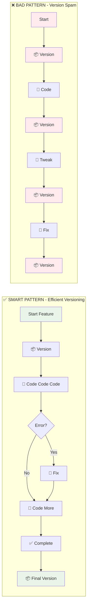
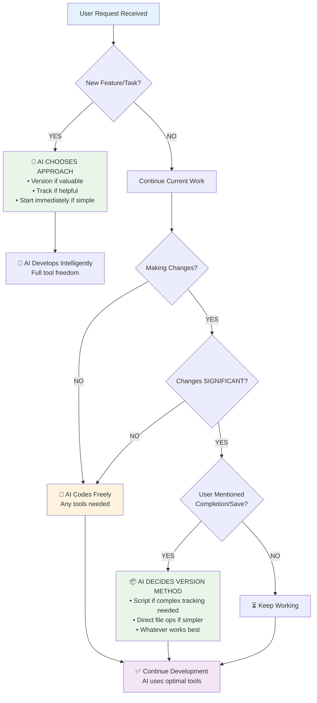

# Automatic Versioning Rules - Intelligent & Balanced

## Rule: Smart Auto-Versioning (Not Every Change!)

### 🎯 Version ONLY at Key Points:

#### DO Version When:
- **Starting** a new feature/modification
- **Completing** a feature successfully  
- **Before** major refactoring
- **After** significant progress (multiple functions added)
- **Failed** attempt that needs rollback point
- **Ending** a work session
- User **explicitly asks** for version

#### DON'T Version When:
- Fixing a typo
- Adjusting a single parameter
- Adding a comment
- Minor formatting changes
- In rapid iteration mode
- Testing different values

### 📊 Intelligent Version Detection

```mermaid
flowchart TD
    A[User Message Received] --> B{Parse Intent}
    
    B -->|"Add [feature]"| C[🆕 START: Version + Track]
    B -->|"That didn't work"| D[⏪ ROLLBACK: Version before revert]
    B -->|"Perfect, that works!"| E[✅ SUCCESS: Capture stable state]
    B -->|"I'm done for now"| F[🔚 END: Final session version]
    B -->|"Save this" / "Version this"| G[💾 EXPLICIT: User request]
    B -->|Minor edits/tweaks| H[⚡ CONTINUE: No versioning needed]
    
    C --> I[📦 Create Minor Version]
    D --> J[📦 Create Rollback Point]
    E --> K[📦 Create Patch Version]
    F --> L[📦 Create Session Version]
    G --> M[📦 Create Requested Version]
    H --> N[🔨 Continue Coding]
    
    style C fill:#e8f5e8
    style D fill:#fff3e0
    style E fill:#e8f5e8
    style F fill:#e8f5e8
    style G fill:#e8f5e8
    style H fill:#f3e5f5
```

**Trigger Phrase Examples:**
- 🆕 **Start**: "Add weekly filter to FVG" → Version ONCE at start
- ⏪ **Rollback**: "That didn't work" → Version before rollback  
- ✅ **Success**: "Perfect, that works" → Version to capture success
- 🔚 **End**: "I'm done for now" → Final version
- 💾 **Explicit**: "Save this" / "Version this" → User request

### 🔄 Workflow Integration



**Result Comparison:**
- ✅ **Smart Pattern**: 2 versions for entire feature (clean history)
- ❌ **Bad Pattern**: 4+ versions for simple feature (cluttered history)

### 📁 Working Directory Management

Keep working directory clean:
- Version at milestones, not every change
- Use descriptive version increments:
  - **patch**: Bug fixes, error corrections
  - **minor**: New features, enhancements
  - **major**: Breaking changes, rewrites

### 🎮 Practical Examples

#### Good Versioning Flow:
```
You: "Add weekly filter to FVG"
Me: [VERSION] fvg_v0.1.0 → fvg_v0.2.0 (minor - new feature)
    [CODE] Implement filter
    [ERROR] Fix HTF issue
    [CODE] Complete implementation
You: "Great, that works"
Me: [VERSION] fvg_v0.2.0 → fvg_v0.2.1 (patch - stabilized)
Total: 2 versions for complete feature
```

#### Bad Versioning Flow:
```
You: "Add weekly filter"
Me: [VERSION] v0.1.0 → v0.2.0
    [CODE] Add basic structure
Me: [VERSION] v0.2.0 → v0.2.1
    [CODE] Add timeframe check
Me: [VERSION] v0.2.1 → v0.2.2
    [ERROR] Fix issue
Me: [VERSION] v0.2.2 → v0.2.3
Total: Too many versions for one feature!
```

### 🤖 My Decision Process



**Quick Decision Reference:**
- 🆕 NEW task/feature → Always version first
- 📝 Minor edits → Just code, no version
- ✅ "That works!" → Version success
- 🔚 "I'm done" → Final version

### 📝 Version Commit Messages

When creating versions, use clear indicators:
```bash
# Feature start
./scripts/pine_master.sh develop file minor  # "Starting: [feature name]"

# Feature complete  
./scripts/pine_master.sh develop file patch  # "Completed: [feature name]"

# Failed attempt
./scripts/pine_tracker.sh rollback file version "Reason for rollback"
```

### 🎯 Key Principles


<!-- Content truncated to meet Windsurf 6KB limit -->

---
> Source: [tradesdontlie/pinescript-development-workspace](https://github.com/tradesdontlie/pinescript-development-workspace) — distributed by [TomeVault](https://tomevault.io).
<!-- tomevault:4.0:windsurf_rules:2026-07-01 -->
