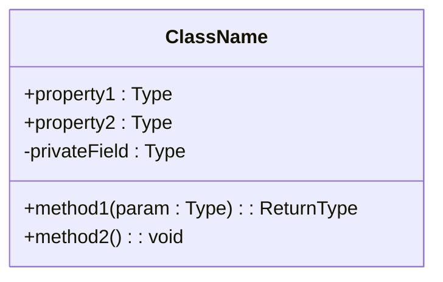

# Wiki Generator

Generate **professional-grade** structured project Wiki to `.mini-wiki/` directory.

> **核心原则**：生成的文档必须 **详细、结构化、有图表、相互关联**，达到企业级技术文档标准。

## 📋 Documentation Quality Standards

**CRITICAL**: All generated documentation MUST meet these standards:

### Content Depth
- Every topic must have **complete context** - no bare lists or skeleton content
- Descriptions must be **detailed and specific** - explain WHY and HOW
- Must include **working code examples** with expected output
- Must document **edge cases, warnings, common pitfalls**

### Structure Requirements
- Use **hierarchical headings** (H2/H3/H4) for clear information architecture
- Important concepts in **tables** for quick reference
- Processes visualized with **Mermaid diagrams**
- **Cross-links** between related documents

### Diagram Requirements (minimum 2-3 per document)
| Content Type | Diagram Type |
|--------------|--------------|
| Architecture | `flowchart TB` with subgraphs |
| Data/Call flow | `sequenceDiagram` |
| State changes | `stateDiagram-v2` |
| **Class/Interface** | `classDiagram` with properties + methods |
| Dependencies | `flowchart LR` |

### 🔴 MANDATORY: Source Code Traceability

**Every section MUST include source references** at the end:

```markdown
**Section sources**
- [filename.ts](file://path/to/file.ts#L1-L50)
- [another.ts](file://path/to/another.ts#L20-L80)

**Diagram sources**
- [architecture.ts](file://src/architecture.ts#L1-L100)
```

### 🔴 MANDATORY: Dynamic Quality Standards

**质量标准基于模块复杂度动态计算，而非固定数字**

#### 复杂度评估因子

```yaml
complexity_factors:
  # 源码指标
  source_lines: 0       # 模块源码行数
  file_count: 0         # 文件数量
  export_count: 0       # 导出的接口数量
  dependency_count: 0   # 依赖的模块数
  dependent_count: 0    # 被依赖次数
  
  # 项目上下文
  project_type: "fullstack"  # frontend / backend / fullstack / library / cli
  language: "typescript"     # typescript / python / go / java / rust
  module_role: "core"        # core / util / config / test / example
```

#### 动态质量公式

| 指标 | 计算公式 | 说明 |
|------|----------|------|
| **文档行数** | `max(100, source_lines × 0.3 + export_count × 20)` | 源码越多，文档越长 |
| **代码示例** | `max(2, export_count × 0.5)` | 每个导出接口至少 0.5 个示例 |
| **图表数量** | `max(1, ceil(file_count / 5))` | 每 5 个文件 1 个图表 |
| **章节数** | `6 + module_role_weight` | 核心模块章节更多 |

#### 模块角色权重

| 角色 | 权重 | 期望深度 |
|------|------|----------|
| **core** (核心) | +4 | 深度分析、完整示例、性能优化 |
| **util** (工具) | +2 | 接口说明、使用示例 |
| **config** (配置) | +1 | 配置项说明、默认值 |
| **test** (测试) | +0 | 测试策略、覆盖率 |
| **example** (示例) | +0 | 运行说明 |

#### 项目类型适配

| 项目类型 | 重点内容 |
|----------|----------|
| **frontend** | 组件 Props、状态管理、UI 交互示例 |
| **backend** | API 接口、数据模型、中间件示例 |
| **fullstack** | 前后端交互、数据流、部署配置 |
| **library** | API 文档、类型定义、兼容性说明 |
| **cli** | 命令参数、配置文件、使用示例 |

#### 语言适配

| 语言 | 示例风格 |
|------|----------|
| **TypeScript** | 类型注解、泛型示例、接口定义 |
| **Python** | docstring、类型提示、装饰器示例 |
| **Go** | 错误处理、并发示例、接口实现 |
| **Rust** | 所有权、生命周期、错误处理 |

### Module Document Sections

根据模块角色动态包含以下章节：

| 章节 | core | util | config | 内容 |
|------|:----:|:----:|:------:|------|
| **概述** | ✅ | ✅ | ✅ | 介绍、价值、架构位置图 |
| **核心功能** | ✅ | ✅ | - | 功能表格 + classDiagram |
| **目录结构** | ✅ | ✅ | - | 文件树 + 职责说明 |
| **API/接口** | ✅ | ✅ | ✅ | 导出接口、类型定义 |
| **代码示例** | ✅ | ✅ | ✅ | 基础/高级/错误处理 |
| **最佳实践** | ✅ | - | - | 推荐/避免做法 |
| **性能优化** | ✅ | - | - | 性能技巧、基准数据 |
| **错误处理** | ✅ | ✅ | - | 常见错误、调试技巧 |
| **依赖关系** | ✅ | ✅ | ✅ | 依赖图 |
| **相关文档** | ✅ | ✅ | ✅ | 交叉链接 |

### 🔴 Code Examples (Target: AI & Architecture Review)

**文档主要受众是 AI 和架构评审**，代码示例必须：

1. **完整可运行**：包含 import、初始化、调用、结果处理
2. **覆盖导出接口**：每个主要导出 API 至少 1 个示例
3. **包含注释说明**：解释关键步骤和设计意图
4. **适配项目语言**：遵循语言最佳实践

```typescript
// ✅ 好的示例：完整、可运行、有注释
import { AgentClient } from '@editverse/agent-core';

// 1. 创建客户端（展示必需配置）
const agent = await AgentClient.create({
  provider: 'openai',
  model: 'gpt-4',
});

// 2. 基础对话
const response = await agent.chat({
  messages: [{ role: 'user', content: '你好' }],
});
console.log(response.content);

// 3. 错误处理
try {
  await agent.chat({ messages: [] });
} catch (error) {
  if (error.code === 'INVALID_MESSAGES') {
    console.error('消息列表不能为空');
  }
}
```

**示例类型根据导出 API 数量动态调整**：
| 导出数量 | 示例要求 |
|----------|----------|
| 1-3 | 每个 API 1 个基础示例 + 1 个错误处理 |
| 4-10 | 核心 API 各 1 个示例 + 1 个集成示例 |
| 10+ | 分类示例（按功能分组） |

### 🔴 MANDATORY: classDiagram for Core Classes

For every core class/interface, generate detailed classDiagram:



### Document Relationships
- Every document must have **"Related Documents"** section
- Module docs link to: architecture position, API reference, dependencies
- API docs link to: parent module, usage examples, type definitions

---

## Output Structure

### 🔴 MANDATORY: Business Domain Hierarchy (Not Flat!)

**按业务领域分层组织，而不是扁平的 modules/ 目录**

```
.mini-wiki/
├── config.yaml
├── meta.json
├── cache/
├── wiki/
│   ├── index.md                    # 项目首页
│   ├── architecture.md             # 系统架构
│   ├── getting-started.md          # 快速开始
│   ├── doc-map.md                  # 文档关系图
│   │
│   ├── AI系统/                      # 业务领域 1
│   │   ├── _index.md               # 领域概述
│   │   ├── Agent核心/              # 子领域
│   │   │   ├── _index.md

<!-- Content truncated to meet Windsurf 6KB limit -->

---
> Source: [trsoliu/mini-wiki](https://github.com/trsoliu/mini-wiki) — distributed by [TomeVault](https://tomevault.io).
<!-- tomevault:4.0:windsurf_rules:2026-06-17 -->
