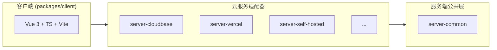

# Twikoo 2.0 开发者指引

本文面向本地二次开发，文档站内容见 `docs/`。

## 项目速览

Twikoo 是一个开源的静态网站评论系统。

## 环境要求

- Node.js 26
- pnpm

## 快速开始

```sh
pnpm install # 安装工作区依赖
pnpm demo # 一键启动本地演示（客户端、私有部署服务端、演示页）
```

### 目录 ↔ 包名对照表

目录名 ≠ 包名，所有代码中引用包名必须使用 `package.json` 里的 `name`，不可凭目录名推断。

```
twikoo/
├── docs/                      # twikoo-docs             ← VitePress 文档站
├── packages/
│   ├── shared/                # @twikoojs/shared        ← 前后端共享类型与常量
│   ├── tsdown-config/         # @twikoojs/tsdown-config ← 共享构建积木
│   ├── client/                # twikoo                  ← 前端库
│   ├── server-common/         # @twikoojs/common        ← 公共后端库，核心交付
│   ├── server-aws-lambda/     # @twikoojs/aws-lambda    ← AWS Lambda 适配器
│   ├── server-cloudbase/      # twikoo-func             ← 腾讯云 CloudBase 适配器
│   ├── server-cloudflare/     # @twikoojs/cloudflare    ← Cloudflare Workers 适配器
│   ├── server-edgeone-makers/ # @twikoojs/edgeone-makers ← EdgeOne Makers 适配器
│   ├── server-netlify/        # twikoo-netlify          ← Netlify 适配器
│   ├── server-vercel/         # twikoo-vercel           ← Vercel 适配器
│   ├── server-self-hosted/    # tkserver                ← 私有部署适配器
│   ├── pkg/                   # twikoo-pkg              ← SEA 可执行产物打包流水线，产出私有部署可执行程序
│   ├── demo/                  # @twikoojs/demo          ← 本地演示工程
│   └── pushoo/                # pushoo                  ← 推送通道库
└── templates/                 # 一键部署模板（纯 JS，平台直取）
    ├── aws-lambda/src/        #   AWS Lambda（terraform/main.tf 的 source_path 指向它）
    ├── cloudbase/twikoo/      #   腾讯云开发（仓库根 cloudbaserc.json 指向它）
    ├── vercel-min/            #   Vercel（api/index.js + vercel.json + package.json）
    ├── hf-space/              #   Hugging Face Space（Dockerfile + src/start.sh）
    └── edgeone-makers/        #   腾讯云 EdgeOne Makers（ZIP 由构建期生成，控制台直接上传）
```

## 常用命令

```bash
pnpm build # 全仓构建
pnpm test # 全仓单元测试
pnpm lint # ESLint
pnpm lint:md # markdown 排版（AutoCorrect，只扫 *.md）
pnpm typecheck # 逐包 tsc --noEmit
pnpm e2e:b2 # 端到端回归
pnpm check:products # 客户端产物逐一 init + 形态断言 + tkserver 启动/shutdown
```

- `pnpm build` 是 `pnpm test`、`pnpm lint`、`pnpm typecheck`、`pnpm e2e:b2`、`pnpm check:products` 的前置
- 单包命令：`pnpm --filter <包名> <script>`（如 `pnpm --filter tkserver test`、`pnpm --filter twikoo build`、`pnpm --filter twikoo-docs docs:build`）。
- **Windows 开发者**：如遇脚本 shell 兼容问题，可用 `bash -lc "pnpm build"` 通过 Git Bash 执行。

## 架构说明



### 事件机制

客户端通过 HTTP POST 发送事件名，服务端 dispatcher 分发到对应 handler：

- 评论操作
  - `COMMENT_SUBMIT`
  - `COMMENT_GET`
  - `COMMENT_LIKE`
  - `COMMENT_DELETE_FOR_USER`
- 管理员操作
  - `COMMENT_GET_FOR_ADMIN`
  - `COMMENT_SET_FOR_ADMIN`
  - `COMMENT_DELETE_FOR_ADMIN`
  - `COMMENT_IMPORT_FOR_ADMIN`
  - `COMMENT_EXPORT_FOR_ADMIN`
- 统计
  - `COUNTER_GET`
  - `GET_COMMENTS_COUNT`
  - `GET_RECENT_COMMENTS`
- 配置/登录
  - `GET_CONFIG`
  - `GET_CONFIG_FOR_ADMIN`
  - `SET_CONFIG`
  - `LOGIN`
  - `GET_PASSWORD_STATUS`
  - `SET_PASSWORD`
- 验证码
  - `CAP_CHALLENGE`
  - `CAP_REDEEM`
- 邮件/上传/反垃圾
  - `EMAIL_TEST`
  - `UPLOAD_IMAGE`
  - `GET_QQ_NICK`
- 版本
  - `GET_FUNC_VERSION`
- 服务端内部事件
  - `POST_SUBMIT`

- 新增事件须在客户端 `api.ts`、`@twikoojs/common` dispatcher 中同步添加；适配器经 common 统一分发，只需声明 capabilities。
- 为了降低发送评论的耗时，`COMMENT_SUBMIT` 中不执行垃圾检测、邮件通知、即时消息通知，而通过调用 `POST_SUBMIT` 事件，由后者执行，即发送评论不等待耗时操作。

## 平台适配器开发指南

- **Ports 注入**：`request` / `response` / `database` / `storage` / `mailer` / `notifier` / `postSubmit` / `capabilities`
- **保持薄**：适配器只做「入口 + 适配器注入 + 平台载荷转换」，业务逻辑一律进 `@twikoojs/common`。
- **依赖完整性**：重依赖在适配器 `dependencies` 中声明（能力为 `true` ⇒ 关联包必须在 `dependencies` 里；
  无能力门的包人人必备）。由 `packages/server-common/test/adapter-deps.test.ts` 自动断言，无需人工核对。
  例外：用 `setCustomLibs` 注入自实现替代依赖的适配器，在 `OVERRIDE_SATISFIED` 里登记（该表有守卫用例）

## 代码规范

### 硬性规则

- **每个函数、类方法、导出常量上方必须写中文注释**
- TypeScript `strict`；语法目标 **ES2022**
- **`packages/*/src` 下不得出现 `.js`/`.mjs`/`.cjs` 源码**
- **`templates/**` 是唯一允许纯 JS 的地方**：云平台点「一键部署」时只克隆目录/仓库后 `npm install`
- 提交信息：Conventional Commits（`feat|fix|chore|docs|test|build|ci|refactor` + scope）

### 工具链

- **ESLint 9** flat（`vue3-recommended` + `typescript-eslint` type-checked）
- **Prettier**（`semi` · 双引号 · `trailingComma: "all"` · `printWidth: 100` · `tabWidth: 2`）
- **markdown 由 [AutoCorrect](https://github.com/huacnlee/autocorrect) 负责**：`pnpm lint:md` 检查、`pnpm format:md` 修复
- **Vitest 5**（工作区模式：根 `vitest.config.ts` 的 `projects` 发现各包 `vitest.config.ts`）

## CSS 规范

- **禁止** `<style scoped>`
- 类名统一 **`tk-` 前缀**（如 `.tk-submit`、`.tk-error`、`.tk-owo-emotion`）
- 作用域挂 **`.twikoo`** 根选择器（`.twikoo .tk-submit { ... }`）
- 为确保在浅色、深色博客主题上保持同样清晰，文字颜色需使用 `currentColor`，边框、背景颜色需使用半透明颜色

## 依赖规则

### 动态 import

- **对重依赖用动态 `import()`**（`@twikoojs/common` 经 `utils/lib-loader.ts` 的 `LITERAL_LOADERS` 表加载）
- **specifier 必须写字面量**：`import(specifier)` 一旦是变量，静态追踪器（Vercel 的 `@vercel/nft`、
  SEA 单文件打包、rolldown 依赖内联）就解析不到包，依赖不会进产物 → 运行时 `LibLoadError`。
  表项是**函数体内的 thunk**（不在模块顶层执行），故惰性不受影响；「不进产物」由各包
  `deps.neverBundle` 保证。纪律由 `test/utils/lib-loader-literals.test.ts` 兜底

### 重依赖清单（全部 external + 动态加载）

- `nodemailer`

<!-- Content truncated to meet Windsurf 6KB limit -->

---
> Source: [twikoojs/twikoo](https://github.com/twikoojs/twikoo) — distributed by [TomeVault](https://tomevault.io).
<!-- tomevault:4.0:windsurf_rules:2026-09-30 -->
