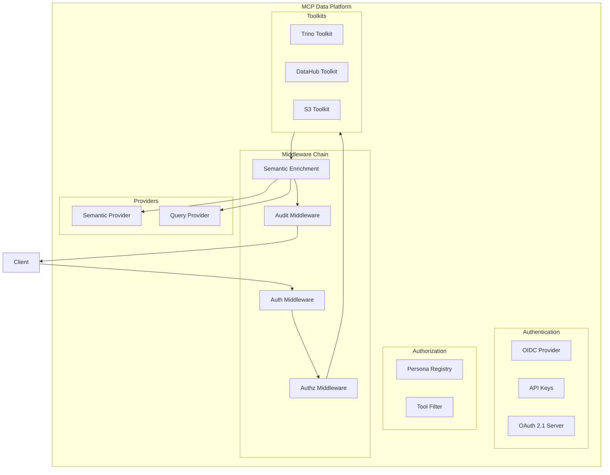

# CLAUDE.md

This file provides guidance to Claude Code when working with this project.

## Project Overview

**mcp-data-platform** is a semantic data platform MCP server that composes multiple txn2 MCP libraries (mcp-trino, mcp-s3, mcp-datahub) with required semantic layer integration. The key differentiator is **bidirectional cross-enrichment** where tool responses automatically include critical context from other services.

**Key Design Goals:**
- **Semantic-first**: All data access includes business context from the semantic layer
- **Composable**: Integrates multiple MCP toolkits (Trino, DataHub, S3) into a unified platform
- **Secure**: OAuth 2.1 authentication, role-based personas, and comprehensive audit logging
- **Extensible**: Plugin-based toolkit registry with middleware chain architecture

## Architecture

### Cross-Enrichment Pattern

**Trino → DataHub**: When describing a table in Trino, the response includes DataHub metadata (owners, tags, glossary terms, deprecation warnings, quality scores).

**DataHub → Trino**: When searching DataHub, results include query availability (can this be queried? how many rows? sample SQL).

## CRITICAL - Factual Integrity (No Confabulation)

AI-generated prose (PR descriptions, commit messages, reviews, explanations) is held to the same verification standard as code. Unverified claims are as unacceptable as untested code.

1. **Never assert facts you haven't verified.** Before stating that a file contains X, a config is missing Y, or a system behaves in way Z — READ the file, CHECK the config, VERIFY the behavior. If you haven't looked, say "I haven't verified this" or say nothing.

2. **Every claim must be evidence-linked.** PR descriptions, commit messages, and work summaries may only include claims that are either: (a) directly visible in the diff, or (b) verified by reading a specific file (cite file:line). No exceptions.

3. **Never pad or embellish.** If you made two fixes, describe two fixes. Do not invent a third to make the work look more complete. Do not present hypotheses as confirmed diagnoses.

4. **Uncertainty must be explicit.** Use "I believe," "possibly," or "I haven't verified" when uncertain. Never upgrade a guess to a fact.

5. **When reviewing, verify claims against evidence.** Treat PR descriptions and commit messages as claims to be fact-checked, not trusted context.

6. **Omission over fabrication.** A gap stated honestly is better than a fabricated answer stated confidently. When in doubt, leave it out.

## Code Standards

1. **Idiomatic Go**: All code must follow idiomatic Go patterns and conventions. Use `gofmt`, follow Effective Go guidelines, and adhere to Go Code Review Comments.

2. **Test Coverage**: Project must maintain >80% unit test coverage. Build mocks where necessary to achieve this. Use table-driven tests where appropriate.
   - **New code must have >80% coverage**: Run `go test -coverprofile=coverage.out ./...` and verify new/modified functions meet the threshold
   - Use `go tool cover -func=coverage.out | grep <function_name>` to check specific functions
   - Framework callbacks (e.g., MCP handlers that require client connections) may be excluded if the actual logic is extracted and tested separately

3. **Testing Definition**: When asked to "test" or "testing" the code, this means running `make verify`, which executes the full CI-equivalent suite:
   - **Tools-check (parity gate)** — verifies local `golangci-lint` and `gosec` versions equal `GOLANGCI_LINT_VERSION` and `GOSEC_VERSION` in the Makefile (which mirror `.github/workflows/ci.yml`). Drifting local tool versions are the most insidious parity gap: a newer local gosec can silently relax a rule that CI's pinned version still enforces, letting a real bug ship to PR. `make verify` refuses to run until local matches CI. Override with `TOOLS_CHECK_STRICT=0` only with explicit reason.
   - Code formatting (`gofmt -s -w .`)
   - Unit tests with race detection (`go test -race ./...`)
   - Coverage verification — total must be ≥80% (hard gate)
   - Patch coverage — changed lines vs main must be ≥80% (mirrors codecov patch check)
   - Linting (`golangci-lint run ./...` plus `--new-from-rev=$MERGE_BASE` to mirror CI's `only-new-issues: true`) — cyclomatic complexity ≤10, cognitive complexity ≤15
   - Security scanning (`gosec ./...` + `govulncheck`)

<!-- Content truncated to meet Windsurf 6KB limit -->

---
> Source: [txn2/mcp-data-platform](https://github.com/txn2/mcp-data-platform) — distributed by [TomeVault](https://tomevault.io).
<!-- tomevault:4.0:windsurf_rules:2026-06-26 -->
