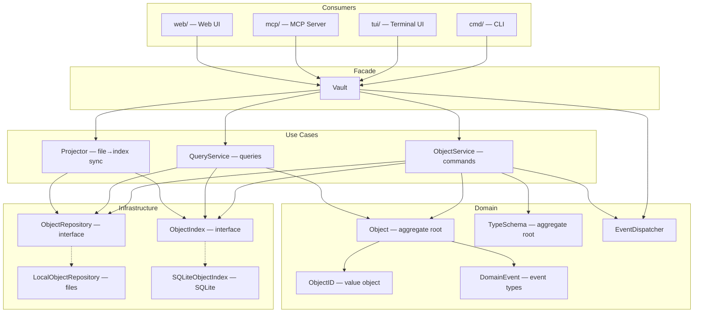

# CLAUDE.md

## Project Overview

typemd is a local-first CLI knowledge management tool. Objects (books, people, ideas) are stored as Markdown files with YAML frontmatter, connected by Relations. SQLite provides indexing.

## Architecture

- **core/** — Core library: objects, types, relations, index
  - **core/ai/** — AI provider abstraction and service layer (Claude CLI integration)
- **cmd/** — CLI commands (Cobra)
- **tui/** — Terminal UI (Bubble Tea)
  - **tui/widget/** — Shared UI primitives (CenteredPopup, OverlayPopup, ToastModel via Layer/Compositor, scroll) used across TUI components
- **mcp/** — MCP server
- **web/** — Web UI: Go HTTP server (`tmd serve`) + Vue 3 frontend (Vite + Tailwind CSS)
  - **web/frontend/** — Vue 3 SPA with vault adapter pattern for API abstraction
- **app/** — Desktop app via Wails + shared Vue 3 frontend (future)
- **websites/** — Non-Go websites (site, docs, blog)
- **marketplace/** — Claude Code marketplace plugins (typemd plugin with vault-guide, instructions-guide, explore, importer, and onboarding skills)

## Core Package Architecture

The `core/` package follows **Clean Architecture** with **CQRS** (Command Query Responsibility Segregation). The design separates concerns into layers with clear dependency rules.

### Layer Diagram

### Key Design Decisions

- **ObjectRepository** returns domain entities (`*Object`, `*TypeSchema`), not raw bytes. Path conventions and serialization are encapsulated in implementations.
- **ObjectIndex** returns `ObjectResult` (lightweight projection) for search results. Full entity retrieval goes through `ObjectRepository.Get(id)`.
- **Vault** is a thin facade / DI container. Object business logic lives in `ObjectService` (commands) and `QueryService` (queries). Type schema CRUD (`SaveType`, `DeleteType`, `CountObjectsByType`) lives directly on Vault since it delegates to `ObjectRepository` without needing a separate service layer.
- **Domain Events** follow "entity produces → use case dispatches" pattern. Entity methods return `DomainEvent`; services collect and dispatch after successful operations.
- **Files are the source of truth**. SQLite index is an acceleration layer maintained by the `Projector`.

### Key Entry Points

- `vault.go` — Vault facade + lifecycle (Open/Close/Init)
- `object_service.go` — command use cases (create/save/link)
- `query_service.go` — query use cases (search/filter/stats)
- `reconciler.go` — file normalization + event emission (full + incremental); `reconciler_relation.go` — relation resolution + tag sync; `reconciler_wikilink.go` — wiki-link sync
- `projector.go` — event-driven SQLite index writer
- `config.go` — VaultConfig (date formats, CLI/TUI/AI config sections)

### TUI Architecture

The TUI uses a three-panel layout (sidebar, body, properties) with **focus mode** (`.` key) for single full-width body. The right panel follows the sidebar cursor via a **right panel mode** system: `panelObject`, `panelTypeEditor`, `panelTemplate`, `panelView` (full-width table/list), `panelStats`, `panelSchemaExplore`, `panelConfig` (config settings page). Keybindings are defined in `tui/keys.go`; see `tui/help.go` for the help popup or the [docs site TUI page](websites/docs/src/content/docs/tui/tui.md) for the full keybinding table.

Key sub-models: `typeEditor` (schema editing + wizard + templates), `viewMode` (table/list views with inline cell editing via `cellEdit`), `propEditor` (inline property editing with type-appropriate widgets), `dateEdit` (segmented input + calendar picker), `configEditor` (config settings editor with two-column category/settings layout), `widget.ToastModel` (transient notifications). File watcher monitors `objects/` and `types/` with debounced incremental sync.

## Data Model

- Objects identified by `type/<slug>-<ulid>` (e.g. `book/golang-in-action-01jqr3k5mpbvn8e0f2g7h9txyz`)

<!-- Content truncated to meet Windsurf 6KB limit -->

---
> Source: [typemd/typemd](https://github.com/typemd/typemd) — distributed by [TomeVault](https://tomevault.io).
<!-- tomevault:4.0:windsurf_rules:2026-07-04 -->
