# CLAUDE.md — Project Context for Claude Code

## What is this project?

Omniscient is an Amazon Product Research Engine. It identifies profitable FBA product opportunities by analyzing demand, competition, suppliers, ad costs, review barriers, and sales velocity. It outputs a scored recommendation (0-100 Omniscient Score) with a 52-week financial projection across bull/base/bear scenarios.

## Tech stack

- **Backend:** Python 3.12, FastAPI (async), SQLAlchemy 2.0 (async ORM), Alembic migrations, Celery + Redis for background tasks
- **Frontend:** Next.js 14 (App Router), TypeScript, Tailwind CSS, Recharts for charts
- **Database:** PostgreSQL 16 with TimescaleDB extension (hypertables for BSR and price time-series)
- **LLM:** Configurable provider system — Qwen (default via DashScope), Anthropic Claude, OpenAI GPT. All implement `BaseLLMClient` abstract class.
- **Scraping:** Playwright headless Chromium with rotating proxies (free via proxyscrape.com or paid residential via BrightData/SmartProxy)

## Project layout

```
omniscient/
├── backend/
│   ├── app/
│   │   ├── main.py            # FastAPI app factory, lifespan, middleware
│   │   ├── config.py          # Pydantic Settings from env vars
│   │   ├── dependencies.py    # DI: get_db, get_redis, get_llm_client
│   │   ├── api/               # FastAPI route handlers (28 endpoints)
│   │   ├── models/            # SQLAlchemy 2.0 ORM models (14 tables)
│   │   ├── schemas/           # Pydantic v2 request/response schemas
│   │   ├── services/          # Business logic layer (16 service modules)
│   │   ├── core/              # Utilities (BSR regression, FBA calc, proxy, cache)
│   │   ├── llm/               # LLM provider abstraction + implementations
│   │   └── workers/           # Celery app, tasks, beat schedule
│   ├── migrations/            # Alembic migrations (001-004)
│   ├── tests/                 # pytest suite
│   └── pyproject.toml         # Python deps
├── frontend/
│   └── src/
│       ├── app/               # Next.js App Router pages (incl. /docs)
│       ├── components/        # UI components (sidebar, charts, cards)
│       ├── lib/               # API client (axios), utilities
│       └── types/             # TypeScript type definitions
├── docker-compose.yml
└── .env.example
```

## Service Dependency Graph

```mermaid
graph TD
    subgraph "API Layer"
        NICHES["niches.py"]
        PRODUCTS["products.py"]
        RECS["recommendations.py"]
        JOBS["jobs.py"]
    end

    subgraph "Task Orchestration"
        TASKS["tasks.py<br/>(13-step pipeline)"]
    end

    subgraph "Scraping Services"
        SCRAPER["ScraperService<br/>Amazon pages"]
        SUPP_SCRAPER["SupplierScraper<br/>1688.com"]
        AMZ_LOGIN["AmazonLoginService"]
        ALI_LOGIN["AlibabaLoginService"]
    end

    subgraph "Analysis Services"
        COMP["CompetitorService"]
        REVIEW["ReviewAnalyzer"]
        NICHE_INTEL["NicheIntelligence"]
        BLUEPRINT["ProductBlueprint"]
        SPEC["SpecGenerator"]
        SUPP_MATCH["SupplierMatchService"]
    end

    subgraph "Financial Services"
        SCORING["ScoringService"]
        SUPPLIER["SupplierService"]
        FORECAST["SalesForecast"]
        PPC["PPCService"]
        REV_STRAT["ReviewStrategy"]
        MARKETING["MarketingService"]
        FIN_REPORT["FinancialReport"]
        REC_ENGINE["RecommendationEngine"]
    end

    subgraph "Core Utilities"
        BSR["BSR Regression"]
        FBA["FBA Calculator"]
        PROXY["ProxyManager"]
        COOKIE["CookieManager"]
        LLM["LLM Client"]
    end

    JOBS -->|dispatch| TASKS
    TASKS --> SCRAPER
    TASKS --> SUPP_SCRAPER
    TASKS --> COMP
    TASKS --> REVIEW
    TASKS --> NICHE_INTEL
    TASKS --> BLUEPRINT
    TASKS --> SPEC
    TASKS --> SUPP_MATCH
    TASKS --> SCORING
    TASKS --> SUPPLIER
    TASKS --> FORECAST
    TASKS --> PPC
    TASKS --> REV_STRAT
    TASKS --> MARKETING
    TASKS --> FIN_REPORT
    TASKS --> REC_ENGINE

    SCRAPER --> PROXY
    SUPP_SCRAPER --> PROXY
    SUPP_SCRAPER --> COOKIE
    AMZ_LOGIN --> COOKIE
    ALI_LOGIN --> COOKIE

    REVIEW --> LLM
    NICHE_INTEL --> LLM
    BLUEPRINT --> LLM
    SPEC --> LLM
    SUPP_MATCH --> LLM
    PPC --> LLM
    REV_STRAT --> LLM
    MARKETING --> LLM
    FIN_REPORT --> LLM

    SCORING --> BSR
    SCORING --> FBA
    SUPPLIER --> FBA
    FORECAST --> FBA

    style TASKS fill:#f59e0b,color:#fff
    style LLM fill:#8b5cf6,color:#fff
    style SCRAPER fill:#3b82f6,color:#fff
    style SCORING fill:#10b981,color:#fff
```



## Database Entity Relationship Diagram

```mermaid
erDiagram
    Niche ||--o{ Product : "niche_id"
    Niche ||--o{ Competitor : "niche_id (CASCADE)"
    Niche ||--o{ NicheKeyword : "niche_id"
    Niche ||--o{ PPCKeyword : "niche_id"
    Niche ||--o{ Supplier : "niche_id (CASCADE)"
    Niche ||--o{ ReviewPainPoint : "niche_id"
    Niche ||--o{ FinancialProjection : "niche_id (CASCADE)"
    Niche ||--o{ Recommendation : "niche_id (CASCADE)"

<!-- Content truncated to meet Windsurf 6KB limit -->

---
> Source: [Umair706/amazon-omniscient](https://github.com/Umair706/amazon-omniscient) — distributed by [TomeVault](https://tomevault.io).
<!-- tomevault:4.0:windsurf_rules:2026-08-11 -->
