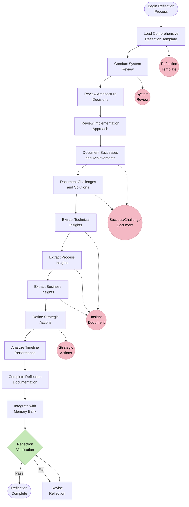

# COMPREHENSIVE REFLECTION FOR LEVEL 4 TASKS

> **TL;DR:** This document outlines a structured, comprehensive approach to reflection for Level 4 (Complex System) tasks, including system review, success and challenge analysis, strategic insights, and action planning.

## 🔍 COMPREHENSIVE REFLECTION OVERVIEW

Level 4 Complex System tasks require in-depth reflection to capture key insights, document successes and challenges, extract strategic lessons, and guide future improvements. This systematic reflection process ensures organizational learning and continuous improvement.



## 📋 REFLECTION TEMPLATE STRUCTURE

### 1. System Overview

```markdown
## System Overview

### System Description
[Comprehensive description of the implemented system, including purpose, scope, and key features]

### System Context
[Description of how the system fits into the broader technical and business ecosystem]

### Key Components
- Component 1: [Description and purpose]
- Component 2: [Description and purpose]
- Component 3: [Description and purpose]

### System Architecture
[Summary of the architectural approach, key patterns, and design decisions]

### System Boundaries
[Description of system boundaries, interfaces, and integration points]

### Implementation Summary
[Overview of the implementation approach, technologies, and methods used]
```

### 2. Project Performance Analysis

```markdown
## Project Performance Analysis

### Timeline Performance
- **Planned Duration**: [X] weeks/months
- **Actual Duration**: [Y] weeks/months
- **Variance**: [+/-Z] weeks/months ([P]%)
- **Explanation**: [Analysis of timeline variances]

### Resource Utilization
- **Planned Resources**: [X] person-months
- **Actual Resources**: [Y] person-months
- **Variance**: [+/-Z] person-months ([P]%)
- **Explanation**: [Analysis of resource variances]

### Quality Metrics
- **Planned Quality Targets**: [List of quality targets]
- **Achieved Quality Results**: [List of achieved quality results]
- **Variance Analysis**: [Analysis of quality variances]

### Risk Management Effectiveness
- **Identified Risks**: [Number of risks identified]
- **Risks Materialized**: [Number and percentage of risks that occurred]
- **Mitigation Effectiveness**: [Effectiveness of risk mitigation strategies]
- **Unforeseen Risks**: [Description of unforeseen risks that emerged]
```

### 3. Achievements and Successes

```markdown
## Achievements and Successes

### Key Achievements
1. **Achievement 1**: [Description]
   - **Evidence**: [Concrete evidence of success]
   - **Impact**: [Business/technical impact]
   - **Contributing Factors**: [What enabled this success]

2. **Achievement 2**: [Description]
   - **Evidence**: [Concrete evidence of success]
   - **Impact**: [Business/technical impact]
   - **Contributing Factors**: [What enabled this success]

### Technical Successes
- **Success 1**: [Description of technical success]
  - **Approach Used**: [Description of approach]
  - **Outcome**: [Results achieved]
  - **Reusability**: [How this can be reused]

- **Success 2**: [Description of technical success]
  - **Approach Used**: [Description of approach]
  - **Outcome**: [Results achieved]
  - **Reusability**: [How this can be reused]

### Process Successes
- **Success 1**: [Description of process success]
  - **Approach Used**: [Description of approach]
  - **Outcome**: [Results achieved]

<!-- Content truncated to meet Windsurf 6KB limit -->

---
> Converted and distributed by [TomeVault](https://tomevault.io/claim/vedmalex) — claim your Tome and manage your conversions.
<!-- tomevault:4.0:windsurf_rules:2026-04-10 -->
