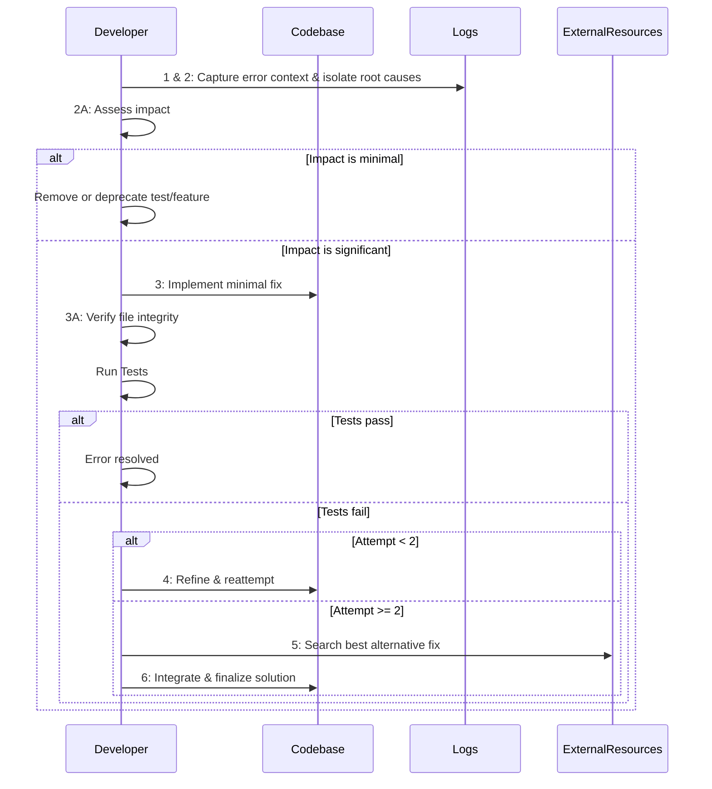

**My Error Fixing Protocols** must be followed for **every** error. Prioritize the “Fail Fast” mindset with small, **incremental** fixes. After each fix attempt, verify whether the error is resolved. If not, refine again or source **alternative solutions** from the internet.  

#### Key Components

- **Comprehensive Root Cause Analysis (RCA):** Dig into logs, code, configurations, and dependencies to find **all** possible culprits.  
- **Prioritize Errors Based on Impact:** Evaluate how each error affects **functionality** and **UI/UX**; fix critical-impact errors first.  
- **Compare Solutions for Optimal Fix:** If repeated attempts fail, search for external solutions. **Compare** these solutions against the current implementation to select the **most efficient, minimal** fix.  
- **Guarantee 100% Error Fix** in **2–3** attempts:  
  1. First attempt: Minimal, targeted fix based on RCA.  
  2. Second attempt (if needed): Refined fix.  
  3. Third approach (if still unresolved): Integrate the **best** alternative from @web research.
- **Cross-Protocol Calls:** If errors relate to directory structure or missing/incorrect imports, call the **Directory Management Protocol**. Conversely, if reorganizing the directory structure causes breakage, call this **Error Handling Protocol** again to fix any new errors.

---

#### Recursive Error Resolution Algorithm

|--------------------------------------|---------------------------------------------------------------------------------------|------------------|-----------------------------|
| Step                                 | Action                                                                                | Attempt Limit    | Exit Condition              |
|--------------------------------------|---------------------------------------------------------------------------------------|------------------|-----------------------------|
| **1. Error Isolation**               | Detect and isolate the error; capture complete context (logs, stack traces, etc.).    | -                | Error context captured      |
| **2. Root Cause Analysis**           | Perform an exhaustive analysis of logs, configurations, and code to list all potentia | —                | All potential causes listed |  
| **2A. Contextual Impact Analysis**   | Evaluate the error against overall project context. Weigh its impact on functionthe   | -                |                             |
|                                      | impact is minimal, remove or deprecate the feature/test.                              | —                | complete                    |
| **3. First Fix Attempt**             | Apply a **minimal, atomic** change based on the RCA. Modify **only** the code—no      |                  |                             |
|                                      | placeholders or extraneous changes.                                                   | 1 of 2           | Tests validat fix           |
| **3A. File Integrity Verification**  | Immediately verify file integrity—ensure **no extraneous placeholders** unintended    |                  |                             |
|                                      | modifications.                                                                        | —                | File integrity confirmed    |
| **4. Recursive Retry**               | If the error persists (<2 attempts), refine and reattempt the fix, then verify file   | 2 of 2           | Error resolved              |
| **5. Alternative Sourcing**          | If the error persists after 2 attempts, **search the internet** for insights          |                  |                             |
|                                      | and solutions, compare them, and pick the most **optimal** fix.                       | —                | Verified found              |
| **6. Final Application**             | Implement the **optimized hybrid** fix, re-run tests, and verify file integrity.      | —                | Error resolved              |
|--------------------------------------|----------------------------------------------------------------------------------------------------------|-----------------------------|

**Implementation Example:**

```python
def handle_error(error, attempt=1):
    # Step 1 & 2: Capture error context and perform exhaustive RCA.
    root_causes = analyze(error)

    # Step 2A: Evaluate error impact relative to project context, focusing on functionality/UI impact.
    impact = assess_impact(error, project_context)
    if impact == "minimal":
        document_rationale_and_remove_test(error)
        return success("Feature/test removed due to minimal impact")

    # Step 3: Apply a minimal, targeted fix.
    solution = minimal_fix(root_causes)

    # Step 3A: Verify file integrity for extraneous/unintended modifications.
    if not verify_file_integrity(solution):
        raise Exception("File integrity check failed: Unwanted modifications detected")

    if validate(solution):
        return success()
    elif attempt < 2:
        # Step 4: Refine the solution and retry if attempts remain.
        return handle_error(error, attempt + 1)
    else:
        # Step 5: Seek alternative solutions, compare, and integrate the best approach.
        web_solution = search_web_for_fix(error)
        hybrid_solution = choose_optimal_fix(solution, web_solution)

        if not verify_file_integrity(hybrid_solution):
            raise Exception("File integrity check failed: Unwanted modifications detected")

        return final_validation(hybrid_solution)
```

#### Sequence Flow Diagram

**Recursive Error Resolution Algorithm**:



---

##### **Recursive Import Error Fixing Algorithm**

**Purpose:** When directory restructuring (under the Directory Management Protocol) causes import breakages, or if import paths are incorrect, you must fix these issues by combining the Directory Management Protocol and Error Handling Protocol.

**Algorithm Steps:**

1. **Detect Import Errors**  
   - Check logs and stack traces for `ModuleNotFoundError`, `ImportError`, or relative path issues.
2. **Invoke Directory Management Protocol**  
   - Confirm the correct file structure.  
   - If the file location changed, update references or revert changes.  
   - Ensure unused/duplicate files do not conflict with existing imports.
3. **Isolate Incorrect Paths**  
   - List all files affected by the import error.  
   - Evaluate relative vs. absolute imports and confirm they match the new structure.
4. **Minimal Fix Implementation**  
   - Update only the necessary import statements.  
   - Run a quick test to confirm resolution.
5. **Error Handling Re-check**  
   - If the error persists, apply the **Recursive Error Resolution Algorithm**.  
   - Conduct Root Cause Analysis focusing on paths, file existence, or symlink issues.
6. **File Integrity & Testing**  
   - Verify no extraneous modifications.  
   - Re-run relevant unit/integration tests.  
   - If successful, proceed.
7. **Rollback or External Search** (If needed)  
   - If two attempts fail, revert to a stable structure and search for alternative solutions.  
   - Integrate the best approach, ensuring minimal changes.

---

### 2.5 Critical Constraints (Mandatory)

#### Code Modifications & Replacement Protocol

- **No functionality or code** is lost, added, or removed beyond the **targeted** change.
- Maximum of **2 direct fix attempts** per error before leveraging external solutions.
- Each change must be **atomic**, following the Single Responsibility Principle (SRP).
- **Prohibition:** Never insert placeholder text like `# ... [rest of the existing methods remain unchanged]`.
- Avoid unnecessary code alterations—**focus** solely on the **precise** change required.

---

---
> Converted and distributed by [TomeVault](https://tomevault.io/claim/Victordtesla24)
> This is a context snippet only. You'll also want the standalone SKILL.md file — [download at TomeVault](https://tomevault.io/claim/Victordtesla24)
<!-- tomevault:4.0:windsurf_rules:2026-04-08 -->
