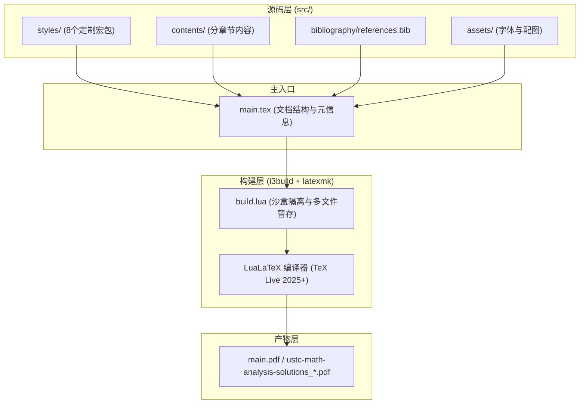

# Repository Guidelines

本项目为中科大《数学分析讲义》（程艺、陈卿、李平 编著）全套习题解析的高质量 LaTeX 文档排版仓库，基于 **LuaLaTeX + l3build** 构建系统，采用模块化宏包架构与自动化 CI/CD 发布流水线．

---

## 1. Project Overview

* **项目目标**：编写并整理《数学分析讲义》（第一、二册，涵盖第 1 ~ 13 章）的完整习题解答与推导过程，提供排版优美、推导严谨、支持矢量图形放大的开源数学参考书．
* **文档类型**：基于 `ctexbook` 文档类，原生支持中文排版与 OpenType 数学字体渲染．
* **分发形式**：通过 GitHub Actions 自动编译生成全彩高质量矢量 PDF（含每夜构建 Nightly 与正式版本 Release）．

---

## 2. Architecture & Data Flow

### 2.1 整体架构



### 2.2 模块化宏包体系 (`src/styles/`)

顶层入口为 `math-solutions.sty`，按关注点分离加载子模块：

| 宏包文件名                  | 职责与功能                                                                       |
| :-------------------------- | :------------------------------------------------------------------------------- |
| `math-solutions.sty`        | 宏包总入口，统筹各子宏包的依赖与基础配置                                         |
| `math-solutions-colors.sty` | 主题配色系统（`ThemeDarkBlue`, `ThemeRose`, `ThemeWine`, `ThemePaper` 等）       |
| `math-solutions-layout.sty` | 版面几何尺寸、页眉页脚（`fancyhdr`）、章节标题装饰线、双栏目录定制               |
| `math-solutions-math.sty`   | 数学字体配置（`NewCMMath-Book.otf`）、`unicode-math`、`fixdif`、数学符号宏定义   |
| `math-solutions-tcb.sty`    | 基于 `tcolorbox` 的习题盒子（`problem`）与说明盒子（`note`）样式定义             |
| `math-solutions-env.sty`    | 解答环境（`solution`）、证明环境（`myproof`）、子题标记（`\ansitem`）及列表样式  |
| `math-solutions-floats.sty` | 浮动体设置、`TikZ` / `pgfplots` / `tabularray` / `booktabs` 图表支持             |
| `math-solutions-ref.sty`    | `zref-clever` 智能引用、`hyperref` / `bookmark` 超链接与 `biblatex` 参考文献格式 |

### 2.3 章节组织与包含机制 (`src/contents/`)

* **`frontmatter/`**：书籍前言与封面（`titlepage.tex`, `preface-overview.tex`, `preface-contrib.tex`）．
* **`mainmatter/chapters/`**：按 `XX-chapter-name/` 规范命名的各章内容．
  * 章节主入口：`XX-main.tex`（负责声明 `\chapter{...}` 并 `\input` 小节与习题文件）．
  * 分节题解：`XX-YY-section-name.tex`（按小节拆分题解内容）．
  * 章末习题：`XX-exercises.tex`（汇总整章补充习题）．
* **`backmatter/`**：附录与开源协议（`fdl.tex`）以及参考文献．

---

## 3. Key Directories

```text
.
├── .github/
│   ├── workflows/        # GitHub Actions CI/CD 配置（l3build / nightly / release）
│   └── tl_packages       # TeX Live 依赖宏包清单（共 66 个核心包）
├── src/
│   ├── assets/           # 静态资源
│   │   ├── fonts/        # 本地字体（NewCMMath-Book.otf, NotoColorEmoji.ttf）
│   │   └── images/       # 题解插图资源
│   ├── bibliography/     # 参考文献数据源（references.bib，采用 GB/T 7714-2015 格式）
│   ├── contents/         # 题解正文（frontmatter / mainmatter / backmatter）
│   └── styles/           # 模块化 LaTeX 宏包（8 个 .sty 文件）
├── build.lua             # l3build 构建与 latexmk 调用规则配置
├── main.tex              # LaTeX 根入口主文档
└── announcement.md       # Release 版本发布公告
```

---

## 4. Development Commands

项目使用 `l3build` 统一构建，内部封装了 `latexmk -lualatex` 多遍编译流程（自动处理 `biber` 文献引用与交叉引用）：

### 4.1 核心构建命令

```bash
# 完整编译生成 PDF（推荐本地开发与 CI 标准命令）
l3build doc

# 清理构建生成的临时文件（.aux, .log, .toc, .out 等）
l3build clean

# 运行 l3build 自检
l3build check
```

### 4.2 手动底层编译（可选）

```bash
# 直接使用 latexmk 执行编译
latexmk -lualatex -interaction=nonstopmode -file-line-error -shell-escape main.tex

# 清理 latexmk 缓存与辅助产物
latexmk -C
```

---

## 5. Code Conventions & Common Patterns

### 5.1 题解编写规范与模板

每一道习题均由 **题干盒子 (`problem`)** 与 **解答环境 (`solution`)** 或 **证明环境 (`myproof`)** 组成：

```latex
\begin{problem}[可选题目来源/名称]
    设函数 $f(x)$ 在 $[a, b]$ 上连续，求证：...
\end{problem}

\begin{solution}
    % 若包含多个小问，使用 \ansitem{1}, \ansitem{2}
    \ansitem{1} 第一问推导过程...

    % 最终核心结论使用 \boxed{} 框出
    最终结果为：
    \[
        \boxed{I = \frac{\uppi}{2}}
    \]
\end{solution}
```

* **证明题**：使用 `\begin{myproof} ... \end{myproof}`，末尾会自动附加空心方块（$\mdwhtsquare$）．
* **计算/题解**：使用 `\begin{solution} ... \end{solution}`，末尾会自动附加实心方块（$\mdblksquare$）．
* **注解/补充说明**：使用 `\begin{note} ... \end{note}` 盒子包裹．

### 5.2 数学排版与符号习惯

* **微分符号**：必须使用 `fixdif` 提供的正体微分算子 `\d x`、`\d t`，严禁直接手写斜体 $d x$．
* **数学常数**：自然对数底使用 `\e`，圆周率使用 `\uppi`，虚数单位使用 `\ii`．
* **行内公式展示**：全局已开启 `\everymath{\displaystyle}`，行内大算子（如求和、积分、分式）默认以全尺寸展示，无需手动加 `\displaystyle`．
* **向量与矩阵**：矢量符号统一使用粗斜体 `\symbfit{v}`，微分形式外微分算子使用 `\dif` 或 `\d`．

### 5.3 交叉引用与公式标记

* **引用引擎**：使用 `zref-clever` 进行智能感知引用．
* **公式标记与引用**：
  * 公式使用 `\begin{equation} \label{eq:name} ... \end{equation}`．
  * 引用时必须使用 `\zcref{eq:name}`（会自动输出中文“式 (X.Y)”），避免手动书写 `式 \eqref{...}`．
* **习题与注释引用**：
  * 题干盒子：`\begin{problem}[...]\label{prob:name} ... \end{problem}`．
  * 引用：`\zcref{prob:name}`．

### 5.4 矢量绘图约定

* 所有几何示意图、曲面积分区域图均推荐使用 `TikZ` / `pgfplots` 绘制．
* 配色尽量对齐 `src/styles/math-solutions-colors.sty` 中的预设调色板（`ThemeDarkBlue`, `ThemeRose`, `ThemeWine`, `ThemePaper`）．

---

## 6. Important Files


<!-- Content truncated to meet Windsurf 6KB limit -->

---
> Source: [wanzhao-ysy/ustc-math-analysis-solutions](https://github.com/wanzhao-ysy/ustc-math-analysis-solutions) — distributed by [TomeVault](https://tomevault.io).
<!-- tomevault:4.0:windsurf_rules:2026-08-30 -->
