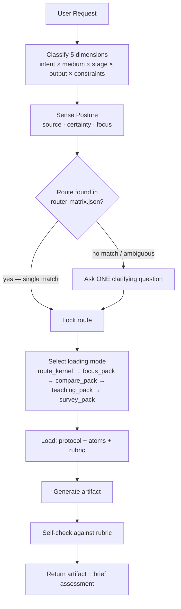
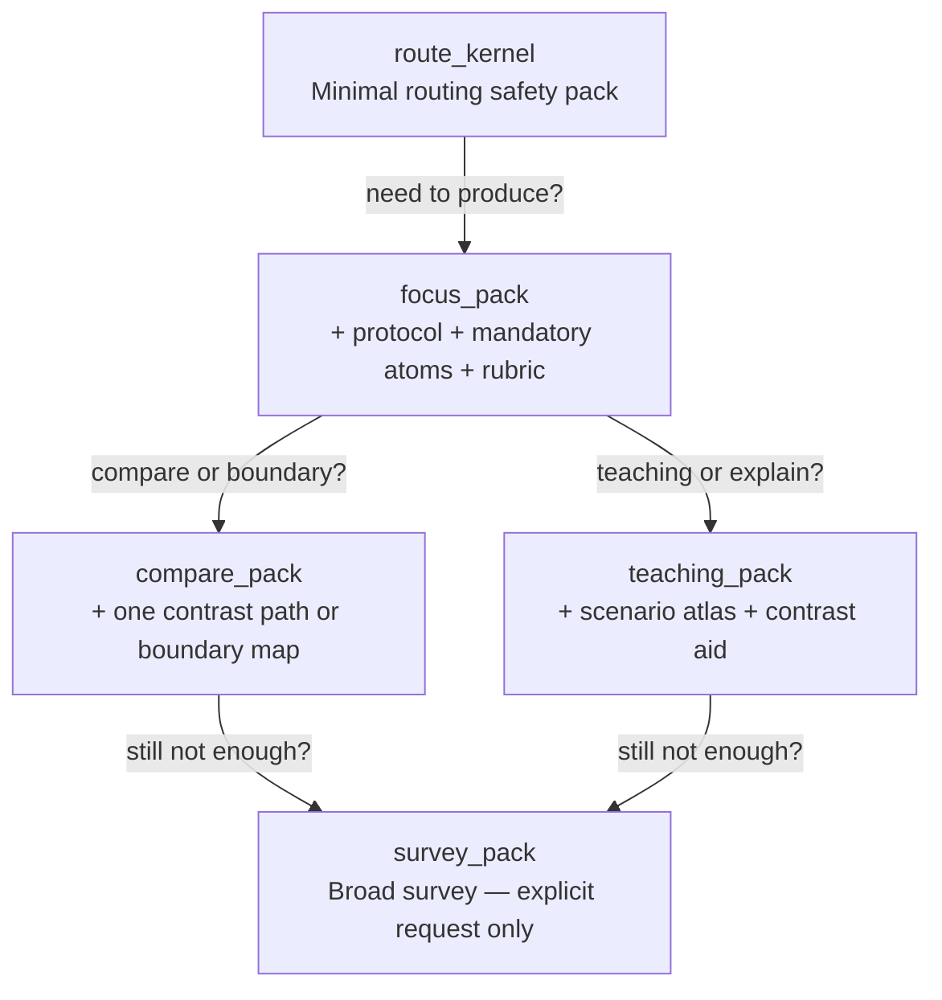

# How To Make Script

Route-first screenplay Agent Skill. Classify the request, load only what\'s needed, produce the exact output contract requested. No theory dumps, no one-size-fits-all advice.

<!-- CACHE DETERMINISM INVARIANTS:
  All knowledge atom frontmatter arrays (mediums, stages) are in schema-enum order.
  All workflow protocol linked_atoms arrays are alphabetically sorted.
  Canonical load order per route: protocol → rubric → linked_atoms (alpha) → optional lenses (alpha by id).
  This ordering ensures deterministic prompt prefixes for LLM cache hit maximization.
-->

## Quick Start

```
Request: "Turn this idea into a feature film beat sheet."
         ───────────────┬───────────────
                        ▼
1. Classify → intent=draft, medium=feature_film, stage=structure, output=beat_sheet
2. Route    → skill.structure-beat → wp.structure-beat-outline → rb.outline
3. Load     → protocol + 4 mandatory atoms + rubric (focus_pack)
4. Generate → beat_sheet artifact
5. Self-check → against rb.outline
```

## Routing Pipeline



## The Five Routing Dimensions

| Dimension | Values | Example |
|-----------|--------|---------|
| **Intent** | discover, design, draft, polish, diagnose, adapt | "polish this dialogue" → polish |
| **Medium** | feature_film, episodic, commercial, interactive, etc. | "TVC script" → commercial |
| **Stage** | ideation, premise, structure, scene, dialogue, rewrite, etc. | "I have an idea" → ideation |
| **Output** | 29 contracts in supported-outputs.md | "give me a logline" → logline |
| **Constraints** | genre, tone, audience, budget, platform, IP, voice, etc. | "PG-13 action" → genre:action, rating:PG-13 |

**Order matters.** Each dimension narrows the next. If the request is ambiguous, ask ONE question — the one that changes the route.

## Posture Sensing

Before routing, read the user's creative posture from their language:

| Signal | User Language (ZH) | User Language (EN) | Response |
|--------|-------------------|-------------------|----------|
| **Source** | 感觉、试试看、说不定 | maybe, let's see, explore | Open possibilities |
| | 应该、确保、框架 | should, ensure, framework | Bring structure |
| | 碰撞、放进去、不管 | collide, throw together | Set conditions |
| **Certainty** | 确定、就是这样 | exactly, I know | Execute cleanly |
| | 也可以、或者、两个方向、不太确定、有点模糊 | maybe this or that | Show tradeoffs |
| | 卡住了、脑子空了、没感觉 | stuck, blank, lost | Offer one small step |
| **Focus** | 人物、角色 | character | Character atoms first |
| | 世界、背景、环境 | world, setting | World atoms first |
| | 事件、情节 | plot, events | Structure atoms first |
| | 观众、感受、体验 | audience, experience | Audience atoms first |
| | 语言、对话、声音 | language, voice | Craft atoms first |

When lost → soften checks, lead with invitation. When exploring → expand possibilities before constraints. When constructing → full protocol and evaluation.

## Context Loading: Climb the Ladder

Start at the bottom. Only climb up when the current level isn't enough.



**Stop expanding when:** route is locked, output contract won't change, next chunk only repeats what's loaded, or you're browsing the repo instead of solving the request.

### Background Bundle Rule

For broad research questions ("how to write a screenplay"), load `bg.screenplay-creation-core` first — then narrow with craft/medium-specific atoms. Never start a broad question with a specific workflow protocol.

## What NOT to Load (Lens Gating)

Specialized lenses load **only when they actually change the answer:**

| Lens | Load When |
|------|-----------|
| Reality lenses | Audience/platform/commissioning/budget/writer-growth constraints present |
| Expression calibration | Producing `voice_style_guide` or explicit tone/register constraint |
| Visual bridge | Producing `visual_language_pack` or `screen_to_video_brief` |
| Team lenses | Designing collaboration — NOT for single-artifact generation |
| Quality gate lenses | Explicit quality/audit request — NOT every generation |
| Audience proxy | Explicit audience simulation request |

## When Routing Fails

Not every input can be routed. When the classification step can't produce a clear route, don't guess.

### Greeting and Capability Discovery


<!-- Content truncated to meet Windsurf 6KB limit -->

---
> Source: [XucroYuri/how-to-make-script](https://github.com/XucroYuri/how-to-make-script) — distributed by [TomeVault](https://tomevault.io).
<!-- tomevault:4.0:windsurf_rules:2026-06-17 -->
