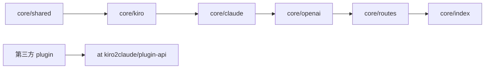

# CLAUDE.md

给在此仓库工作的 Claude Code 看的**规范与地图**。面向使用者的介绍与 HTTP 路由见 [README.md](./README.md),plugin 指南见 [docs/PLUGIN-DEVELOPMENT.md](./docs/PLUGIN-DEVELOPMENT.md);环境变量、wire format 各有单一真相源——本文件只给指针,不复述。

## 项目一句话

把 kiro-cli(Kiro 后端)包装成 **Claude + OpenAI 双协议代理**。Claude 全系 + GPT-5.6(Sol / Terra / Luna);GPT 与 Claude 走**完全相同**的上游、两个协议端点都可用(踩坑「GPT 完全相同上游」)。**MIT**:core 管 HTTP 直发 + plugin 加载;两个内置插件(`metering` 计量、`derived` credit 反演)默认启用,与第三方插件一样只经 [`@kiro2claude/plugin-api`](./packages/plugin-api/) 契约接入。

**运行时**:Node ≥ 22 / TypeScript / ES Modules NodeNext / Fastify / pnpm workspace。

## Monorepo 边界

```
packages/   ★ 全部 MIT
├── plugin-api/           契约包:types + abstract base class,0 runtime deps
├── core/                 gateway runtime:HTTP 路由、plugin loader、token manager
├── plugin-metering/      注入 usage.kiro_metering(credit 计量)
├── plugin-derived/       反演 Kiro credit → Anthropic token,注入 usage.kiro_derived
└── examples/echo-plugin/ 公开示范 plugin

tools/claude-code/        Claude Code CLI 的 Docker harness(人工点验 + headless 回归,非 runtime)
tools/codex/              Codex CLI 的 Docker harness(Responses 端点点验,非 runtime)
docker/Dockerfile         单一发布镜像(core + 两个内置插件)
.github/workflows/        ci.yml:全 workspace lint+typecheck+test;release.yml:见速查表「发版」
```

所有插件都是**普通 npm 包**,loader 唯一发现路径 = 扫 `node_modules/**` 里带 `kiro2claude-plugin` keyword 的包;内置与第三方走**完全相同**的机制(契约不加 tier 字段)。

## 架构地图

```
packages/core/src/
├── index.ts            入口;启动链:config → login → creds → SingleTokenManager
│                       → plugin-host(HookBus + CapabilityRegistry)→ Fastify → 挂路由 → discoverPlugins。
│                       /api/{claude,openai}/v1 = 去泄漏镜像(preHandler 打 stripPluginUsage 标记)
├── token.ts            count_tokens 本地估算 + 远程回退
├── model/config.ts     ★ 环境变量单一真相源(改 env 必先看这里)
├── shared/             横切层(鉴权 / wire-format errors / logger / paths / reqId-ALS),不依赖 kiro claude
├── plugin-host/        ★ 插件契约核心实现
│   ├── hook-bus.ts            按 plugin 注册顺序执行 onUsageFinish
│   ├── usage-finish-event.ts  UsageFinishEventImpl(meta / extensions / overrides)
│   ├── capability-registry.ts host 注册命名 capability,plugin 按 name 取
│   └── loader.ts              node_modules keyword 扫描 + 拓扑排序
├── routes/             HTTP 装配层;唯一可同时 import claude 和 kiro 的地方;prefix 由 index.ts 注入
├── kiro/               上游适配层(token-manager / client-profile / provider / retry-executor / parser);
│                       SingleTokenManager 经 'usage-limits' capability 暴露给 plugin,不直接 export
└── claude/             下游兼容层(HTTP 直发)
    ├── handlers.ts           路由 handler 薄胶水,分发到专职模块
    ├── converter.ts          Claude→Kiro 请求;mapModel / system + thinking + 身份覆写注入
    ├── stream-handler.ts     流式 handler;deferred commit + 空流有界重试(见「流式」组)
    ├── non-stream-handler.ts 非流式 handler;判空/重试镜像
    ├── non-stream-reduce.ts  reduceKiroResponse:bytes→归约;claude & openai 非流式共用的纯函数
    ├── stream.ts             SSE 状态机;finish 调 hookBus;buildClaudeUsagePayload = Claude usage 唯一组装点;
    │                         buildKiroUsageFinishEvent = `kiro.*` meta 唯一构造点;isMeteringLost = 漏账判据唯一定义点
    ├── empty-capture.ts      空流类型 + 诊断抓包(KIRO2CLAUDE_CAPTURE_EMPTY_DIR)
    ├── tool-call-text.ts     泄漏工具调用的检测/救援/剥除;★ 头注释 = 全部红线(踩坑「工具调用文本泄漏」)
    ├── error-mapper.ts       classifyProviderError(状态/文案/Retry-After 真相源)+ mapProviderError
    ├── models-catalog.ts     静态模型列表(含 GPT-5.6)
    └── schemas/ · request-validator.ts · websearch.ts · types.ts · converter/ · stream/

openai/                 OpenAI 兼容层(下游;import claude/kiro/shared,不被反向依赖)。两个协议:
                        Chat Completions + Responses(Codex)。语义核心复用 claude(StreamContext +
                        reduceKiroResponse + provider),仅协议翻译是 OpenAI 特有。
├── freeform-tool.ts        ★ `type:"custom"` 工具替身编解码的**单一真相源**(schema + wrap/unwrap
│                           + 适配说明);放共享层而非 responses/,便于将来接 chat 侧 custom 工具
├── stream-transport.ts     chat+responses 共用流式脚手架(复制自 claude,隔离坑「空流有界重试」)
├── non-stream-transport.ts chat+responses 共用非流式(reduceKiroResponse + 计费 hook)
├── converter.ts            Chat 请求 → MessagesRequest;mapReasoningEffort / parseDataUri 两端共用
├── response-stream.ts      SseEvent → chat.completion.chunk
├── response-nonstream.ts   归约结果 → chat.completion + buildOpenAiUsage(读原始 token,踩坑「OpenAI prompt_tokens」)
├── stream-handler.ts · non-stream-handler.ts · handlers.ts · error-mapper.ts · models-catalog.ts
└── responses/          OpenAI Responses API(Codex 走这;wire_api=responses)
    ├── converter.ts        Responses 请求(input items / instructions / 扁平 tools)→ MessagesRequest;
    │                       collectTools 兼容 code mode(工具在 input 的 additional_tools 里)+ freeform 包裹
    ├── response-stream.ts  SseEvent → 严格语义事件序列(踩坑「Codex 只说 Responses」);Claude thinking → reasoning item
    ├── response-nonstream.ts  归约结果 → Response 对象(含 reasoning item)
    └── stream-handler.ts · non-stream-handler.ts · handlers.ts · types.ts
```

**依赖方向**(箭头不得反向):




<!-- Content truncated to meet Windsurf 6KB limit -->

---
> Source: [yupanzi/kiro2claude](https://github.com/yupanzi/kiro2claude) — distributed by [TomeVault](https://tomevault.io).
<!-- tomevault:4.0:windsurf_rules:2026-08-12 -->
