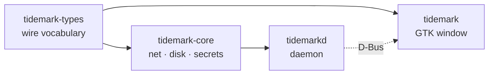

# Repository Guidelines

## Project Overview

Tidemark shows how much AI-provider quota is left, on the Linux desktop. A background daemon
(`tidemarkd`) polls providers, files readings into SQLite, and publishes them on the session
bus; a GTK4 + libadwaita window (`tidemark`) renders one card per account. Native only — no
Electron, no embedded webview.

Rust workspace, edition 2024, MSRV 1.92 (gtk4-rs 0.11 floor), MIT, `github.com/zbndev/tidemark`.
Runtime floor is GTK 4.22 / libadwaita 1.9 → Fedora 44+, Ubuntu 26.04+, rolling distros.

`CONTEXT.md` is the normative design record; `docs/adr/` holds binding decisions. Treat both as
settled — do not relitigate them in code.

## Architecture & Data Flow

Four crates in a strictly enforced layering:



- `tidemark-types` reaches **nothing** — no network, disk, or display. Only `serde` + `zvariant`.
- `tidemark-core` owns providers, HTTP, SQLite, keyring. **Never the display.**
- `tidemarkd` is the only process allowed to hold both.
- `tidemark` is display-only and speaks D-Bus. It may **not** depend on `tidemark-core`,
  `reqwest`/`hyper`, or `rusqlite`/`libsqlite3-sys`.

`scripts/check-layering.sh` enforces this in CI. It is an architecture contract, not a lint.

**Poll → pixel:** `tidemarkd::main::run` loads `Config`, opens `History`, creates `Keyring`, then
`registry::accounts` → `Engine::poll_due` lazily builds `Arc<dyn Provider>` and awaits
`Provider::fetch` concurrently → `Engine::apply` calls `History::ingest(&Snapshot)` and
`ProviderStatus::set_reading` → publisher task runs `Published::upsert` then
`Daemon::provider_changed`. On the UI side `bus::watch` drives `DaemonProxy` through
`glib::spawn_future_local`; signals become `Update::Changed`; `MainWindow::handle` calls
`show_all`/`show_one`; `Card::apply` converts back with `ProviderStatus::to_snapshot`;
`QuotaBar::set` draws value and pace mark on a `gtk::DrawingArea` with Cairo.

**D-Bus surface:** bus name `io.github.zbndev.Tidemark.Daemon`, object path
`/io/github/zbndev/Tidemark`, interface `io.github.zbndev.Tidemark.Daemon1`, methods
`GetStatus` / signal `ProviderChanged`. App ID is `io.github.zbndev.Tidemark`. The daemon is
D-Bus-activated via `data/dbus-1/services/` → systemd **user** unit `tidemarkd.service`. It is a
public contract — `busctl` and Waybar modules consume it:

```bash
busctl --user introspect io.github.zbndev.Tidemark.Daemon /io/github/zbndev/Tidemark
busctl --user call io.github.zbndev.Tidemark.Daemon /io/github/zbndev/Tidemark \
    io.github.zbndev.Tidemark.Daemon1 GetStatus
```

Published shapes are extensible `a{sv}` dictionaries: **absent values must stay absent** — never
substitute a default.

## Key Directories

| Path | Purpose |
| --- | --- |
| `crates/tidemark-types/src/` | `present`, `snapshot`, `time`, `window`, `wire`, `ids` (app/bus constants) |
| `crates/tidemark-core/src/providers/` | `Provider` trait, shared transport, `keyed/`, `claude`, `codex`, `antigravity/` |
| `crates/tidemark-core/src/storage/` | `mod.rs` (`History`), `schema.rs` (migrations), `segment.rs` (reset boundaries) |
| `crates/tidemark-core/src/` | also `config` (TOML), `paths` (XDG), `oauth` (loopback PKCE), `oauth_file`, `secrets` |
| `crates/tidemarkd/src/` | `engine`, `registry`, `service`, `keyring`, `scheduler`, `notify`, `startup`, `update` |
| `crates/tidemark/src/` | `window`, `bus`, `card`, `bar`, `chart`, `detail`, `grid`, `model`, `tray`, `provider_settings/` |
| `scripts/` | Layering, packaging, desktop-integration and release automation (all shellchecked) |
| `data/` | systemd unit, D-Bus service, desktop/autostart entries, AppStream metainfo, icons, packaging hooks |
| `docs/adr/`, `docs/superpowers/` | Binding decisions; dated design specs and implementation plans |

Root `src/` is empty, gitignored dead scratch — not a Cargo target. `pkg/`, `.worktrees/`,
`target/`, `*.pkg.tar.*` are build output: never edit or commit.

## Development Commands

```bash
cargo build --workspace
cargo run -p tidemark

# The full local gate (from .superpowers/sdd/global-constraints.md)
cargo fmt --check && cargo clippy --workspace --all-targets -- -D warnings \
  && cargo test --workspace && ./scripts/check-layering.sh
```

CI (`ubuntu-26.04`, `.github/workflows/ci.yml`) runs exactly:

```bash
cargo fmt --all --check
cargo clippy --workspace --all-targets -- -D warnings
cargo test --workspace
scripts/check-layering.sh
scripts/check-desktop-integration.sh
scripts/test-restart-user-daemon.sh
shellcheck scripts/*.sh data/restart-user-daemon \
  data/packaging/deb/postinst data/packaging/rpm/post-install.sh
```

Build prerequisites: `libgtk-4-dev libadwaita-1-dev libsqlite3-dev pkg-config` (Fedora:
`gtk4-devel libadwaita-devel sqlite-devel pkgconf-pkg-config`). There are **no** `build.rs`
files, no Blueprint, no gresource — nothing to pre-compile.

Run-by-hand only (no workflow triggers them): `scripts/test-release.sh` and
`scripts/test-package-upgrade.sh [workdir]` (needs Docker, privileged systemd containers).


<!-- Content truncated to meet Windsurf 6KB limit -->

---
> Source: [zbndev/tidemark](https://github.com/zbndev/tidemark) — distributed by [TomeVault](https://tomevault.io).
<!-- tomevault:4.0:windsurf_rules:2026-08-27 -->
